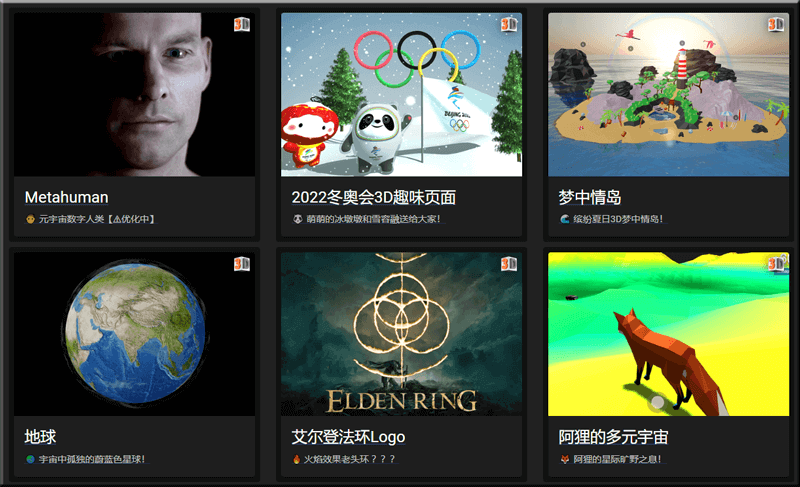

# Three.js Based 3D Examples

主要基于 `Three.js` 的前端 `WebGL` 页面开发合集， 可以在 `src/containers` 对应目录下的 `README.md` 中查看当前页面的开发说明和知识点总结。

`Three.js` based front-end `WebGL` page development collection, you can view the development instructions and knowledge points summary of the current page in `README.md` in the corresponding directory of `src/containers`.

主に `Three.js` フロントエンドの`WebGL`ページ開発コレクションに基づいて、`src/containers` の対応するディレクトリの `README.md` で現在のページの開発手順とナレッジポイントの概要を表示できます。

访问地址：

> preview available ・ オンラインで閲覧

* <https://dragonir.github.io/3d/>
* <https://3d-dragonir.vercel.app/>

## 内容概览

> Content overview ・ コンテンツの詳細

* [1]. [元人类 ・ Metahuman ・ メタヒューマン](https://dragonir.github.io/3d/#/human)
* [2]. [奥运主题冰墩墩雪容融 ・ Olympic mascot ・ オリンピックのマスコット](https://dragonir.github.io/3d/#/olympic)
* [3]. [海岛 ・ IsLand ・ 小島](https://dragonir.github.io/3d/#/ocean)
* [4]. [地球 ・ The Earth ・ 地球](https://dragonir.github.io/3d/#/earth)
* [5]. [数字地球 ・ Digital Earth ・ デジタルグローブ](https://dragonir.github.io/3d/#/earthDigital)
* [6]. [艾尔登法环 ・ Eldon Ring ・ エルドンリング](https://dragonir.github.io/3d/#/ring)
* [7]. [阿狸的多元宇宙 ・ Running Fox ・ アリの多元宇宙](https://dragonir.github.io/3d/#/metaverse)
* [8]. [悬浮文字 ・ Floating Text ・ フローティングテキスト](https://dragonir.github.io/3d/#/floating)
* [9]. [3D漫画 ・ Three-dimensional Comics ・ 立体漫画](https://dragonir.github.io/3d/#/comic)
* [10]. [基于滚动的3D布局 ・ Scroll Based ・ スクロールベース](https://dragonir.github.io/3d/#/scroll)
* [11]. [⚠ 数字城市 ・ Digital City ・ デジタルシティ](https://dragonir.github.io/3d/#/city)
* [12]. [脸书Meta Logo ・ Meta Logo ・ Facebookのロゴ](https://dragonir.github.io/3d-meta-logo/)
* [13]. [虎年春节创意 ・ Chinese Year of Tiger ・ 虎の旧正月](https://dragonir.github.io/3d/#/lunar)
* [14]. [全景侦探小游戏 ・ Panorama Game ・ パノラマミニゲーム](https://dragonir.github.io/3d-panoramic-vision/)
* [15]. [SegmentFault突破1000粉纪念 ・ 1000 Fans ・ 千人の信者](https://dragonir.github.io/3d/#/segmentfault)
* [16]. [虚拟主播 ・ Virtual Idol ・ バーチャルアイドル](https://dragonir.github.io/3d/#/live)
* [17]. [⚠ 动植物细胞结构 ・ Cell Structure ・ 細胞構造](https://dragonir.github.io/3d/#/cell)
* [18]. [⚠ 车 ・ Car ・ 車](https://dragonir.github.io/3d/#/car)
* [19]. [⚠ 塞尔达：旷野之息林克 ・ Zelda: Breath of the Wild ・ ゼルダ：ブレスオブザワイルド](https://dragonir.github.io/3d/#/car)
* 持续更新中... ・ Updating... ・ 更新を続けています...

> `⚠` ：正在开发优化中 ・ Under development and optimization ・ 開発中および最適化中

## 项目运行

> Run Example ・ プロジェクト開発

### Getting Started with Create React App

This project was bootstrapped with [Create React App](https://github.com/facebook/create-react-app).

#### Available Scripts

In the project directory, you can run:

##### `yarn start`

Runs the app in the development mode.\
Open [http://localhost:3000](http://localhost:3000) to view it in your browser.

The page will reload when you make changes.\
You may also see any lint errors in the console.

##### `yarn test`

Launches the test runner in the interactive watch mode.\
See the section about [running tests](https://facebook.github.io/create-react-app/docs/running-tests) for more information.

##### `yarn build`

Builds the app for production to the `build` folder.\
It correctly bundles React in production mode and optimizes the build for the best performance.

The build is minified and the filenames include the hashes.\
Your app is ready to be deployed!

See the section about [deployment](https://facebook.github.io/create-react-app/docs/deployment) for more information.

##### `yarn eject`

**Note: this is a one-way operation. Once you `eject`, you can't go back!**

If you aren't satisfied with the build tool and configuration choices, you can `eject` at any time. This command will remove the single build dependency from your project.

Instead, it will copy all the configuration files and the transitive dependencies (webpack, Babel, ESLint, etc) right into your project so you have full control over them. All of the commands except `eject` will still work, but they will point to the copied scripts so you can tweak them. At this point you're on your own.

You don't have to ever use `eject`. The curated feature set is suitable for small and middle deployments, and you shouldn't feel obligated to use this feature. However we understand that this tool wouldn't be useful if you couldn't customize it when you are ready for it.

#### Learn More

You can learn more in the [Create React App documentation](https://facebook.github.io/create-react-app/docs/getting-started).

To learn React, check out the [React documentation](https://reactjs.org/).

##### Code Splitting

This section has moved here: [https://facebook.github.io/create-react-app/docs/code-splitting](https://facebook.github.io/create-react-app/docs/code-splitting)

##### Analyzing the Bundle Size

This section has moved here: [https://facebook.github.io/create-react-app/docs/analyzing-the-bundle-size](https://facebook.github.io/create-react-app/docs/analyzing-the-bundle-size)

##### Making a Progressive Web App

This section has moved here: [https://facebook.github.io/create-react-app/docs/making-a-progressive-web-app](https://facebook.github.io/create-react-app/docs/making-a-progressive-web-app)

##### Advanced Configuration

This section has moved here: [https://facebook.github.io/create-react-app/docs/advanced-configuration](https://facebook.github.io/create-react-app/docs/advanced-configuration)

#### Deployment

This section has moved here: [https://facebook.github.io/create-react-app/docs/deployment](https://facebook.github.io/create-react-app/docs/deployment)

#### `yarn build` fails to minify

This section has moved here: [https://facebook.github.io/create-react-app/docs/troubleshooting#npm-run-build-fails-to-minify](https://facebook.github.io/create-react-app/docs/troubleshooting#npm-run-build-fails-to-minify)

> * 声明：页面涉及图文和模型素材仅用于个人学习、研究和欣赏，请勿二次修改、非法传播、转载、出版、商用、及进行其他获利行为。
> * Disclaimer: The pictures, texts and model materials on the page are only for personal study, research and appreciation. Please do not re-modify, illegally spread, reprint, publish, commercialize, or conduct other profit-making activities.
> * 免責事項：ページ上の写真、テキスト、モデル資料は、個人的な調査、調査、および鑑賞のみを目的としています。再変更、違法な拡散、転載、公開、商業化、またはその他の営利活動を行わないでください。
