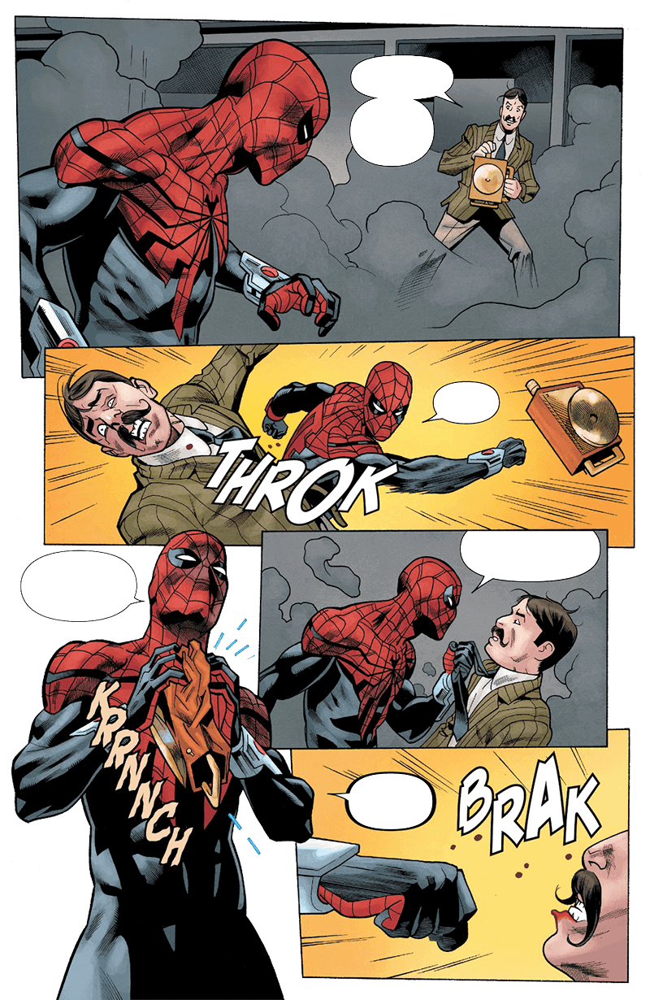
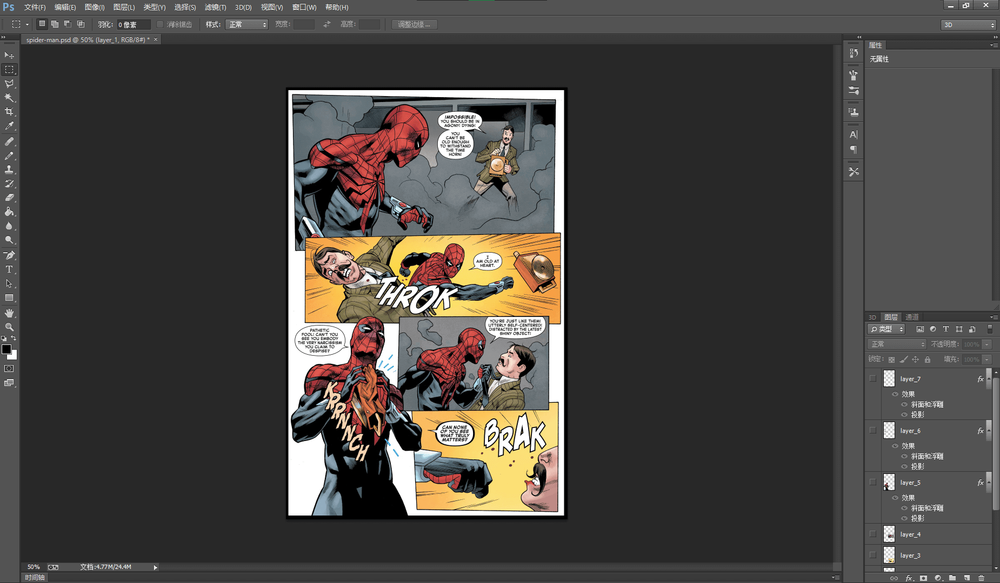
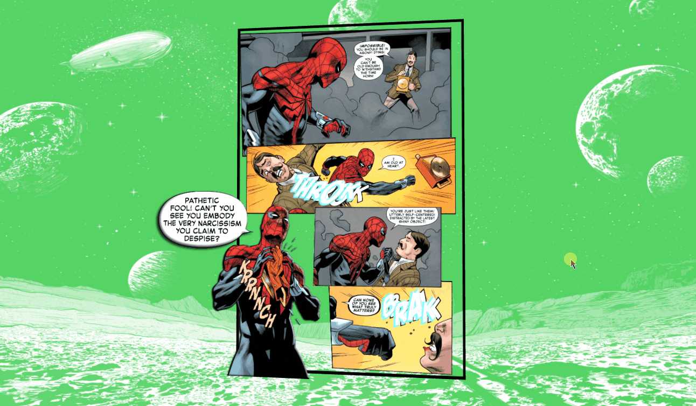
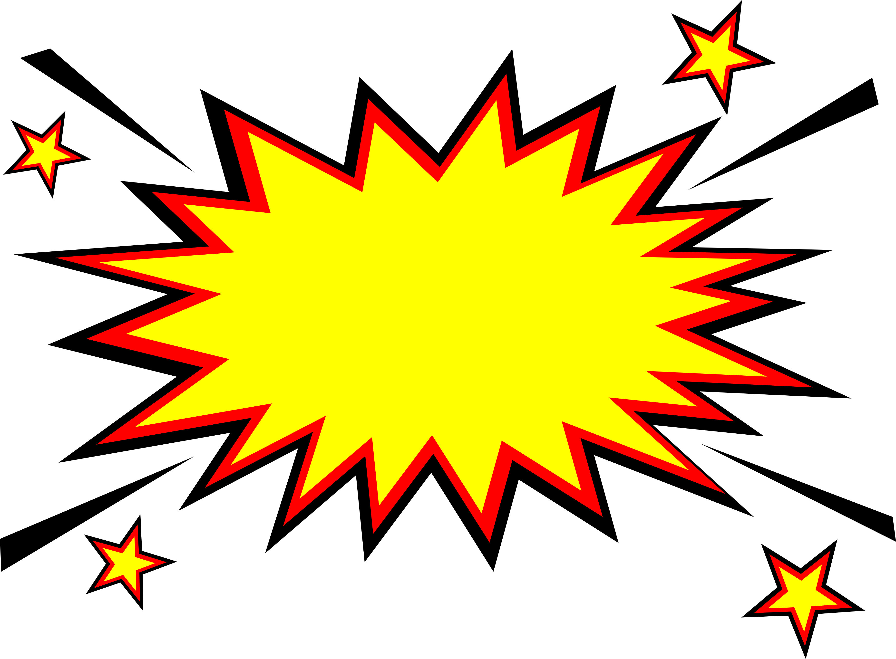
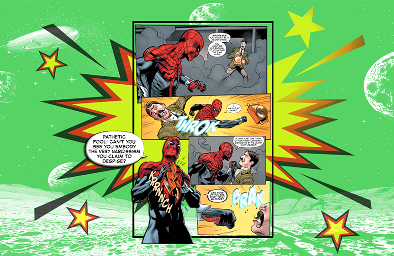

<!-- # 使用Three.js把喜欢的漫画图片改成惊艳的3D视觉吧💥 -->
# 拜托，使用Three.js让二维图片具有3D效果超酷的好吗 💥


> 声明：本文涉及图文和模型素材仅用于个人学习、研究和欣赏，请勿二次修改、非法传播、转载、出版、商用、及进行其他获利行为。

## 背景

逛 `sketchfab` 网站的时候我看到有很多二维平面转 `3D` 的模型例子，于是仿照他们的例子，使用 `Three.js` + `React` 技术栈，将二维漫画图片转化为三维视觉效果。本文包含的内容主要包括：`THREE.Group` 层级模型、`MeshPhongMaterial` 高光网格材质、`正弦余弦函数` 创建模型移动轨迹等。

## 效果

实现效果如 `👇` 下图所示：页面主要有背景图、漫画图片主体以及 `💥 Boom` 爆炸背景图片构成，按住鼠标左键移动模型可以获得不同视图，让图片在视觉上有 `3D` 景深效果。


已适配:

* `💻` PC端
* `📱` 移动端

> `👀` 在线预览：<https://dragonir.github.io/3d/#/comic>

## 实现

本文实现比较简单，和我前面几篇文章实现基本上是相同的，流程也比较简单，主要是素材准备流程比较复杂。下面看看具体实现方法。

### 素材制作

准备一张自己喜欢的图片作为素材原图，图片内容最好可以分成多个层级，以实现 `3D` 景深效果，本实例中使用的是一张漫画图片，刚好可以切分成多个层级。



在 `Photoshop` 中打开图片，根据自己需要的分层数量，创建若干图层，并将地图复制到每个图层上，然后根据对图层景深层级的划分，编辑每个图层，结合使用**魔棒工具**和**套索工具**删除多余的部分，然后将每个图层单独导出作为素材。我分为 `👆` 如上 `7` 个图层，外加一个边框，一共有 `8` 个图层。



### 资源引入

其中 `OrbitControls` 用于镜头轨道控制、`TWEEN` 用于镜头补间动画。

```js
import React from 'react';
import * as THREE from "three";
import { OrbitControls } from "three/examples/jsm/controls/OrbitControls";
import { TWEEN } from "three/examples/jsm/libs/tween.module.min.js";
```

### 场景初始化

初始化渲染容器、场景、摄像机、光源。摄像机初始位置设置为位于偏左方的 `(-12, 0, 0)`，以便于后面使用 `TWEEN` 实现翻转动画效果。

```js
// 场景
container = document.getElementById('container');
renderer = new THREE.WebGLRenderer({ antialias: true });
renderer.setPixelRatio(window.devicePixelRatio);
renderer.setSize(window.innerWidth, window.innerHeight);
container.appendChild(renderer.domElement);
scene = new THREE.Scene();
// 添加背景图片
scene.background = new THREE.TextureLoader().load(background);
// 相机
camera = new THREE.PerspectiveCamera(60, window.innerWidth / window.innerHeight, 0.1, 1000);
camera.position.set(-12, 0, 0);
camera.lookAt(new THREE.Vector3(0, 0, 0));
// 直射光
light = new THREE.DirectionalLight(0xffffff, 1);
light.intensity = .2;
light.position.set(10, 10, 30);
light.castShadow = true;
light.shadow.mapSize.width = 512 * 12;
light.shadow.mapSize.height = 512 * 12;
light.shadow.camera.top = 100;
light.shadow.camera.bottom = - 50;
light.shadow.camera.left = - 50;
light.shadow.camera.right = 100;
scene.add(light);
// 环境光
ambientLight = new THREE.AmbientLight(0xdddddd);
scene.add(ambientLight);
```

### 创建漫画主体

首先创建一个 `Group`，用于添加图层网格，然后遍历图层背景图片数组，在循环体中创建每个面的网格，该网格使用平面立方体 `PlaneGeometry`，材质使用物理材质 `MeshPhysicalMaterial`，对每个网格位置设置相同的x轴和y轴值和不同的z轴值以创建景深效果。最后将 `Group` 添加到场景 `Scene` 中。

```js
var layerGroup = new THREE.Group();
let aspect = 18;
for (let i=0; i<layers.length; i++) {
  let mesh = new THREE.Mesh(new THREE.PlaneGeometry(10.41, 16), new THREE.MeshPhysicalMaterial({
    map: new THREE.TextureLoader().load(layers[i]),
    transparent: true,
    side: THREE.DoubleSide
  }));
  mesh.position.set(0, 0, i);
  mesh.scale.set(1 - (i / aspect), 1 - (i / aspect), 1 - (i / aspect));
  layerGroup.add(mesh);
  // 文字
  if (i === 5) {
    mesh.material.metalness = .6;
    mesh.material.emissive = new THREE.Color(0x55cfff);
    mesh.material.emissiveIntensity = 1.6;
    mesh.material.opacity = .9;
  }
  // 会话框
  if (i === 6) {
    mesh.scale.set(1.5, 1.5, 1.5);
    animateLayer = mesh;
  }
}
layerGroup.scale.set(1.2, 1.2, 1.2);
```

到这一步，实现效果如下图所示：



#### `💡` THREE.Group 层级模型

将具有相同主体的网格可以通过 `Group` 合并在一起，以便于提高运行效率。`Three.js` 层级模型 `Group` 的基类是 `Object3D`，它是 `Three.js` 中大部分对象的基类，提供了一系列的属性和方法来对三维空间中的物体进行操纵。如可以通过 `.add(object)` 方法来将对象进行组合，该方法将对象添加为子对象。

但最好使用 `Group` 来作为父对象，因为 `Group` 相比较`Object3D` 更语义化，可以使用 `Group` 作为点、线、网格等模型的父对象，用来构建一个层级模型。

### 创建Boom背景

为了加强视觉效果，我添加了一个`💥 Boom` 爆炸图形平面作为背景，用鼠标移动的时候随着光线的变化，可以看到该图案有**金属渐变效果**，这种效果主要是通过高光材质 `MeshPhongMaterial` 的 `specular` 和 `shininess` 属性实现的。



```js
const boom = new THREE.Mesh(new THREE.PlaneGeometry(36.76, 27.05), new THREE.MeshPhongMaterial({
  map: new THREE.TextureLoader().load(boomImage),
  transparent: true,
  shininess: 160,
  specular: new THREE.Color(0xff6d00),
  opacity: .7
}));
boom.scale.set(.8, .8, .8);
boom.position.set(0, 0, -3);
layerGroup.add(boom)
scene.add(layerGroup);
```

添加后效果


#### `💡` MeshPhongMaterial 高光网格材质

`MeshPhongMaterial` 是一种用于**具有镜面高光的光泽表面**的材质。该材质使用非物理的 `Blinn-Phong` 模型来计算反射率。 与 `MeshLambertMaterial` 中使用的 `Lambertian` 模型不同，该材质可以模拟具有镜面高光的光泽表面，如涂漆木材。

**构造函数**：

```js
MeshPhongMaterial(parameters: Object)
```

`parameters`：可选，用于定义材质外观的对象，具有一个或多个属性。 材质的任何属性都可以从此处传入(包括从`Material`继承的任何属性)。

**特殊属性**：

* `.emissive[Color]`：材质的放射光颜色，基本上是不受其他光照影响的固有颜色。默认为 `黑色`。
* `.emissiveMap[Texture]`：设置发光贴图。默认值为 `null`。放射贴图颜色由放射颜色和强度所调节。
* `.emissiveIntensity[Float]`：放射光强度。调节发光颜色。默认为 `1`。
* `.envMap[TextureCube]`：环境贴图。默认值为 `null`。
* `.isMeshPhongMaterial[Boolean]`：用于检查此类或派生类是否为 `Phong` 网格材质。默认值为 `true`。
* `.lightMap[Texture]`：光照贴图。默认值为 `null`。
* `.lightMapIntensity[Float]`：烘焙光的强度。默认值为 `1`。
* `.reflectivity[Float]`：环境贴图对表面的影响程度。默认值为 `1`，有效范围介于 `0（无反射）` 和 `1（完全反射）` 之间。
* `.refractionRatio[Float]`：空气的折射率除以材质的折射率。折射率不应超过 `1`。默认值为 `0.98`。
* `.shininess[Float]`：`.specular` 高亮的程度，越高的值越闪亮。默认值为 `30`。
* `.skinning[Boolean]`：材质是否使用蒙皮。默认值为 `false`。
* `.specular[Color]`：材质的高光颜色。默认值为 `0x111111` 的颜色 `Color`。这定义了材质的光泽度和光泽的颜色。
* `.specularMap[Texture]`：镜面反射贴图值会影响镜面高光以及环境贴图对表面的影响程度。默认值为 `null`。

> `📌` 使用 `Phong` 着色模型计算着色时，会计算每个像素的阴影，与 `MeshLambertMaterial` 使用的 `Gouraud` 模型相比，该模型的结果更准确，但代价是牺牲一些性能。

### 镜头控制、缩放适配、动画

镜头补间动画，镜头切换到正确位置。

```js
Animations.animateCamera(camera, controls, { x: 0, y: 0, z: 20 }, { x: 0, y: 0, z: 0 }, 3600, () => { });
```

镜头控制，本示例中显示了模型平移以及水平垂直旋转的角度，以达到最好的预览效果。

```js
controls = new OrbitControls(camera, renderer.domElement);
controls.target.set(0, 0, 0);
controls.enableDamping = true;
controls.enablePan = false;
// 垂直旋转角度限制
controls.minPolarAngle = 1.2;
controls.maxPolarAngle = 1.8;
// 水平旋转角度限制
controls.minAzimuthAngle = -.6;
controls.maxAzimuthAngle = .6;
```

屏幕缩放适配。

```js
window.addEventListener('resize', () => {
  camera.aspect = window.innerWidth / window.innerHeight;
  camera.updateProjectionMatrix();
  renderer.setSize(window.innerWidth, window.innerHeight);
}, false);
```

对于**会话框**图层网格，我给它添加了在一条光滑曲线上左右移动的动画效果，主要是通过修改它在 `x` 轴和 `y` 轴上的 `position` 来实现的 。

```js
function animate() {
  requestAnimationFrame(animate);
  renderer.render(scene, camera);
  controls && controls.update();
  TWEEN && TWEEN.update();
  // 会话框摆动动画
  step += 0.01;
  animateLayer.position.x = 2.4 + Math.cos(step);
  animateLayer.position.y = .4 + Math.abs(Math.sin(step));
}
```

#### `💡` 正弦余弦函数创建模型移动轨迹

使用 `step` 变量并在函数 `Math.cos()` 和 `Math.sin()` 的帮助下 ，创建出一条光滑的轨迹。`step+= 0.01` 定义的是球的弹跳速度。

到此，本示例的完整实现都描述完毕了，大家感兴趣的话，可以动手试着把自己喜欢的图片改造成 `3D` 视图。拜托，使用 `Three.js` 这样展示图片超酷的好吗！ `😂`

> `🔗` 完整代码：<https://github.com/dragonir/3d/tree/master/src/containers/Comic>

## 总结

本文知识点主要包含的的新知识：

* `THREE.Group` 层级模型
* `MeshPhongMaterial` 高光网格材质
* `正弦余弦函数` 创建模型移动轨迹

> 想了解场景初始化、光照、阴影、基础几何体、网格、材质及其他 `Three.js` 的相关知识，可阅读我往期文章。**转载请注明原文地址和作者**。如果觉得文章对你有帮助，不要忘了**一键三连哦 👍**。

## 附录

* [1]. [Three.js 实现2022冬奥主题3D趣味页面 🐼](https://juejin.cn/post/7060292943608807460)
* [2]. [1000粉！使用Three.js制作一个专属3D奖牌 🥇](https://juejin.cn/post/7055079293247815711)
* [3]. [Three.js 实现虎年春节3D创意页面](https://juejin.cn/post/7051745314914435102)
* [4]. [Three.js 实现脸书元宇宙3D动态Logo](https://juejin.cn/post/7031893833163997220)
* [5]. [Three.js 实现3D全景侦探小游戏](https://juejin.cn/post/7042298964468564005)
* [6]. [Three.js实现炫酷的酸性风格3D页面](https://juejin.cn/post/7012996721693163528)
* [7]. [3dx模型转换为blender支持格式](https://anyconv.com/tw/max-zhuan-obj/)
