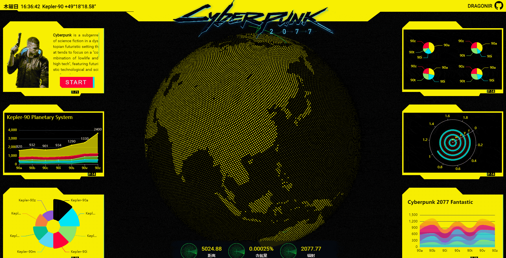

# 使用Three.js实现炫酷的赛博朋克风格3D数字地球大屏 🌏

> 声明：本文涉及图文和模型素材仅用于个人学习、研究和欣赏，请勿二次修改、非法传播、转载、出版、商用、及进行其他获利行为。


## 背景

近期涉及到数字大屏的需求，于是利用业余时间，结合 Three.js 和 [CSS实现赛博朋克2077风格视觉效果](https://juejin.cn/post/6972759988632551460) 的实现炫酷3D数字地球。页面使用 `React + Three.js + Echarts` 技术栈，本文涉及到的主要知识点包括：

## 效果

如下图所示，页面主要由顶部header、两侧aside底部footer


## 实现

### 资源引入

引入开发必备的资源，其中除了基础的React和样式表之外，`dat.gui` 用于动态控制页面参数，通过它提供的GUI界面调整模型参数可以实时更新到页面上，方便调试和特效优化。其他剩余的主要分为两部分：Three.js 相关， `OrbitControls` 用于镜头轨道控制、TWEEN 用于补间动画控制、mergeBufferGeometries 用户合并模型、lineFragmentShader 是飞线的shader；echarts相关，按需引入需要的echarts组件，最后不要忘了使用 echarts.use 使其生效。

```js
import './index.styl';
import React from 'react';
import * as dat from 'dat.gui';
// three.js 相关
import * as THREE from 'three';
import { OrbitControls } from 'three/examples/jsm/controls/OrbitControls';
import { TWEEN } from 'three/examples/jsm/libs/tween.module.min.js';
import { mergeBufferGeometries } from 'three/examples/jsm/utils/BufferGeometryUtils';
import lineFragmentShader from '@/containers/EarthDigital/shaders/line/fragment.glsl';
// echarts 相关
import * as echarts from 'echarts/core';
import { BarChart /*...*/ } from 'echarts/charts';
import { GridComponent /*...*/ } from 'echarts/components';
import { LabelLayout /*...*/ } from 'echarts/features';
import { CanvasRenderer } from 'echarts/renderers';
echarts.use([BarChart, GridComponent, /* ...*/ ]);
```

> echarts图标使用不是本文重点内容，想要了解更多细节内容，可访问其官网 <https://echarts.apache.org/zh/index.html>

### 页面结构

页面主要结构如以下代码所示，`.webgl` 用于渲染3D数字地球；`.header` 是页面顶部，里面包括时间、日期、坐标、`Cyberpunk 2077 Logo`、本人github链接显示等；`.aside` 是左右两侧的图表展示区域；`.footer` 是底部的仪表盘，展示一些雷达动画和文本信息；如果仔细观察，可以看出背景有噪点效果，`.bg` 就是用于生成噪点背景效果的模块。

```js
<div className='earth_digital'>
  <canvas className='webgl'></canvas>
  <header className='hud header'>
  <header></header>
  <aside className='hud aside left'></aside>
  <aside className='hud aside right'></aside>
  <footer className='hud footer'></footer>
  <section className="bg"></section>
</div>
```

### 场景初始化

定义一些全局变量和参数，初始化场景、相机、镜头轨道控制器、灯光、页面缩放监听等。

```js
const renderer = new THREE.WebGLRenderer({
  canvas: document.querySelector('canvas.webgl'),
  antialias: true,
  alpha: true
});
renderer.setSize(window.innerWidth, window.innerHeight);
renderer.setPixelRatio(Math.min(window.devicePixelRatio, 2));
// 创建场景
const scene = new THREE.Scene();
// 创建相机
const camera = new THREE.PerspectiveCamera(45, window.innerWidth / window.innerHeight, .01, 50);
camera.position.set(0, 0, 15.5);
// 添加镜头轨道控制器
const controls = new OrbitControls(camera, renderer.domElement);
controls.enableDamping = true;
controls.enablePan = false;
// 页面缩放监听并重新更新场景和相机
window.addEventListener('resize', () => {
  camera.aspect = window.innerWidth / window.innerHeight;
  camera.updateProjectionMatrix();
  renderer.setSize( window.innerWidth, window.innerHeight );
}, false);
// 页面重绘动画
renderer.setAnimationLoop( _ => {
  TWEEN.update();
  earth.rotation.y += 0.001;
  renderer.render(scene, camera);
});
```

### 生成点状地球

使用地图图片生成点状地球


```js
let params = {
  colors: {
    base: "#f9f002",
    gradInner: "#8ae66e",
    gradOuter: "#03c03c"
  },
  reset: () => {controls.reset()}
}

let maxImpactAmount = 10;
let impacts = [];
let trails = [];
for (let i = 0; i < maxImpactAmount; i++) {
  impacts.push({
    impactPosition: new THREE.Vector3().random().subScalar(0.5).setLength(5),
    impactMaxRadius: 5 * THREE.Math.randFloat(0.5, 0.75),
    impactRatio: 0,
    prevPosition: new THREE.Vector3().random().subScalar(0.5).setLength(5),
    trailRatio: {value: 0},
    trailLength: {value: 0}
  });
  makeTrail(i);
}

let uniforms = {
  impacts: {
    value: impacts
  },
  // 陆地色块大小
  maxSize: {
    value: 0.04
  },
  // 海洋色块大小
  minSize: {
    value: 0.025
  },
  waveHeight: {
    value: 0.1
  },
  scaling: {
    value: 1
  },
  gradInner: {
    value: new THREE.Color(params.colors.gradInner)
  },
  gradOuter: {
    value: new THREE.Color(params.colors.gradOuter)
  }
}

var tweens = [];

for (let i = 0; i < maxImpactAmount; i++) {
  tweens.push({
    runTween: () => {
      let path = trails[i];
      let speed = 3;
      let len = path.geometry.attributes.lineDistance.array[99];
      let dur = len / speed;
      let tweenTrail = new TWEEN.Tween({value: 0})
        .to({value: 1}, dur * 1000)
        .onUpdate( val => {
          impacts[i].trailRatio.value = val.value;
        });
        var tweenImpact = new TWEEN.Tween({ value: 0 })
        .to({ value: 1 }, THREE.Math.randInt(2500, 5000))
        .onUpdate(val => {
          uniforms.impacts.value[i].impactRatio = val.value;
        })
        .onComplete(val => {
          impacts[i].prevPosition.copy(impacts[i].impactPosition);
          impacts[i].impactPosition.random().subScalar(0.5).setLength(5);
          setPath(path, impacts[i].prevPosition, impacts[i].impactPosition, 1);
          uniforms.impacts.value[i].impactMaxRadius = 5 * THREE.Math.randFloat(0.5, 0.75);
          tweens[i].runTween();
        });
      tweenTrail.chain(tweenImpact);
      tweenTrail.start();
    }
  });
}

tweens.forEach(t => {t.runTween();})
makeGlobeOfPoints();


function makeGlobeOfPoints(){
  let dummyObj = new THREE.Object3D();
  let p = new THREE.Vector3();
  let sph = new THREE.Spherical();
  let geoms = [];
  let tex = new THREE.TextureLoader().load(imgData);
  let counter = 75000;
  let rad = 5;
  let r = 0;
  let dlong = Math.PI * (3 - Math.sqrt(5));
  let dz = 2 / counter;
  let long = 0;
  let z = 1 - dz / 2;
  for (let i = 0; i < counter; i++) {
    r = Math.sqrt(1 - z * z);
    p.set( Math.cos(long) * r, z, -Math.sin(long) * r).multiplyScalar(rad);
    z = z - dz;
    long = long + dlong;
    sph.setFromVector3(p);
    dummyObj.lookAt(p);
    dummyObj.updateMatrix();
    let g =  new THREE.PlaneGeometry(1, 1);
    g.applyMatrix4(dummyObj.matrix);
    g.translate(p.x, p.y, p.z);
    let centers = [
      p.x, p.y, p.z,
      p.x, p.y, p.z,
      p.x, p.y, p.z,
      p.x, p.y, p.z
    ];
    let uv = new THREE.Vector2(
      (sph.theta + Math.PI) / (Math.PI * 2),
      1. - sph.phi / Math.PI
    );
    let uvs = [
      uv.x, uv.y,
      uv.x, uv.y,
      uv.x, uv.y,
      uv.x, uv.y
    ];
    g.setAttribute('center', new THREE.Float32BufferAttribute(centers, 3));
    g.setAttribute('baseUv', new THREE.Float32BufferAttribute(uvs, 2));
    geoms.push(g);
  }
  let g = mergeBufferGeometries(geoms);
  let m = new THREE.MeshBasicMaterial({
    color: new THREE.Color(params.colors.base),
    onBeforeCompile: shader => {
      shader.uniforms.impacts = uniforms.impacts;
      shader.uniforms.maxSize = uniforms.maxSize;
      shader.uniforms.minSize = uniforms.minSize;
      shader.uniforms.waveHeight = uniforms.waveHeight;
      shader.uniforms.scaling = uniforms.scaling;
      shader.uniforms.gradInner = uniforms.gradInner;
      shader.uniforms.gradOuter = uniforms.gradOuter;
      shader.uniforms.tex = {value: tex};
      shader.vertexShader = `
        struct impact {
          vec3 impactPosition;
          float impactMaxRadius;
          float impactRatio;
        };
        uniform impact impacts[${maxImpactAmount}];
        uniform sampler2D tex;
        uniform float maxSize;
        uniform float minSize;
        uniform float waveHeight;
        uniform float scaling;

        attribute vec3 center;
        attribute vec2 baseUv;

        varying float vFinalStep;
        varying float vMap;

        ${shader.vertexShader}
      `.replace(
        `#include <begin_vertex>`,
        `#include <begin_vertex>
        float finalStep = 0.0;
        for (int i = 0; i < ${maxImpactAmount};i++){
          float dist = distance(center, impacts[i].impactPosition);
          float curRadius = impacts[i].impactMaxRadius * impacts[i].impactRatio;
          float sstep = smoothstep(0., curRadius, dist) - smoothstep(curRadius - ( 0.25 * impacts[i].impactRatio ), curRadius, dist);
          sstep *= 1. - impacts[i].impactRatio;
          finalStep += sstep;
        }
        finalStep = clamp(finalStep, 0., 1.);
        vFinalStep = finalStep;

        float map = texture(tex, baseUv).g;
        vMap = map;
        float pSize = map < 0.5 ? maxSize : minSize;
        float scale = scaling;

        transformed = (position - center) * pSize * mix(1., scale * 1.25, finalStep) + center; // scale on wave
        transformed += normal * finalStep * waveHeight; // lift on wave
        `
      );
      shader.fragmentShader = `
        uniform vec3 gradInner;
        uniform vec3 gradOuter;
        varying float vFinalStep;
        varying float vMap;
        ${shader.fragmentShader}
        `.replace(
        `vec4 diffuseColor = vec4( diffuse, opacity );`,
        `
        // shaping the point, pretty much from The Book of Shaders
        vec2 hUv = (vUv - 0.5);
        int N = 8;
        float a = atan(hUv.x,hUv.y);
        float r = PI2/float(N);
        float d = cos(floor(.5+a/r)*r-a)*length(hUv);
        float f = cos(PI / float(N)) * 0.5;
        if (d > f) discard;

        vec3 grad = mix(gradInner, gradOuter, clamp( d / f, 0., 1.)); // gradient
        vec3 diffuseMap = diffuse * ((vMap > 0.5) ? 0.5 : 1.);
        vec3 col = mix(diffuseMap, grad, vFinalStep); // color on wave
        //if (!gl_FrontFacing) col *= 0.25; // moderate the color on backside
        vec4 diffuseColor = vec4( col , opacity );
        `
      );
    }
  });
  m.defines = {'USE_UV':''};
  earth = new THREE.Mesh(g, m);
  earth.rotation.y = Math.PI;
  trails.forEach(t => {earth.add(t)});
  earth.add(new THREE.Mesh(new THREE.SphereGeometry(4.9995, 72, 36), new THREE.MeshBasicMaterial({color: new THREE.Color(0x000000)})));
  earth.position.set(0, -.4, 0);
  scene.add(earth);
}
```


### 添加调试工具

```js
const gui = new dat.GUI();
gui.add(uniforms.maxSize, 'value', 0.01, 0.06).step(0.001).name('陆地');
gui.add(uniforms.minSize, 'value', 0.01, 0.06).step(0.001).name('海洋');
gui.add(uniforms.waveHeight, 'value', 0.1, 1).step(0.001).name('浪高');
gui.add(uniforms.scaling, 'value', 1, 5).step(0.01).name('范围');
gui.addColor(params.colors, 'base').name('基础色').onChange(val => {
  if (earth) earth.material.color.set(val);
});
gui.addColor(params.colors, 'gradInner').name('渐变内').onChange(val => {
  uniforms.gradInner.value.set(val);
});
gui.addColor(params.colors, 'gradOuter').name('渐变外').onChange(val => {
  uniforms.gradOuter.value.set(val);
});
gui.add(params, 'reset').name('重置');
gui.hide();
```


### 添加飞线和冲击波

```js
function makeTrail(idx){
  let pts = new Array(100 * 3).fill(0);
  let g = new THREE.BufferGeometry();
  g.setAttribute("position", new THREE.Float32BufferAttribute(pts, 3));
  let m = new THREE.LineDashedMaterial({
    color: params.colors.gradOuter,
    transparent: true,
    onBeforeCompile: shader => {
      shader.uniforms.actionRatio = impacts[idx].trailRatio;
      shader.uniforms.lineLength = impacts[idx].trailLength;
      shader.fragmentShader = lineFragmentShader;
    }
  });
  let l = new THREE.Line(g, m);
  l.userData.idx = idx;
  setPath(l, impacts[idx].prevPosition, impacts[idx].impactPosition, 1);
  trails.push(l);
}

function setPath(l, startPoint, endPoint, peakHeight, cycles) {
  let pos = l.geometry.attributes.position;
  let division = pos.count - 1;
  let cycle = cycles || 1;
  let peak = peakHeight || 1;
  let radius = startPoint.length();
  let angle = startPoint.angleTo(endPoint);
  let arcLength = radius * angle;
  let diameterMinor = arcLength / Math.PI;
  let radiusMinor = (diameterMinor * 0.5) / cycle;
  let peakRatio = peak / diameterMinor;
  let radiusMajor = startPoint.length() + radiusMinor;
  let basisMajor = new THREE.Vector3().copy(startPoint).setLength(radiusMajor);
  let basisMinor = new THREE.Vector3().copy(startPoint).negate().setLength(radiusMinor);
  let tri = new THREE.Triangle(startPoint, endPoint, new THREE.Vector3());
  let nrm = new THREE.Vector3();
  tri.getNormal(nrm);
  let v3Major = new THREE.Vector3();
  let v3Minor = new THREE.Vector3();
  let v3Inter = new THREE.Vector3();
  let vFinal = new THREE.Vector3();
  for (let i = 0; i <= division; i++) {
    let divisionRatio = i / division;
    let angleValue = angle * divisionRatio;
    v3Major.copy(basisMajor).applyAxisAngle(nrm, angleValue);
    v3Minor.copy(basisMinor).applyAxisAngle(nrm, angleValue + Math.PI * 2 * divisionRatio * cycle);
    v3Inter.addVectors(v3Major, v3Minor);
    let newLength = ((v3Inter.length() - radius) * peakRatio) + radius;
    vFinal.copy(v3Inter).setLength(newLength);
    pos.setXYZ(i, vFinal.x, vFinal.y, vFinal.z);
  }
  pos.needsUpdate = true;
  l.computeLineDistances();
  l.geometry.attributes.lineDistance.needsUpdate = true;
  impacts[l.userData.idx].trailLength.value = l.geometry.attributes.lineDistance.array[99];
  l.material.dashSize = 3;
}
```


### 添加头部卡片

机甲风格

```stylus
.header
  background #f9f002
  clip-path polygon(0 0, 100% 0, 100% calc(100% - 35px), 75% calc(100% - 35px), 72.5% 100%, 27.5% 100%, 25% calc(100% - 35px), 0 calc(100% - 35px), 0 0)
```


### 添加两侧卡片

```stylus
.box
  width 100%
  height 31%
  padding 4px
  box-sizing border-box
  position relative
  font-size 1.2rem
  color var(--yellow-color)
  border 30px solid var(--yellow-color)
  border-right 5px solid var(--yellow-color)
  border-left 5px solid var(--yellow-color)
  border-bottom 24px solid var(--yellow-color)
  background-color #000
  clip-path polygon(0px 25px, 26px 0px, calc(60% - 25px) 0px, 60% 25px, 100% 25px, 100% calc(100% - 10px), calc(100% - 15px) calc(100% - 10px), calc(80% - 10px) calc(100% - 10px), calc(80% - 15px) 100%, 80px calc(100% - 0px), 65px calc(100% - 15px), 0% calc(100% - 15px))
  transition all .25s linear
  &::before
    content "P-14"
    display block
    position absolute
    bottom -12px
    right 25px
    padding 2px 2px 0px 2px
    font-size 0.6rem
    line-height 0.6rem
    border-left 2px solid var(--border-color)
    background-color #000
    color var(--yellow-color)
  &.inverse
    border none
    padding 40px 15px 30px
    color #000
    background-color var(--yellow-color)
    border-right 2px solid var(--border-color)
    clip-path polygon(0px 25px, 26px 0px, calc(60% - 25px) 0px, 60% 25px, 100% 25px, 100% calc(100% - 10px), calc(100% - 15px) calc(100% - 10px), calc(80% - 10px) calc(100% - 10px), calc(80% - 15px) 100%, 80px calc(100% - 0px), 65px calc(100% - 15px), 0% calc(100% - 15px))
    &::before
      content "T-71"
      right 90px
      bottom 9px
      background-color #000
      color var(--yellow-color)
  &.dotted, &.dotted::after
    background var(--yellow-color)
    background-image radial-gradient(#00000021 1px, transparent 0)
    background-size 5px 5px
    background-position -13px -3px
  .chart
    height 100%
    width 100%
  &.box_0
    display flex
    justify-content space-between
    .cover
      width 45%
      height 100%
      background url('./images/role_0.png') no-repeat center
      background-size auto 100%
    .info
      width 55%
      height 100%
      padding-left 16px
      display flex
      flex-direction column
      justify-content space-between
      align-items center
      .text
        font-size 14px
        text-align justify
        text-align-last left
        word-break break-all
        line-height 1.5
        overflow hidden auto
        text-overflow ellipsis
        white-space pre-wrap
        height calc(100% - 50px)
      .button
        height 40px
```

```js
initChart = () => {
  const chart_1 = echarts.init(document.getElementsByClassName('chart_1')[0], 'dark');
  chart_1 && chart_1.setOption(chart_1_option);
  // ...
}
```


### 添加底部仪表盘

```stylus
.radar
  background: radial-gradient(center, rgba(32, 255, 77, 0.3) 0%, rgba(32, 255, 77, 0) 75%), repeating-radial-gradient(rgba(32, 255, 77, 0) 5.8%, rgba(32, 255, 77, 0) 18%, #20ff4d 18.6%, rgba(32, 255, 77, 0) 18.9%), linear-gradient(90deg, rgba(32, 255, 77, 0) 49.5%, #20ff4d 50%, #20ff4d 50%, rgba(32, 255, 77, 0) 50.2%), linear-gradient(0deg, rgba(32, 255, 77, 0) 49.5%, #20ff4d 50%, #20ff4d 50%, rgba(32, 255, 77, 0) 50.2%)
  background: -webkit-radial-gradient(center, rgba(32, 255, 77, 0.3) 0%, rgba(32, 255, 77, 0) 75%), -webkit-repeating-radial-gradient(rgba(32, 255, 77, 0) 5.8%, rgba(32, 255, 77, 0) 18%, #20ff4d 18.6%, rgba(32, 255, 77, 0) 18.9%), -webkit-linear-gradient(90deg, rgba(32, 255, 77, 0) 49.5%, #20ff4d 50%, #20ff4d 50%, rgba(32, 255, 77, 0) 50.2%), -webkit-linear-gradient(0deg, rgba(32, 255, 77, 0) 49.5%, #20ff4d 50%, #20ff4d 50%, rgba(32, 255, 77, 0) 50.2%)
  width: 60px
  height: 60px
  max-height: 60px
  max-width: 60px
  position: relative
  border-radius: 50%
  border: 0.1rem solid #20ff4d
  overflow: hidden
  opacity .8
.radar:before
  content: " "
  display: block
  position: absolute
  width: 100%
  height: 100%
  border-radius: 50%
  animation: blips 5s infinite
  animation-timing-function: linear
  animation-delay: 1.4s
.radar:after
  content: ''
  display: block
  background-image: linear-gradient(44deg, rgba(0, 255, 51, 0) 50%, #00ff33 100%)
  width: 50%
  height: 50%
  position: absolute
  top: 0
  left: 0
  animation: radar-beam 5s infinite
  animation-timing-function: linear
  transform-origin: bottom right
  border-radius: 100% 0 0 0
```


### 添加点击交互

```js
const raycaster = new THREE.Raycaster();
const mouse = new THREE.Vector2();
window.addEventListener('dblclick', event => {
  mouse.x = (event.clientX / window.innerWidth) * 2 - 1;
  mouse.y = - (event.clientY / window.innerHeight) * 2 + 1;
  raycaster.setFromCamera(mouse, camera);
  const intersects = raycaster.intersectObjects(earth.children);
  if (intersects.length > 0) {
    this.setState({
      showModal: true,
      modelText: tips[Math.floor(Math.random() * tips.length)]
    });
  }
}, false);
```


### 添加入场动画等其他细节

```js
updateTime = () => {
  this.timeInterval = setInterval(() => {
    let date = new Date();
    let hours = date.getHours();
    let minutes = date.getMinutes();
    let seconds = date.getSeconds();
    let time = `${hours < 10 ? '0' + hours : hours }:${minutes < 10 ? '0' + minutes : minutes }:${seconds < 10 ? '0' + seconds : seconds}`;
    this.setState({
      time: time
    })
  }, 1000);
}

handleModalClick = () =>  {
  setTimeout(() => {
    this.setState({
      showModal: false
    })
  })
}

handleStartButtonClick = () => {
  this.setState({
    showModal: true,
    modelText: tips[Math.floor(Math.random() * tips.length)]
  });
}
```

入场动画、头部文字闪烁动画、按钮故障风格动画



## 总结

本文包含的新知识点主要包括：

> 想了解其他前端知识或其他未在本文中详细描述的 `Web 3D` 开发技术相关知识，可阅读我往期的文章。**转载请注明原文地址和作者**。如果觉得文章对你有帮助，不要忘了**一键三连哦 👍**。

## 参考

* [1]. <https://threejs.org>

## 附录

* [朕的3D专栏](https://juejin.cn/column/7049923956257587213)
* [1]. [🦊 Three.js 实现3D开放世界小游戏：阿狸的多元宇宙](https://juejin.cn/post/7081429595689320478)
* [2]. [🔥 Three.js 火焰效果实现艾尔登法环动态logo](https://juejin.cn/post/7077726955528781832)
* [3]. [🐼 Three.js 实现2022冬奥主题3D趣味页面，含冰墩墩](https://juejin.cn/post/7060292943608807460)
* `...`

* [1]. [📷 前端实现很哇塞的浏览器端扫码功能](https://juejin.cn/post/7018722520345870350)
* [2]. [🌏 前端瓦片地图加载之塞尔达传说旷野之息](https://juejin.cn/post/7007432493569671182)
* [3]. [😱 仅用CSS几步实现赛博朋克2077风格视觉效果](https://juejin.cn/post/6972759988632551460)
* `...`
