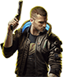
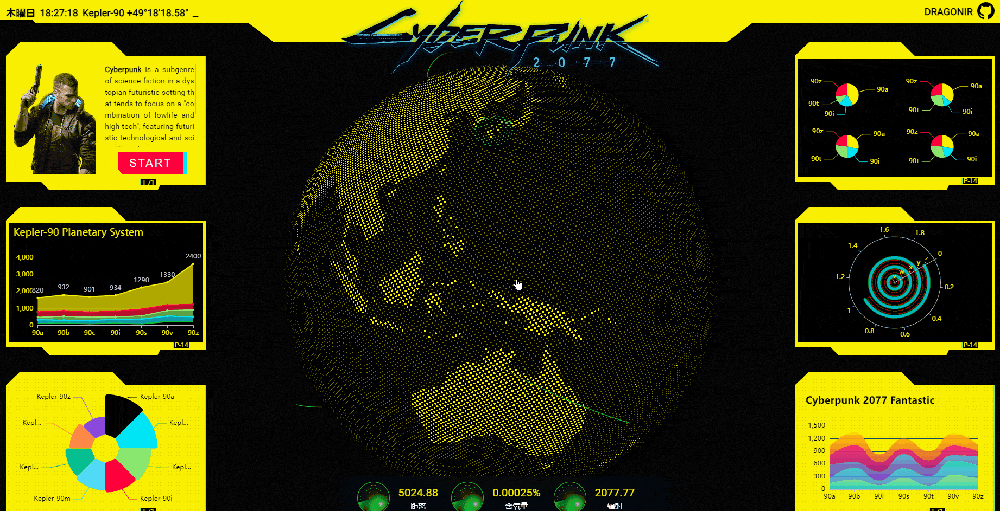
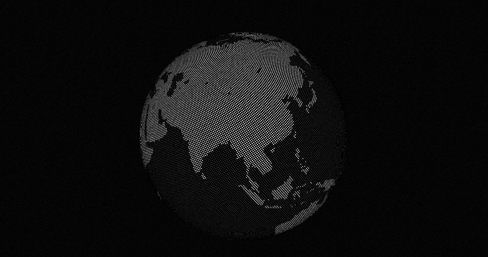
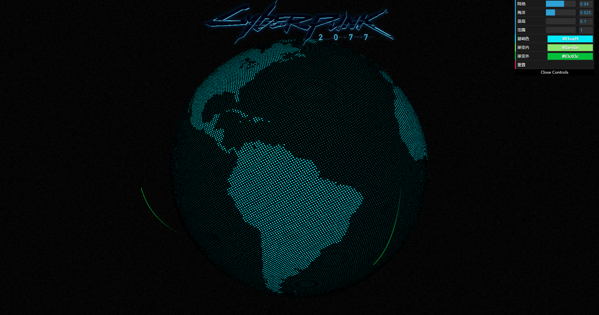
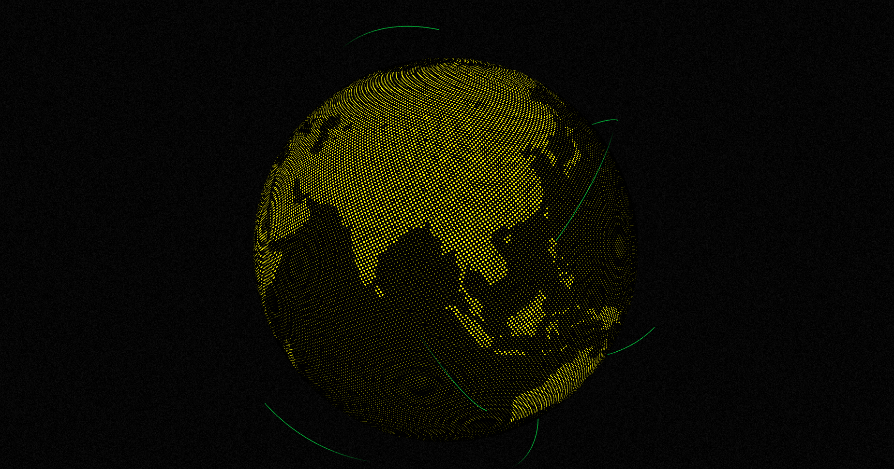
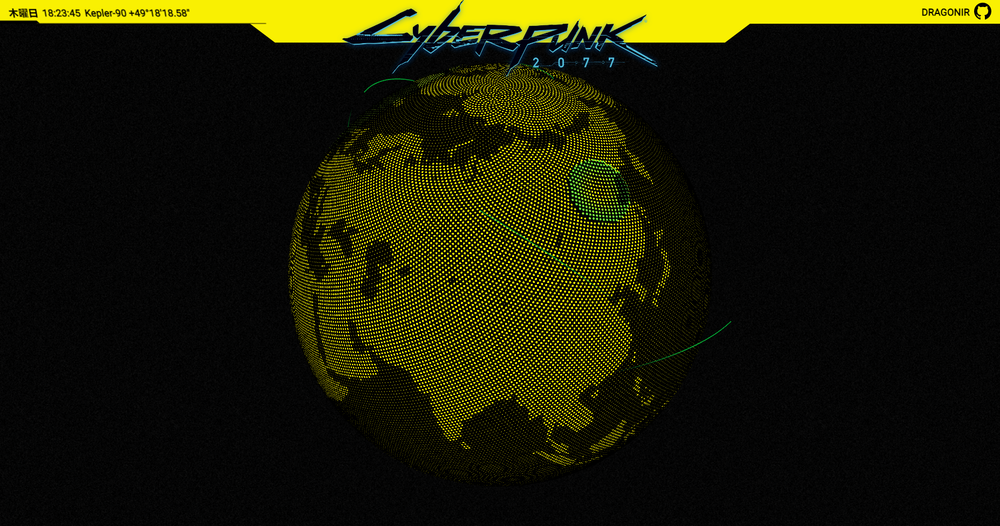
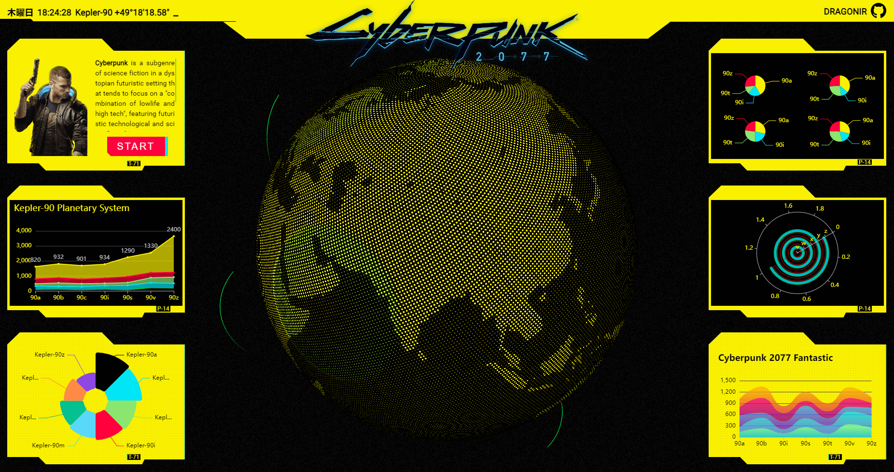
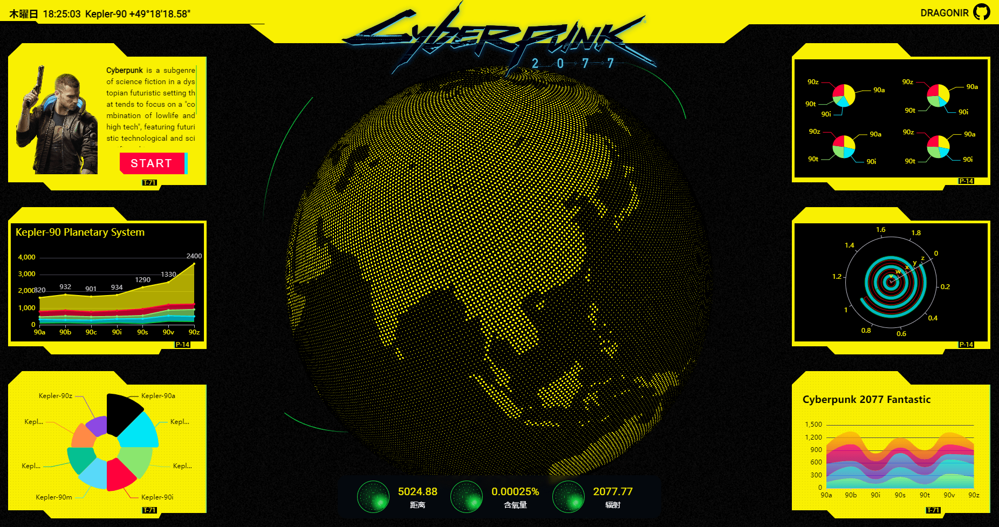
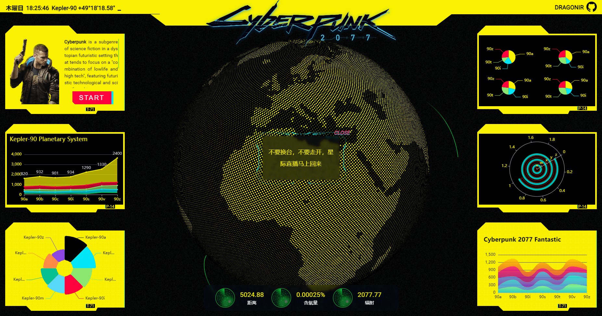

# 使用Three.js实现炫酷的赛博朋克风格3D数字地球大屏 🌐


> 声明：本文涉及图文和模型素材仅用于个人学习、研究和欣赏，请勿二次修改、非法传播、转载、出版、商用、及进行其他获利行为。

## 背景



近期工作有涉及到数字大屏的需求，于是利用业余时间，结合 `Three.js` 和 [CSS实现赛博朋克2077风格视觉效果](https://juejin.cn/post/6972759988632551460) 实现炫酷 `3D` 数字地球大屏页面。页面使用 `React + Three.js + Echarts + stylus` 技术栈，本文涉及到的主要知识点包括：`THREE.Spherical` 球体坐标系的应用、`Shader` 结合 `TWEEN` 实现飞线和冲击波动画效果、`dat.GUI` 调试工具库的使用、`clip-path` 创建不规则图形、`Echarts` 的基本使用方法、`radial-gradient` 创建雷达图形及动画、`GlitchPass` 添加故障风格后期、`Raycaster` 网格点击事件等。

## 效果

如下图 `👇` 所示，页面主要头部、两侧卡片、底部仪表盘以及主体 `3D` 地球 `🌐` 构成，地球外围有 `飞线` 动画和 `冲击波` 动画效果 `🌠` ，通过 `🖱` 鼠标可以旋转和放大地球。点击第一张卡片的 `START` `⬜` 按钮会给页面添加故障风格后期 `⚡`，**双击**地球会弹出随机提示语弹窗。



* `💻` 本页面仅适配 `PC` 端，大屏访问效果更佳。
* `👁‍🗨` 在线预览地址1：<https://3d-eosin.vercel.app/#/earthDigital>
* `👁‍🗨` 在线预览地址2：<https://dragonir.github.io/3d/#/earthDigital>

## 实现

### `📦` 资源引入

引入开发必备的资源，其中除了基础的 `React` 和样式表之外，`dat.gui` 用于动态控制页面参数，其他剩余的主要分为两部分：**Three.js**相关， `OrbitControls` 用于镜头轨道控制、`TWEEN` 用于补间动画控制、`mergeBufferGeometries` 用户合并模型、`EffectComposer` `RenderPass` `GlitchPass` 用于生成后期故障效果动画、 `lineFragmentShader` 是飞线的 `Shader`、**Echarts**相关按需引入需要的组件，最后使用 `echarts.use` 使其生效。

```js
import './index.styl';
import React from 'react';
import * as dat from 'dat.gui';
// three.js 相关
import * as THREE from 'three';
import { OrbitControls } from 'three/examples/jsm/controls/OrbitControls';
import { TWEEN } from 'three/examples/jsm/libs/tween.module.min.js';
import { mergeBufferGeometries } from 'three/examples/jsm/utils/BufferGeometryUtils';
import { EffectComposer } from 'three/examples/jsm/postprocessing/EffectComposer.js';
import { RenderPass } from 'three/examples/jsm/postprocessing/RenderPass.js';
import { GlitchPass } from 'three/examples/jsm/postprocessing/GlitchPass.js';
import lineFragmentShader from '@/containers/EarthDigital/shaders/line/fragment.glsl';
// echarts 相关
import * as echarts from 'echarts/core';
import { BarChart /*...*/ } from 'echarts/charts';
import { GridComponent /*...*/ } from 'echarts/components';
import { LabelLayout /*...*/ } from 'echarts/features';
import { CanvasRenderer } from 'echarts/renderers';
echarts.use([BarChart, GridComponent, /* ...*/ ]);
```

### `📃` 页面结构

页面主要结构如以下代码所示，`.webgl` 用于渲染 `3D` 数字地球；`.header` 是页面顶部，里面包括**时间**、**日期**、**星际坐标**、`Cyberpunk 2077 Logo`、本人 `Github` 仓库地址等；`.aside` 是左右两侧的图表展示区域；`.footer` 是底部的仪表盘，展示一些雷达动画和文本信息；如果仔细观察，可以看出背景有**噪点**效果，`.bg` 就是用于生成噪点背景效果。

```js
<div className='earth_digital'>
  <canvas className='webgl'></canvas>
  <header className='hud header'>
  <header></header>
  <aside className='hud aside left'></aside>
  <aside className='hud aside right'></aside>
  <footer className='hud footer'></footer>
  <section className="bg"></section>
</div>
```

### `🔩` 场景初始化

定义一些全局变量和参数，初始化**场景**、**相机**、**镜头轨道控制器**、**页面缩放监听**、添加页面**重绘更新动画**等进行场景初始化。

```js
const renderer = new THREE.WebGLRenderer({
  canvas: document.querySelector('canvas.webgl'),
  antialias: true,
  alpha: true
});
renderer.setSize(window.innerWidth, window.innerHeight);
renderer.setPixelRatio(Math.min(window.devicePixelRatio, 2));
// 创建场景
const scene = new THREE.Scene();
// 创建相机
const camera = new THREE.PerspectiveCamera(45, window.innerWidth / window.innerHeight, .01, 50);
camera.position.set(0, 0, 15.5);
// 添加镜头轨道控制器
const controls = new OrbitControls(camera, renderer.domElement);
controls.enableDamping = true;
controls.enablePan = false;
// 页面缩放监听并重新更新场景和相机
window.addEventListener('resize', () => {
  camera.aspect = window.innerWidth / window.innerHeight;
  camera.updateProjectionMatrix();
  renderer.setSize( window.innerWidth, window.innerHeight );
}, false);
// 页面重绘动画
renderer.setAnimationLoop( _ => {
  TWEEN.update();
  earth.rotation.y += 0.001;
  renderer.render(scene, camera);
});
```

### `🌐` 创建点状地球

具体思路是使用 `THREE.Spherical` 创建一个球体坐标系 `〽`，然后创建 `10000` 个平面网格圆点，将它们的空间坐标转换成球坐标，并使用 `mergeBufferGeometries` 将它们合并为一个网格。然后使用一张如下图所示的地图图片作为材质，在 `shader` 中根据材质图片的颜色分布调整圆点的大小和透明度，根据传入的参数调整圆点的颜色和大小比例。然后创建一个球体 `SphereGeometry`，使用生成的着色器材质，并将它添加到场景中。到此，一个点状地球 `🌐` 模型就完成了，具体实现如下。


```js
// 创建球类坐标
let sph = new THREE.Spherical();
let dummyObj = new THREE.Object3D();
let p = new THREE.Vector3();
let geoms = [], rad = 5, r = 0;
let dlong = Math.PI * (3 - Math.sqrt(5));
let dz = 2 / counter;
let long = 0;
let z = 1 - dz / 2;
let params = {
  colors: { base: '#f9f002', gradInner: '#8ae66e', gradOuter: '#03c03c' },
  reset: () => { controls.reset() }
}
let uniforms = {
  impacts: { value: impacts },
  // 陆地色块大小
  maxSize: { value: .04 },
  // 海洋色块大小
  minSize: { value: .025 },
  // 冲击波高度
  waveHeight: { value: .1 },
  // 冲击波范围
  scaling: { value: 1 },
  // 冲击波径向渐变内侧颜色
  gradInner: { value: new THREE.Color(params.colors.gradInner) },
  // 冲击波径向渐变外侧颜色
  gradOuter: { value: new THREE.Color(params.colors.gradOuter) }
}
// 创建10000个平面圆点网格并将其定位到球坐标
for (let i = 0; i < 10000; i++) {
  r = Math.sqrt(1 - z * z);
  p.set( Math.cos(long) * r, z, -Math.sin(long) * r).multiplyScalar(rad);
  z = z - dz;
  long = long + dlong;
  sph.setFromVector3(p);
  dummyObj.lookAt(p);
  dummyObj.updateMatrix();
  let g =  new THREE.PlaneGeometry(1, 1);
  g.applyMatrix4(dummyObj.matrix);
  g.translate(p.x, p.y, p.z);
  let centers = [p.x, p.y, p.z, p.x, p.y, p.z, p.x, p.y, p.z, p.x, p.y, p.z];
  let uv = new THREE.Vector2((sph.theta + Math.PI) / (Math.PI * 2), 1. - sph.phi / Math.PI);
  let uvs = [uv.x, uv.y, uv.x, uv.y, uv.x, uv.y, uv.x, uv.y];
  g.setAttribute('center', new THREE.Float32BufferAttribute(centers, 3));
  g.setAttribute('baseUv', new THREE.Float32BufferAttribute(uvs, 2));
  geoms.push(g);
}
// 将多个网格合并为一个网格
let g = mergeBufferGeometries(geoms);
let m = new THREE.MeshBasicMaterial({
  color: new THREE.Color(params.colors.base),
  onBeforeCompile: shader => {
    shader.uniforms.impacts = uniforms.impacts;
    shader.uniforms.maxSize = uniforms.maxSize;
    shader.uniforms.minSize = uniforms.minSize;
    shader.uniforms.waveHeight = uniforms.waveHeight;
    shader.uniforms.scaling = uniforms.scaling;
    shader.uniforms.gradInner = uniforms.gradInner;
    shader.uniforms.gradOuter = uniforms.gradOuter;
    // 将地球图片作为参数传递给shader
    shader.uniforms.tex = { value: new THREE.TextureLoader().load(imgData) };
    shader.vertexShader = vertexShader;
    shader.fragmentShader = fragmentShader;
    );
  }
});
// 创建球体
const earth = new THREE.Mesh(g, m);
earth.rotation.y = Math.PI;
earth.add(new THREE.Mesh(new THREE.SphereGeometry(4.9995, 72, 36), new THREE.MeshBasicMaterial({ color: new THREE.Color(0x000000) })));
earth.position.set(0, -.4, 0);
scene.add(earth);
```



### `🔧` 添加调试工具

为了实时调整球体的样式和后续飞线和冲击波的参数调整，可以使用工具库 `dat.GUI`。它可以创建一个表单添加到页面，通过调整表单上面的参数、滑块和数值等方式绑定页面参数，参数值更改后可以实时更新画面，这样就不用一边到编辑器调整代码一边到浏览器查看效果了。基本用法如下，本例中可以在页面通过点击键盘 `⌨` **H键**显示或隐藏参数表单，通过表单可以修改 `🌐` 地球背景色、飞线颜色、冲击波幅度大小等效果。

```js
const gui = new dat.GUI();
gui.add(uniforms.maxSize, 'value', 0.01, 0.06).step(0.001).name('陆地');
gui.add(uniforms.minSize, 'value', 0.01, 0.06).step(0.001).name('海洋');
gui.addColor(params.colors, 'base').name('基础色').onChange(val => {
 earth && earth.material.color.set(val);
});
```



> `📌` 如果想要了解更多关于 `dat.GUI` 的属性和方法，可以访问本文末尾提供的官方文档地址

### `💫` 添加飞线和冲击波

这部分内容实现地球表层的飞线和冲击波效果 `🌠`，基本思路是：使用 `THREE.Line` 创建 `10` 条随机位置的飞线路径，通过 `setPath` 方法设置飞线的路径 然后通过 `TWEEN` 更新飞线和冲击波扩散动画，一条动画结束后，在终点的位置基础上重新调整飞线开始的位置，通过更新 `Shader` 参数 实现飞线和冲击波效果，并循环执行该过程，最后将飞线和冲击波关联到地球 `🌐` 上，具体实现如以下代码所示：

```js
let maxImpactAmount = 10, impacts = [];
let trails = [];
for (let i = 0; i < maxImpactAmount; i++) {
  impacts.push({
    impactPosition: new THREE.Vector3().random().subScalar(0.5).setLength(5),
    impactMaxRadius: 5 * THREE.Math.randFloat(0.5, 0.75),
    impactRatio: 0,
    prevPosition: new THREE.Vector3().random().subScalar(0.5).setLength(5),
    trailRatio: {value: 0},
    trailLength: {value: 0}
  });
  makeTrail(i);
}
// 创建虚线材质和线网格并设置路径
function makeTrail(idx){
  let pts = new Array(100 * 3).fill(0);
  let g = new THREE.BufferGeometry();
  g.setAttribute('position', new THREE.Float32BufferAttribute(pts, 3));
  let m = new THREE.LineDashedMaterial({
    color: params.colors.gradOuter,
    transparent: true,
    onBeforeCompile: shader => {
      shader.uniforms.actionRatio = impacts[idx].trailRatio;
      shader.uniforms.lineLength = impacts[idx].trailLength;
      // 片段着色器
      shader.fragmentShader = lineFragmentShader;
    }
  });
  // 创建飞线
  let l = new THREE.Line(g, m);
  l.userData.idx = idx;
  setPath(l, impacts[idx].prevPosition, impacts[idx].impactPosition, 1);
  trails.push(l);
}
// 飞线网格、起点位置、终点位置、顶点高度
function setPath(l, startPoint, endPoint, peakHeight) {
  let pos = l.geometry.attributes.position;
  let division = pos.count - 1;
  let peak = peakHeight || 1;
  let radius = startPoint.length();
  let angle = startPoint.angleTo(endPoint);
  let arcLength = radius * angle;
  let diameterMinor = arcLength / Math.PI;
  let radiusMinor = (diameterMinor * 0.5) / cycle;
  let peakRatio = peak / diameterMinor;
  let radiusMajor = startPoint.length() + radiusMinor;
  let basisMajor = new THREE.Vector3().copy(startPoint).setLength(radiusMajor);
  let basisMinor = new THREE.Vector3().copy(startPoint).negate().setLength(radiusMinor);
  let tri = new THREE.Triangle(startPoint, endPoint, new THREE.Vector3());
  let nrm = new THREE.Vector3();
  tri.getNormal(nrm);
  let v3Major = new THREE.Vector3();
  let v3Minor = new THREE.Vector3();
  let v3Inter = new THREE.Vector3();
  let vFinal = new THREE.Vector3();
  for (let i = 0; i <= division; i++) {
    let divisionRatio = i / division;
    let angleValue = angle * divisionRatio;
    v3Major.copy(basisMajor).applyAxisAngle(nrm, angleValue);
    v3Minor.copy(basisMinor).applyAxisAngle(nrm, angleValue + Math.PI * 2 * divisionRatio * 1);
    v3Inter.addVectors(v3Major, v3Minor);
    let newLength = ((v3Inter.length() - radius) * peakRatio) + radius;
    vFinal.copy(v3Inter).setLength(newLength);
    pos.setXYZ(i, vFinal.x, vFinal.y, vFinal.z);
  }
  pos.needsUpdate = true;
  l.computeLineDistances();
  l.geometry.attributes.lineDistance.needsUpdate = true;
  impacts[l.userData.idx].trailLength.value = l.geometry.attributes.lineDistance.array[99];
  l.material.dashSize = 3;
}
```

添加动画过渡效果

```js
for (let i = 0; i < maxImpactAmount; i++) {
  tweens.push({
    runTween: () => {
      let path = trails[i];
      let speed = 3;
      let len = path.geometry.attributes.lineDistance.array[99];
      let dur = len / speed;
      let tweenTrail = new TWEEN.Tween({ value: 0 })
        .to({value: 1}, dur * 1000)
        .onUpdate( val => {
          impacts[i].trailRatio.value = val.value;
        });
        var tweenImpact = new TWEEN.Tween({ value: 0 })
        .to({ value: 1 }, THREE.Math.randInt(2500, 5000))
        .onUpdate(val => {
          uniforms.impacts.value[i].impactRatio = val.value;
        })
        .onComplete(val => {
          impacts[i].prevPosition.copy(impacts[i].impactPosition);
          impacts[i].impactPosition.random().subScalar(0.5).setLength(5);
          setPath(path, impacts[i].prevPosition, impacts[i].impactPosition, 1);
          uniforms.impacts.value[i].impactMaxRadius = 5 * THREE.Math.randFloat(0.5, 0.75);
          tweens[i].runTween();
        });
      tweenTrail.chain(tweenImpact);
      tweenTrail.start();
    }
  });
}
```



### 📟 创建头部

头部**机甲风格**的形状是通过纯 `CSS` 实现的，利用 `clip-path` 属性，使用不同的裁剪方式创建元素的可显示区域，区域内的部分显示，区域外的隐藏。

```stylus
.header
  background #f9f002
  clip-path polygon(0 0, 100% 0, 100% calc(100% - 35px), 75% calc(100% - 35px), 72.5% 100%, 27.5% 100%, 25% calc(100% - 35px), 0 calc(100% - 35px), 0 0)
```

> `📌` 如果想了解关于 `clip-path` 的更多知识，可以访问文章末尾提供的 `MDN` 地址。



### 📊 添加两侧卡片

两侧的 `卡片` `🎴`，也是机甲风格形状，同样由 `clip-path` 生成的。卡片有**实心**、**实心点状背景**、**镂空背景**三种基本样式。

```stylus
.box
  background-color #000
  clip-path polygon(0px 25px, 26px 0px, calc(60% - 25px) 0px, 60% 25px, 100% 25px, 100% calc(100% - 10px), calc(100% - 15px) calc(100% - 10px), calc(80% - 10px) calc(100% - 10px), calc(80% - 15px) 100%, 80px calc(100% - 0px), 65px calc(100% - 15px), 0% calc(100% - 15px))
  transition all .25s linear
  &.inverse
    border none
    padding 40px 15px 30px
    color #000
    background-color var(--yellow-color)
    border-right 2px solid var(--border-color)
    &::before
      content "T-71"
      background-color #000
      color var(--yellow-color)
  &.dotted, &.dotted::after
    background var(--yellow-color)
    background-image radial-gradient(#00000021 1px, transparent 0)
    background-size 5px 5px
    background-position -13px -3px
```

卡片上的图表 `📊`，直接使用的是 `Eachrts` 插件，通过修改每个图表的配置来适配 `赛博朋克 2077` 的样式风格。

```js
const chart_1 = echarts.init(document.getElementsByClassName('chart_1')[0], 'dark');
chart_1 && chart_1.setOption(chart_1_option);
```

> `📌` `Echarts` 图标使用不是本文重点内容，想要了解更多细节内容，可访问其官网。



### `⏱` 添加底部仪表盘

底部仪表盘主要用于数据展示，并且添加了 `3` 个**雷达**扫描动画，雷达 `📡` 形状则是通过 `radial-gradient` 径向渐变来实现的，然后利用 `::before` 和 `::after` 伪元素实现扫描动画效果，具体 `keyframes` 实现可以查看样式源码。

```stylus
.radar
  background: radial-gradient(center, rgba(32, 255, 77, 0.3) 0%, rgba(32, 255, 77, 0) 75%), repeating-radial-gradient(rgba(32, 255, 77, 0) 5.8%, rgba(32, 255, 77, 0) 18%, #20ff4d 18.6%, rgba(32, 255, 77, 0) 18.9%), linear-gradient(90deg, rgba(32, 255, 77, 0) 49.5%, #20ff4d 50%, #20ff4d 50%, rgba(32, 255, 77, 0) 50.2%), linear-gradient(0deg, rgba(32, 255, 77, 0) 49.5%, #20ff4d 50%, #20ff4d 50%, rgba(32, 255, 77, 0) 50.2%)
.radar:before
  content ''
  display block
  position absolute
  width 100%
  height 100%
  border-radius: 50%
  animation blips  1.4s 5s infinite linear
.radar:after
  content ''
  display block
  background-image linear-gradient(44deg, rgba(0, 255, 51, 0) 50%, #00ff33 100%)
  width 50%
  height 50%
  animation radar-beam 5s infinite linear
  transform-origin: bottom right
  border-radius 100% 0 0 0
```



### `🤳` 添加交互

#### 故障风格后期

点击第一个卡片上的按钮 `START` `⬜`，星际之旅进入 `Hard 模式` `😱`，页面将会产生如下图所示的**故障动画**效果。它是通过引入 `Three.js` 内置的后期通道 `GlitchPass` 实现的，添加以下代码后，记得要在页面重绘动画中更新 `composer`。

```js
const composer = new EffectComposer(renderer);
composer.addPass( new RenderPass(scene, camera));
const glitchPass = new GlitchPass();
composer.addPass(glitchPass);
```

#### 地球点击事件

使用 `Raycaster` 给地球网格添加点击事件，在地球上 `双击鼠标` `🖱`，会弹出一个提示框 `💬`，并会随机加载一些提示文案。

```js
const raycaster = new THREE.Raycaster();
const mouse = new THREE.Vector2();
window.addEventListener('dblclick', event => {
  mouse.x = (event.clientX / window.innerWidth) * 2 - 1;
  mouse.y = - (event.clientY / window.innerHeight) * 2 + 1;
  raycaster.setFromCamera(mouse, camera);
  const intersects = raycaster.intersectObjects(earth.children);
  if (intersects.length > 0) {
    this.setState({
      showModal: true,
      modelText: tips[Math.floor(Math.random() * tips.length)]
    });
  }
}, false);
```



### `🎥` 添加入场动画等其他细节

最后，还添加了一些样式细节和动画效果，如头部和两侧卡片的**入场动画**、头部时间坐标**文字闪烁动画**、第一张卡片**按钮故障风格动画**、`Cyberpunk 2077 Logo` 的**阴影效果**等。由于文章篇幅有限，不在这里细讲，感兴趣的朋友可以自己查看源码学习。也可以查看阅读我的另一篇文章 [仅用CSS几步实现赛博朋克2077风格视觉效果 > 传送门 `🚪`](https://juejin.cn/post/6972759988632551460) 查看更多细节内容。

## 总结

本文包含的新知识点主要包括：

* `THREE.Spherical` 球体坐标系的应用
* `Shader` 结合 `TWEEN` 实现飞线和冲击波动画效果
* `dat.GUI` 调试工具库的使用
* `clip-path` 创建不规则图形
* `Echarts` 的基本使用方法
* `radial-gradient` 创建雷达图形及动画
* `GlitchPass` 添加故障风格后期
* `Raycaster` 网格点击事件等

**后续计划**：

本页面虽然已经做了很多效果和优化，但是还有很多改进的空间，后续我计划更新的内容包括：

* `🌏` 地球坐标和实际地理坐标结合，可以根据经纬度定位到国家、省份等具体位置
* `💻` 缩放适配不同屏幕尺寸
* `📊` 图表以及仪表盘展示一些真实的数据并且可以实时更新
* `🌠` 头部和卡片添加一些炫酷的描边动画
* `🌟` 添加宇宙星空粒子背景（有时间的话，现在的噪点背景也不错）
* `🐌` 性能优化

> 想了解其他前端知识或其他未在本文中详细描述的 `Web 3D` 开发技术相关知识，可阅读我往期的文章。**转载请注明原文地址和作者**。如果觉得文章对你有帮助，不要忘了**一键三连哦 👍**。

## 附录

* [我的3D专栏可以点击此链接访问 👈](https://juejin.cn/column/7049923956257587213)
* [1]. [🦊 Three.js 实现3D开放世界小游戏：阿狸的多元宇宙](https://juejin.cn/post/7081429595689320478)
* [2]. [🔥 Three.js 火焰效果实现艾尔登法环动态logo](https://juejin.cn/post/7077726955528781832)
* [3]. [🐼 Three.js 实现2022冬奥主题3D趣味页面，含冰墩墩](https://juejin.cn/post/7060292943608807460)
* `...`

* [1]. [📷 前端实现很哇塞的浏览器端扫码功能](https://juejin.cn/post/7018722520345870350)
* [2]. [🌏 前端瓦片地图加载之塞尔达传说旷野之息](https://juejin.cn/post/7007432493569671182)
* [3]. [😱 仅用CSS几步实现赛博朋克2077风格视觉效果](https://juejin.cn/post/6972759988632551460)
* `...`

## 参考

* [1]. [https://threejs.org](https://threejs.org)
* [2]. [https://github.com/dataarts/dat.gui/blob/master/API.md](https://github.com/dataarts/dat.gui/blob/master/API.md)
* [3]. [https://echarts.apache.org/zh/index.html](https://echarts.apache.org/zh/index.html)
* [4]. [https://www.cnblogs.com/pangys/p/13276936.html](https://www.cnblogs.com/pangys/p/13276936.html)
* [5]. [https://developer.mozilla.org/zh-CN/docs/Web/CSS/gradient/radial-gradient](https://developer.mozilla.org/zh-CN/docs/Web/CSS/gradient/radial-gradient)
* [6]. [https://developer.mozilla.org/zh-CN/docs/Web/CSS/clip-path](https://developer.mozilla.org/zh-CN/docs/Web/CSS/clip-path)
