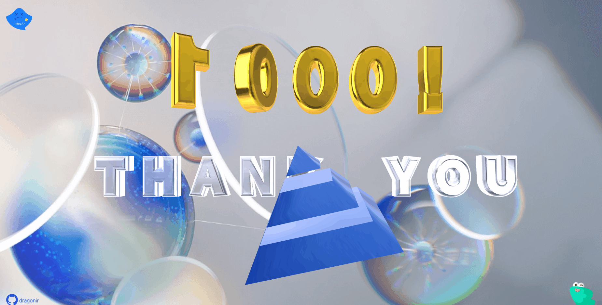
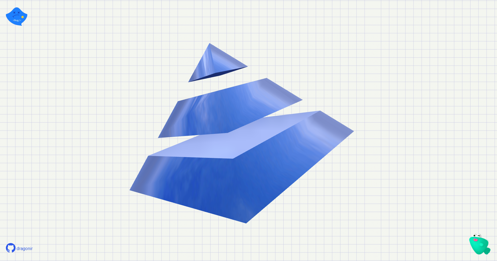
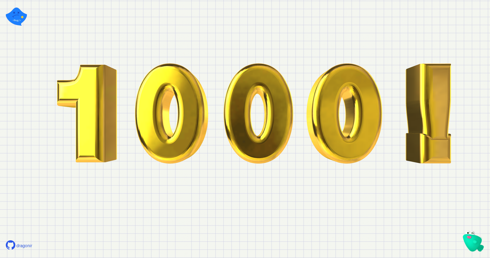
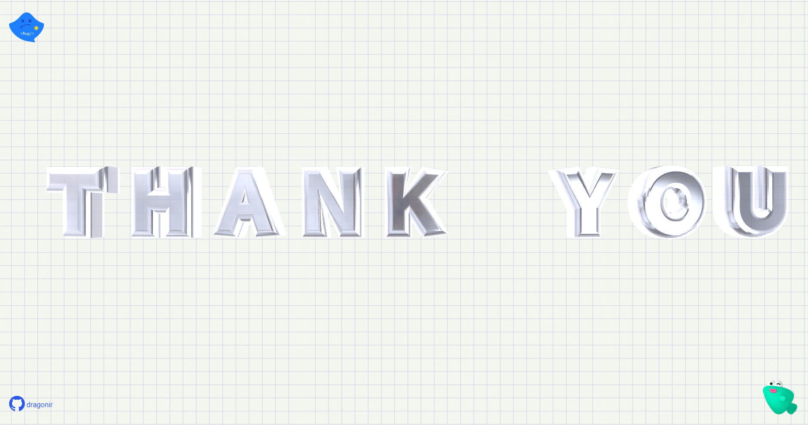
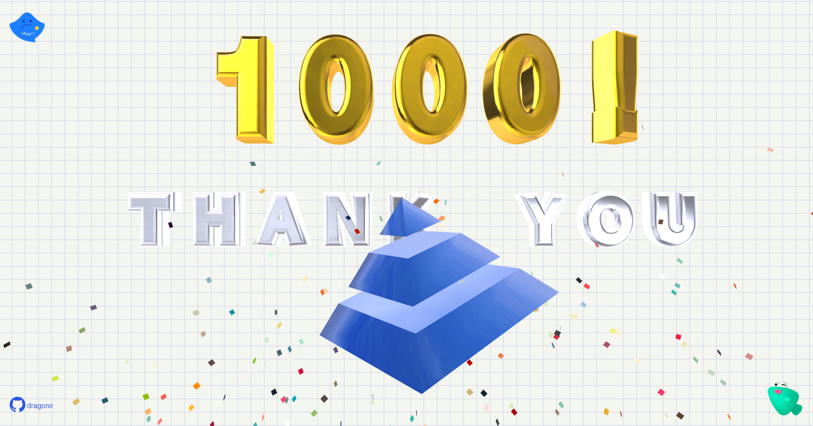
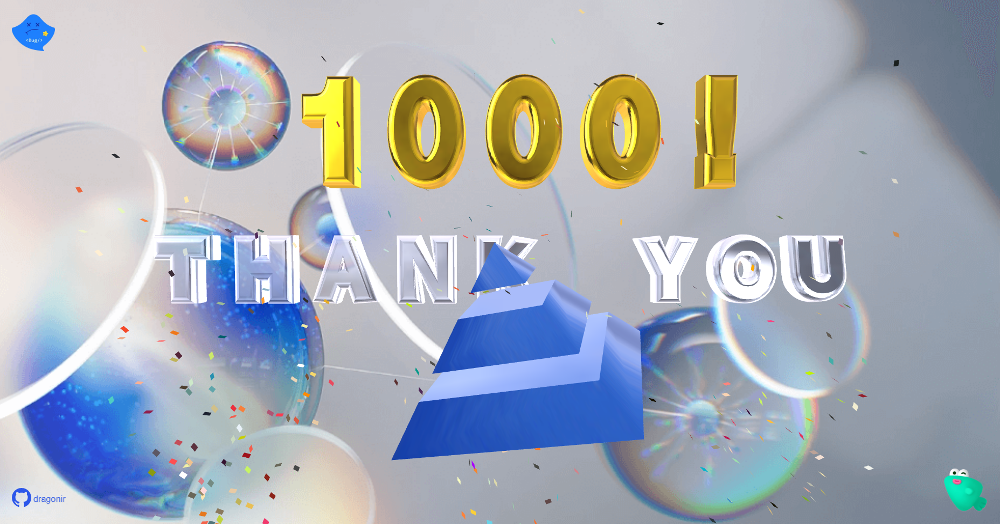

# 掘金1000粉！使用Three.js实现一个创意纪念页面 🏆


> 声明：本文涉及图文和模型素材仅用于个人学习、研究和欣赏，请勿二次修改、非法传播、转载、出版、商用、及进行其他获利行为。

## 背景

不知不觉，掘金关注者已经超过 `1000` 人了，因此特地做了这个页面纪念一下。

## 效果

页面主体内容主要由四部分组成，分别是：文字 `1000!`、文字 `THANK YOU`、掘金三维 `Logo`、以及 `纸片礼花` `🎉`。

* `💻` 本页面适配**PC端**和**移动端**，大屏访问效果更佳。
* `👁‍🗨` 在线预览地址1：<https://3d-eosin.vercel.app/#/fans>
* `👁‍🗨` 在线预览地址2：<https://dragonir.github.io/3d/#/fans>



## 实现

### `📦` 资源引入

引入开发必备的资源，其中除了基础的 `React` 和样式表之外，`dat.gui` 用于动态控制页面参数，其他剩余的主要分为两部分：**Three.js**相关， `OrbitControls` 用于镜头轨道控制、`TWEEN` 用于补间动画控制、`mergeBufferGeometries` 用户合并模型、`EffectComposer` `RenderPass` `GlitchPass` 用于生成后期故障效果动画、 `lineFragmentShader` 是飞线的 `Shader`、**Echarts**相关按需引入需要的组件，最后使用 `echarts.use` 使其生效。

### `📃` 页面结构

页面主要结构如以下代码所示，`.webgl` 用于渲染 `3D` 数字地球；`.header` 是页面顶部，里面包括**时间**、**日期**、**星际坐标**、`Cyberpunk 2077 Logo`、本人 `Github` 仓库地址等；`.aside` 是左右两侧的图表展示区域；`.footer` 是底部的仪表盘，展示一些雷达动画和文本信息；如果仔细观察，可以看出背景有**噪点**效果，`.bg` 就是用于生成噪点背景效果。

### 创建掘金 `Logo`

```js
// 创建logo
const logo = new THREE.Group();
const logoMaterial = new THREE.MeshMatcapMaterial({
  matcap: this.matcaps.logoMatcap,
  side: THREE.DoubleSide,
})
const cone = new THREE.Mesh(new THREE.ConeGeometry(4, 4, 4), logoMaterial);
logo.add(cone);
const cylinder = new THREE.Mesh(new THREE.CylinderGeometry(6, 10, 4, 4, 1), logoMaterial);
cylinder.position.y = -6
logo.add(cylinder);
const cylinder2 = new THREE.Mesh(new THREE.CylinderGeometry(12, 16, 4, 4, 1), logoMaterial);
cylinder2.position.y = -12
logo.add(cylinder2);
logo.position.set(0, 0, 0);
logo.scale.set(11, 11, 11);
logo.rotateY(Math.PI * 0.2);
logo.rotateZ(Math.PI * 0.1);
scene.add(logo);
```



### 创建文字 `1000!`

```js
new Text({
  ...DEFAULTS,
  text: '1000!',
  position: new THREE.Vector3(120, 160, -80),
  textOptions: {
    size: 110,
    spacing: 120
  },
  material: {
    matcap: this.matcaps.textMatcap1
  },
  animation: 'zoomAndFlip',
  onLoad: () => {
    this.confetti.pop(2);
  },
});
```



### 创建文字 `THANK YOU`

```js
new Text({
  ...DEFAULTS,
  text: 'THANK YOU',
  position: new THREE.Vector3(-120, -10, -80),
  textOptions: {
    size: 60,
    spacing: 100,
  },
  material: {
    matcap: this.matcaps.textMatcap2,
    opacity: .75
  },
  animation: 'upDownFlip',
});
```



### 创建礼花 `🎉`



### 缩放监听及重绘动画

```js
const animate = () => {
  requestAnimationFrame(animate);
  controls && controls.update();
  logo && logo.rotateOnAxis(axis, Math.PI / 400);
  renderer.render(scene, camera);
}
animate();

window.addEventListener('pointermove', e => {
  e.preventDefault();
  this.mousePosition.x = e.clientX;
  this.mousePosition.y = e.clientY;
});

window.addEventListener('pointerdown', e => {
  e.preventDefault();
  this.confetti && this.confetti.pop();
});

window.addEventListener('resize', () => {
  this.width = window.innerWidth;
  this.height = window.innerHeight;
  this.camera.aspect = this.width / this.height;
  this.camera.updateProjectionMatrix();
  renderer.setPixelRatio(Math.min(window.devicePixelRatio, 2));
  this.renderer.setSize(this.width, this.height);
}, {
  passive: true
});
```

### 样式细节优化



https://observablehq.com/@makio135/matcaps?ui=classic

https://github.com/nidorx/matcaps

http://jeanmoreno.com/unity/matcap/

MeshMatcapMaterial

```js
MeshMatcapMaterial 由一个材质捕捉（MatCap，或光照球（Lit Sphere））纹理所定义，其编码了材质的颜色与明暗。

由于mapcap图像文件编码了烘焙过的光照，因此MeshMatcapMaterial 不对灯光作出反应。
它将会投射阴影到一个接受阴影的物体上(and shadow clipping works)，但不会产生自身阴影或是接受阴影。

// iOS iframe auto-resize workaround
if ( /(iPad|iPhone|iPod)/g.test( navigator.userAgent ) ) {
const scene = document.getElementById( 'scene' );
scene.style.width = getComputedStyle( scene ).width;
scene.style.height = getComputedStyle( scene ).height;
scene.setAttribute( 'scrolling', 'no' );
}

构造函数(Constructor)
MeshMatcapMaterial( parameters : Object )
parameters - (可选)用于定义材质外观的对象，具有一个或多个属性。
材质的任何属性都可以从此处传入(包括从Material继承的任何属性)。

属性color例外，其可以作为十六进制字符串传递，默认情况下为 0xffffff（白色），内部调用Color.set(color)。

属性(Properties)
共有属性请参见其基类Material。

.alphaMap : Texture
alpha贴图是一张灰度纹理，用于控制整个表面的不透明度。（黑色：完全透明；白色：完全不透明）。
默认值为null。

仅使用纹理的颜色，忽略alpha通道（如果存在）。
对于RGB和RGBA纹理，WebGL渲染器在采样此纹理时将使用绿色通道，
因为在DXT压缩和未压缩RGB 565格式中为绿色提供了额外的精度。
Luminance-only以及luminance/alpha纹理也仍然有效。

.bumpMap : Texture
用于创建凹凸贴图的纹理。黑色和白色值映射到与光照相关的感知深度。凹凸实际上不会影响对象的几何形状，只影响光照。如果定义了法线贴图，则将忽略该贴图。

.bumpScale : Float
凹凸贴图会对材质产生多大影响。典型范围是0-1。默认值为1。

.color : Color
材质的颜色(Color)，默认值为白色 (0xffffff)。

.displacementMap : Texture
位移贴图会影响网格顶点的位置，与仅影响材质的光照和阴影的其他贴图不同，移位的顶点可以投射阴影，阻挡其他对象，
以及充当真实的几何体。位移纹理是指：网格的所有顶点被映射为图像中每个像素的值（白色是最高的），并且被重定位。

.displacementScale : Float
位移贴图对网格的影响程度（黑色是无位移，白色是最大位移）。如果没有设置位移贴图，则不会应用此值。默认值为1。

.displacementBias : Float
位移贴图在网格顶点上的偏移量。如果没有设置位移贴图，则不会应用此值。默认值为0。

.flatShading : Boolean
定义材质是否使用平面着色进行渲染。默认值为false。

.map : Texture
颜色贴图。默认为null。纹理贴图颜色由漫反射颜色.color调节。

.matcap : Texture
matcap贴图，默认为null。

.morphNormals : Boolean
定义是否使用morphNormals。设置为true可将morphNormal属性从geometry传递到shader。默认值为false。

.morphTargets : Boolean
定义材质是否使用morphTargets。默认值为false。

.normalMap : Texture
用于创建法线贴图的纹理。RGB值会影响每个像素片段的曲面法线，并更改颜色照亮的方式。法线贴图不会改变曲面的实际形状，只会改变光照。
In case the material has a normal map authored using the left handed convention, the y component of normalScale
should be negated to compensate for the different handedness.

.normalMapType : Integer
法线贴图的类型。

选项为THREE.TangentSpaceNormalMap（默认）和THREE.ObjectSpaceNormalMap。

.normalScale : Vector2
法线贴图对材质的影响程度。典型范围是0-1。默认值是Vector2设置为（1,1）。
```

## 总结

本文包含的知识点主要包括：

> 想了解其他前端知识或其他未在本文中详细描述的 `Web 3D` 开发技术相关知识，可阅读我往期的文章。**转载请注明原文地址和作者**。如果觉得文章对你有帮助，不要忘了**一键三连哦 👍**。

## 附录

* [我的3D专栏可以点击此链接访问 👈](https://juejin.cn/column/7049923956257587213)
* [1]. [🦊 Three.js 实现3D开放世界小游戏：阿狸的多元宇宙](https://juejin.cn/post/7081429595689320478)
* [2]. [🔥 Three.js 火焰效果实现艾尔登法环动态logo](https://juejin.cn/post/7077726955528781832)
* [3]. [🐼 Three.js 实现2022冬奥主题3D趣味页面，含冰墩墩](https://juejin.cn/post/7060292943608807460)
* `...`

* [1]. [📷 前端实现很哇塞的浏览器端扫码功能](https://juejin.cn/post/7018722520345870350)
* [2]. [🌏 前端瓦片地图加载之塞尔达传说旷野之息](https://juejin.cn/post/7007432493569671182)
* [3]. [😱 仅用CSS几步实现赛博朋克2077风格视觉效果](https://juejin.cn/post/6972759988632551460)
* `...`

## 参考

* [1]. [https://threejs.org](https://threejs.org)
* [2]. [https://github.com/dataarts/dat.gui/blob/master/API.md](https://github.com/dataarts/dat.gui/blob/master/API.md)
* [3]. [https://echarts.apache.org/zh/index.html](https://echarts.apache.org/zh/index.html)
* [4]. [https://www.cnblogs.com/pangys/p/13276936.html](https://www.cnblogs.com/pangys/p/13276936.html)
* [5]. [https://developer.mozilla.org/zh-CN/docs/Web/CSS/gradient/radial-gradient](https://developer.mozilla.org/zh-CN/docs/Web/CSS/gradient/radial-gradient)
* [6]. [https://developer.mozilla.org/zh-CN/docs/Web/CSS/clip-path](https://developer.mozilla.org/zh-CN/docs/Web/CSS/clip-path)