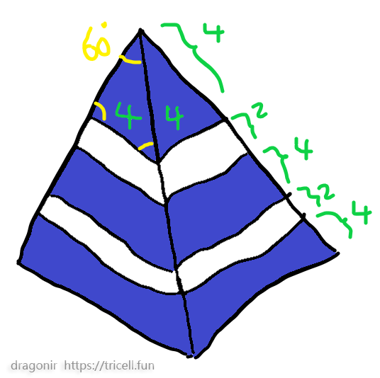
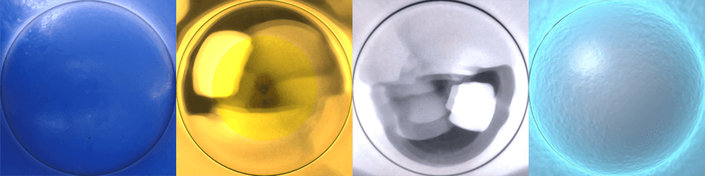
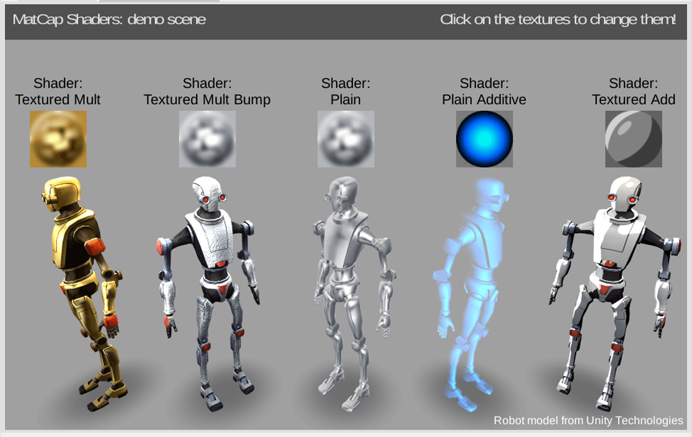
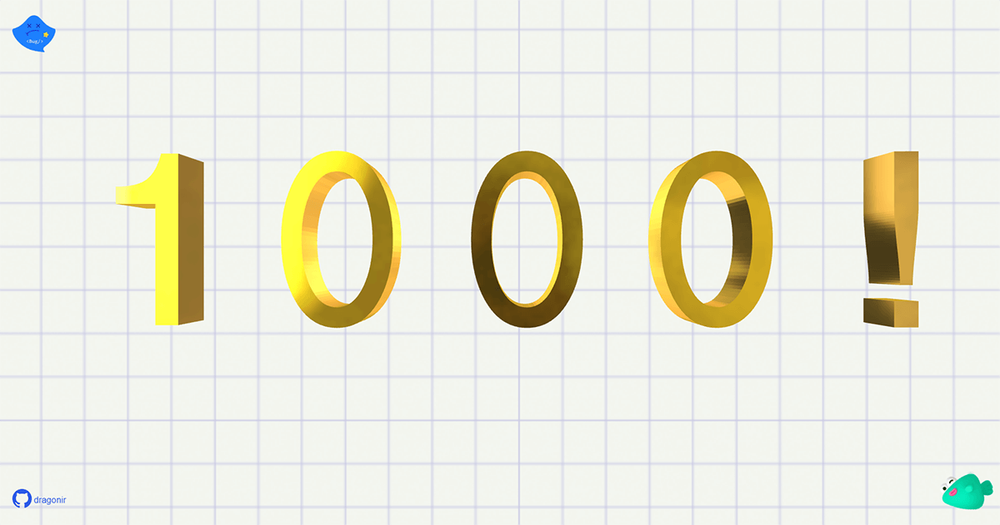

# 掘金1000粉！使用Three.js实现一个创意纪念页面 🏆


> 声明：本文涉及图文和模型素材仅用于个人学习、研究和欣赏，请勿二次修改、非法传播、转载、出版、商用、及进行其他获利行为。

## 背景

不知不觉，掘金关注者人数已经超过 `1000` 人，因此特地做了这个页面纪念一下，`🙇‍` 感谢大家关注，后续也会继续努力，持续输出一些有价值的文章。本文内容涉及的技术栈为 `React + Three.js + Stulus`，本文中主要包含的知识点包括：

对了，后续我专门新建了一个专门针对 `Three.js` 系列的专栏[【Three.js 奥德赛进阶之旅】](https://juejin.cn/column/7140122697622618119)，是掘金签约的专栏。从基础入门开始，全方位了解Three.js的各种特性，并结合和应用对应特性，实现令人眼前一亮的 `Web` 创意页面，进而逐步挖掘 `Three.js` 和 `WebGL` 深层次的知识。在这里推广一下，大家感兴趣的话可以关注一下 `😘`。


## 效果

页面主体内容主要由四部分组成，分别是：文字 `1000!`、文字 `THANK YOU`、掘金三维 `Logo`、以及 `纸片礼花` `🎉`。其中文字各自具有翻转效果动画，掘金 `Logo` 有自转动画效果，当用 `🖱` 鼠标点击屏幕时，会出现 `*★,°*:.☆(￣▽￣)/$:*.°★* 。撒花` 效果。


打开以下链接中的任意一个可以在线预览效果。本页面适配**PC端**和**移动端**，大屏访问效果更佳。

* `👁‍🗨` 在线预览地址1：<https://3d-eosin.vercel.app/#/fans>
* `👁‍🗨` 在线预览地址2：<https://dragonir.github.io/3d/#/fans>

## 实现

### `📦` 资源引入

首先在顶部引入开发必备的资源，除了基础的 `React` 和样式表之外，`THREE` 是 `Three.js` 库；`OrbitControls` 用于镜头轨道控制，可以使用鼠标移动或旋转模型；`Text` 是用于创建文字模型的一个类；`Confetti` 是一个用于创建礼花效果的类，在后面内容中会做详细介绍。

```js
import './index.styl';
import React from 'react';
import * as THREE from "three";
import { OrbitControls } from "three/examples/jsm/controls/OrbitControls";
import Text from '@/assets/utils/Text';
import Confetti from '@/assets/utils/Confetti';
```

### `📃` 页面结构

页面主要结构非常简单，其中 `.webgl` 用于渲染 `3D` 元素；`.logo` 是页面上的一些图标装饰，`.github` 是存放本项目的 `Github` 链接地址。

```html
<div className='fans_page'>
  <canvas className='webgl'></canvas>
  <i className='logo'></i>
  <i className='logo click'></i>
  <a className='github' href='https://github.com/dragonir/3d' target='_blank'></a>
</div>
```

### 创建掘金 `Logo`

创建 `Logo` 时，先创建一个 `Group`，然后将 `Logo` 的各个部分添加到 `Group` 中，这样有利于对 `Logo` 整体调整位置和添加动画，也有利于页面加载性能。接着，通过以下步骤创建 `Logo` 模型的三部分：

* 创建通用的材质 `MeshMatcapMaterial`，`Logo` 模型的所有组成网格都将使用这种材质;
* 使用 `ConeGeometry` 创建顶部的 `四棱锥`，并应用材质；
* 使用 `CylinderGeometry` 创建中间的 `四棱台`，并应用材质；
* 使用 `CylinderGeometry` 创建底部的 `四棱台`，并应用材质；
* 将上述网格模型添加到 `Group` 中，并调整整体的位置、大小，并**设置倾斜角度**以便获得更好的页面视觉效果。

> `📌` 在实际开发中，应用了 `ConeBufferGeometry`、`CylinderBufferGeometry` 代替 `ConeGeometry` 和 `CylinderGeometry`，以便获得更好的性能。



本示例中模型的计算参数如上图所示，顶部**四棱柱**的四个面都是边长为4的等边三角形，其余两个**棱台**的侧边长也是 `4`，其他边的长度参数都可以通过**勾股定理**以及**三角函数**计算得出，本文中不做详细计算。（PS：模型示意图是用 `Windows` 画图工具画的，有点丑 `🤣`）

```js
const logo = new THREE.Group();
// 材质捕捉纹理材质
const logoMaterial = new THREE.MeshMatcapMaterial({
  matcap: this.matcaps.logoMatcap,
  side: THREE.DoubleSide,
});
// 顶部四棱锥
const cone = new THREE.Mesh(new THREE.ConeGeometry(4, 4, 4), logoMaterial);
logo.add(cone);
// 中间四棱台
const cylinder = new THREE.Mesh(new THREE.CylinderGeometry(6, 10, 4, 4, 1), logoMaterial);
cylinder.position.y = -6
logo.add(cylinder);
// 底部四棱台
const cylinder2 = new THREE.Mesh(new THREE.CylinderGeometry(12, 16, 4, 4, 1), logoMaterial);
cylinder2.position.y = -12
logo.add(cylinder2);
logo.position.set(0, 0, 0);
logo.scale.set(11, 11, 11);
// 设置倾斜角度
logo.rotateY(Math.PI * 0.2);
logo.rotateZ(Math.PI * 0.1);
scene.add(logo);
```


#### `💡 知识点` 圆锥几何体ConeGeometry

圆锥几何体 `ConeGeometry`，是一个用于生成圆锥几何体的类，侧面分段数越多则越圆，本例中分段数为 `4`，所以看起来是个四棱锥。

**构造函数**：

```js
ConeGeometry(radius: Float, height: Float, radialSegments: Integer, heightSegments: Integer, openEnded: Boolean, thetaStart: Float, thetaLength: Float);
```

**参数说明**：

* `radius`：圆锥底部的半径，默认值为 `1`。
* `height`：圆锥的高度，默认值为 `1`。
* `radialSegments`：圆锥侧面周围的分段数，默认为 `8`。
* `heightSegments`：圆锥侧面沿着其高度的分段数，默认值为 `1`。
* `openEnded`：一个 `Boolean` 值，指明该圆锥的底面是开放的还是封顶的。默认值为 `false`，即其底面默认是封顶的。
* `thetaStart`：第一个分段的起始角度，默认为 `0`。
* `thetaLength`：圆锥底面圆扇区的中心角，通常被称为 `θ`。默认值是 `2*PI`，这使其成为一个完整的圆锥。

#### `💡 知识点` 圆柱几何体CylinderGeometry

圆柱几何体 `CylinderGeometry`，是一个用于生成圆柱几何体的类。本文中 `Logo` 的中间和底部就由此类生成。

**构造函数**：

```js
CylinderGeometry(radiusTop: Float, radiusBottom: Float, height: Float, radialSegments: Integer, heightSegments: Integer, openEnded : Boolean, thetaStart: Float, thetaLength: Float)
```

**参数说明**：

* `radiusTop`：圆柱的顶部半径，默认值是 `1`。
* `radiusBottom`：圆柱的底部半径，默认值是 `1`。
* `height`：圆柱的高度，默认值是 `1`。
* `radialSegments`：圆柱侧面周围的分段数，默认为 `8`。
* `heightSegments`：圆柱侧面沿着其高度的分段数，默认值为 `1`。
* `openEnded`：一个 `Boolean`值，指明该圆锥的底面是开放的还是封顶的。默认值为 `false`，即其底面默认是封顶的。
* `thetaStart`：第一个分段的起始角度，默认为 `0`。
* `thetaLength`：圆柱底面圆扇区的中心角，通常被称为 `θ`。默认值是 `2*PI`，这使其成为一个完整的圆柱。

#### `💡 知识点` 材质捕捉纹理材质MeshMatcapMaterial

`MeshMatcapMaterial` 由一个材质捕捉 `MatCap或光照球` 纹理所定义，其编码了材质的颜色与明暗。由于 `mapcap` 图像文件编码了烘焙过的光照，因此**MeshMatcapMaterial不对灯光作出反应**。它可以投射阴影到一个接受阴影的物体上，但不会产生自身阴影或是接收阴影。

**构造函数**：

```js
MeshMatcapMaterial(parameters: Object)
```

`parameters`：可选，用于定义材质外观的对象，具有一个或多个属性，材质的任何属性都可以从此处传入，包括从 `Material` 继承的任何属性。

* `.color[Color]`：材质的颜色，默认值为白色 `0xffffff`。
* `.matcap[Texture]`：`matcap` 贴图，默认为 `null`。
* 其他Material基类的共有属性等。

`MeshMatcapMaterial` 是一种非常好用的材质，简单使用这种材质就能实现复杂的纹理效果，如本文中 `Logo` 的光泽效果，以及后续文字的**金属效果**以及**透明玻璃效果**，选择合适的材质，可以实现各种各样的神奇效果。下面这张图就是本文中所有元素的材质贴图，可以看出它们是一个个光照球体样式。



除了在 `Blender`、`Photoshop`等设计软件中生成 `MeshMatcapMaterial` 之外，下面几个网站可以免费下载各种好看的材质，并且具有在线实时预览功能，大家可以根据页面元素内容和自身需求找到合适的材质图片，感兴趣的话可以亲手试试看 `😉`。


> `🔗` [https://observablehq.com/@makio135/matcaps?ui=classic](https://observablehq.com/@makio135/matcaps?ui=classic) `🔗` [https://github.com/nidorx/matcaps](https://github.com/nidorx/matcaps)



> `🔗` [http://jeanmoreno.com/unity/matcap/]()http://jeanmoreno.com/unity/matcap/

### 创建文字 `1000!`

接着，来创建文字，此时需要引入 `FontLoader`，用于加载字体文件，它返回一个字体实例，然后使用`TextGeometry` 创建文字网格，将它添加到场景中就可以了。

```js
import { FontLoader } from 'three/examples/jsm/loaders/FontLoader';
import { TextGeometry } from 'three/examples/jsm/geometries/TextGeometry';

fontLoader.load('fontface.json', font => {
  textMesh.geometry = new TextGeometry('1000！', {
    font: font,
    size: 100,
    height: 40
  });
  scene.add(textMesh);
});
```

看起来非常普通对不对，其实文字网格可以 `TextGeometry` 参数中调整字符的厚度、斜角等参数，我们可以按类似下面这种稍微优化一下，调整到自己满意的结果。

```js
textMesh.geometry = new TextGeometry('1000！', {
  font: font,
  size: 100,
  height: 40,
  curveSegments: 100,
  bevelEnabled: true,
  bevelThickness: 10,
  bevelSize: 10,
  bevelOffset: 2,
  bevelSegments: 10
});
```



看看优化后的效果 `✨`！


### 创建文字 `THANK YOU`

使用同样的方法添加 `THANK YOU` 文字网格，并为它设置半透明玻璃效果的 `MeshMatcapMaterial` 和文字厚度斜角样式。


> `📌` 关于文字网格的详细应用可以看看我的这篇文章 [《使用Three.js实现神奇的3D文字悬浮效果》](https://juejin.cn/post/7072899771819622413)，本文中不再赘述了。

### 创建文字动画

文字创建完成后，可以给它们添加一些文字翻转动画效果。动画效果是通过 `Gsap` 实现的，其中，给`1000！` 添加了一个缩放并翻转的动画效果，给 `THANK YOU` 添加了一个上下翻转的动画效果。可以参考如下方法实现。

```js
import gsap from 'gsap';
// 上下翻转动画
zoomAndFlip() {
  gsap.timeline({
    repeat: -1,
    defaults: {
      duration: 2,
      ease: 'elastic.out(1.2, 1)',
      stagger: 0.1,
    },
  })
  .to(this.meshesPosition, { z: this.meshesPosition[0].z + 100 }, 'start')
  .to(this.meshesRotation, { duration: 2, y: Math.PI * 2 }, 'start')
  .to(this.meshesRotation, { duration: 2, y: Math.PI * 4 }, 'end')
  .to(this.meshesPosition, { z: this.meshesPosition[0].z }, 'end');
}
```

### 创建礼花 `🎉`

页面每次打开以及点击屏幕时，可以产生礼花效果。其中礼花使用了面基础缓冲模型 `PlaneBufferGeometry` 以及 `MeshBasicMaterial` 基础材质构成，在场景中创建三束礼花，每束礼花内的碎片位置和大小随机，并在一段时间后自动消失。其中礼花的动画效果也是使用了 `Gsap` 以及它的插件 `Physics2DPlugin` 来实现的，`Physics2DPlugin` 插件可以模拟物理动画效果包括重力、速度、加速度、摩擦力动画等。可以像本文中这样使用它们：

```js
import gsap from 'gsap';
const physics2D = require('./physics2D');
gsap.registerPlugin(physics2D.Physics2DPlugin);
// 对每一片礼花应用动画效果
gsap.to(this.confettiSprites[id], DECAY, {
  physics2D: {
    velocity,
    angle,
    gravity,
    friction,
  },
  ease: 'power4.easeIn',
  onComplete: () => {
    _.pull(this.confettiSpriteIds, id);
    this.parent.remove(this.meshes[id]);
    this.meshes[id].material.dispose();
    delete this.confettiSprites[id];
  },
});
```


### 缩放监听及重绘动画

```js
const animate = () => {
  requestAnimationFrame(animate);
  controls && controls.update();
  logo && logo.rotateOnAxis(axis, Math.PI / 400);
  renderer.render(scene, camera);
}
animate();

window.addEventListener('pointermove', e => {
  e.preventDefault();
  this.mousePosition.x = e.clientX;
  this.mousePosition.y = e.clientY;
});

window.addEventListener('pointerdown', e => {
  e.preventDefault();
  this.confetti && this.confetti.pop();
});

window.addEventListener('resize', () => {
  this.width = window.innerWidth;
  this.height = window.innerHeight;
  this.camera.aspect = this.width / this.height;
  this.camera.updateProjectionMatrix();
  renderer.setPixelRatio(Math.min(window.devicePixelRatio, 2));
  this.renderer.setSize(this.width, this.height);
}, {
  passive: true
});
```

### 样式细节优化

到这一步，页面的全部功能全部完成了，现在来装饰一下页面，将 `renderer` 设置为透明，然后在 `CSS` 中使用一张好看的科技感图片作为页面背景，最后加上几个角落里的图片装饰物和 `Github` 图标链接，加一点点 `CSS` 动画，页面整体视觉效果就得到了不错的提升 `😉`。


## 总结

本文包含的知识点主要包括：

> 想了解其他前端知识或其他未在本文中详细描述的 `Web 3D` 开发技术相关知识，可阅读我往期的文章。**转载请注明原文地址和作者**。如果觉得文章对你有帮助，不要忘了**一键三连哦 👍**。

## 附录

* [我的3D专栏可以点击此链接访问 👈](https://juejin.cn/column/7049923956257587213)
* [1]. [🦊 Three.js 实现3D开放世界小游戏：阿狸的多元宇宙](https://juejin.cn/post/7081429595689320478)
* [2]. [🔥 Three.js 火焰效果实现艾尔登法环动态logo](https://juejin.cn/post/7077726955528781832)
* [3]. [🐼 Three.js 实现2022冬奥主题3D趣味页面，含冰墩墩](https://juejin.cn/post/7060292943608807460)
* `...`

* [1]. [📷 前端实现很哇塞的浏览器端扫码功能](https://juejin.cn/post/7018722520345870350)
* [2]. [🌏 前端瓦片地图加载之塞尔达传说旷野之息](https://juejin.cn/post/7007432493569671182)
* [3]. [😱 仅用CSS几步实现赛博朋克2077风格视觉效果](https://juejin.cn/post/6972759988632551460)
* `...`

## 参考

* [1]. [https://threejs.org](https://threejs.org)
* [2]. [https://github.com/dataarts/dat.gui/blob/master/API.md](https://github.com/dataarts/dat.gui/blob/master/API.md)
* [3]. [https://echarts.apache.org/zh/index.html](https://echarts.apache.org/zh/index.html)
* [4]. [https://www.cnblogs.com/pangys/p/13276936.html](https://www.cnblogs.com/pangys/p/13276936.html)
* [5]. [https://developer.mozilla.org/zh-CN/docs/Web/CSS/gradient/radial-gradient](https://developer.mozilla.org/zh-CN/docs/Web/CSS/gradient/radial-gradient)
* [6]. [https://developer.mozilla.org/zh-CN/docs/Web/CSS/clip-path](https://developer.mozilla.org/zh-CN/docs/Web/CSS/clip-path)