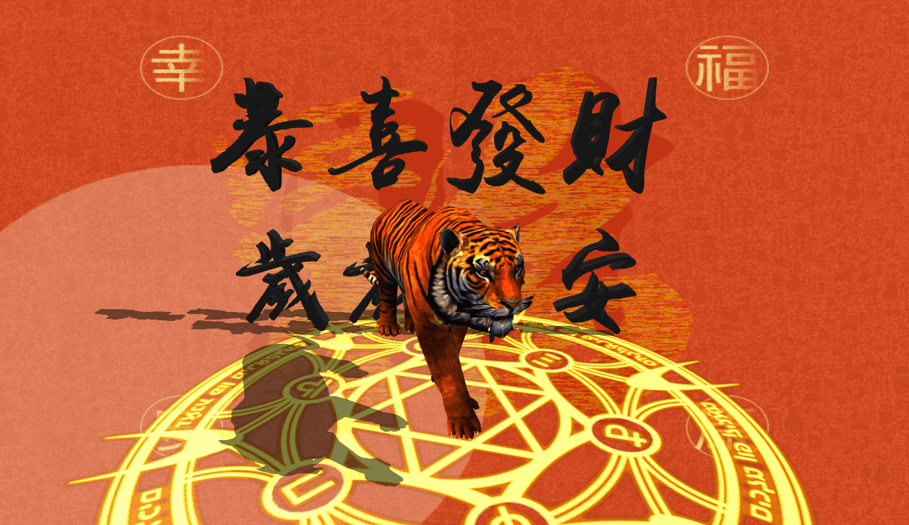
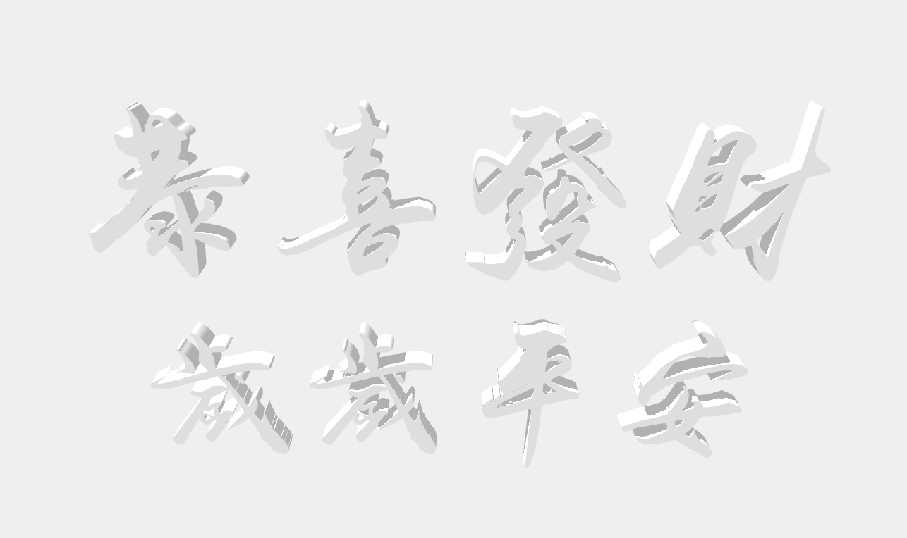
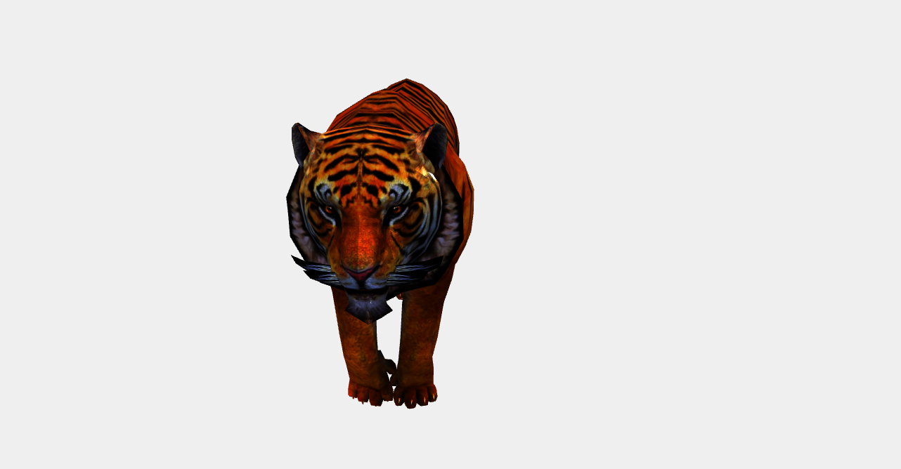
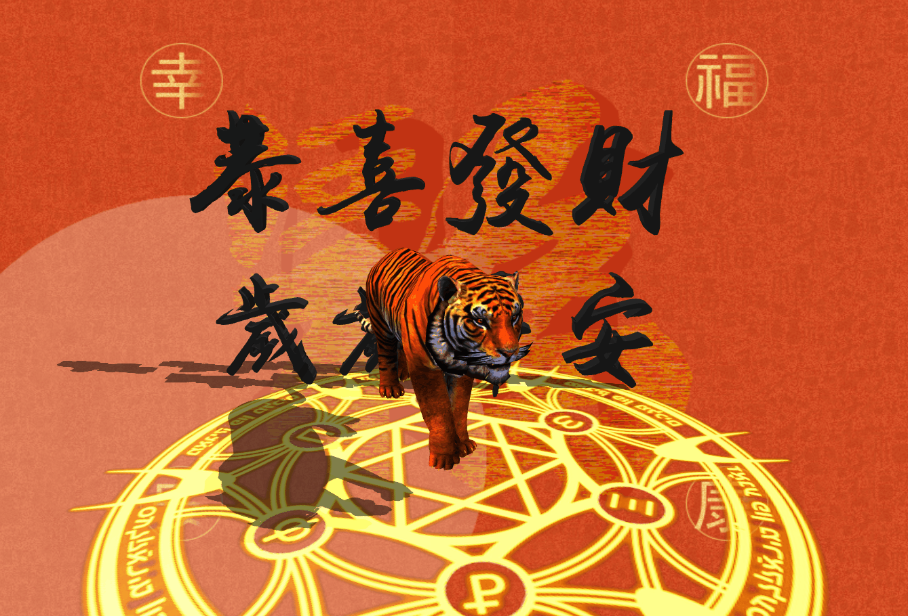

# Three.js 实现虎年春节3D创意页面



## 背景

虎年 `🐅` 春节将至，本文使用 `React` + `Three.js` 技术栈，实现趣味 `3D` 创意页面。本文包含的知识点主要包括：`ShadowMaterial`、 `MeshPhongMaterial` 两种基本材质的使用、使用 `LoadingManager` 展示模型加载进度、`OrbitControls` 的缓动动画、`TWEEN` 简单补间动画效果等。

## 实现

> `👀` 在线预览，已适配移动端：<https://dragonir.github.io/3d/#/lunar>

### 引入资源

其中 `GLTFLoader`、`FBXLoader` 用于加在模型、`OrbitControls` 用户镜头轨道控制、`TWEEN` 用于生成补间动画。

```js
import * as THREE from "three";
import { GLTFLoader } from "three/examples/jsm/loaders/GLTFLoader";
import { FBXLoader } from "three/examples/jsm/loaders/FBXLoader";
import { OrbitControls } from "three/examples/jsm/controls/OrbitControls";
import { TWEEN } from "three/examples/jsm/libs/tween.module.min.js";
```

### 场景初始化

这部分内容主要用于初始化场景和参数，详细讲解可点击文章末尾链接阅读我之前的文章，本文不再赘述。

```js
container = document.getElementById('container');
renderer = new THREE.WebGLRenderer({ antialias: true });
renderer.setPixelRatio(window.devicePixelRatio);
renderer.setSize(window.innerWidth, window.innerHeight);
renderer.shadowMap.enabled = true;
container.appendChild(renderer.domElement);
// 场景
scene = new THREE.Scene();
scene.background = new THREE.TextureLoader().load(bgTexture);
// 雾化效果
scene.fog = new THREE.Fog(0xdddddd, 100, 120);
// 摄像机
camera = new THREE.PerspectiveCamera(60, window.innerWidth / window.innerHeight, 0.1, 1000);
camera.position.set(100, 100, 100);
camera.lookAt(new THREE.Vector3(0, 0, 0));
// 平行光
const cube = new THREE.Mesh(new THREE.BoxGeometry(0.001, 0.001, 0.001), new THREE.MeshLambertMaterial({ color: 0xdc161a }));
cube.position.set(0, 0, 0);
light = new THREE.DirectionalLight(0xffffff, 1);
light.position.set(20, 20, 8);
light.target = cube;
scene.add(light);
// 环境光
const ambientLight = new THREE.AmbientLight(0xffffff);
scene.add(ambientLight);
// 聚光灯
const spotLight = new THREE.SpotLight(0xffffff);
spotLight.position.set(-20, 20, -2);
scene.add(spotLight);
```

#### `💡` Fog 场景雾化

本例中，打开页面时**模型由远及近加载，颜色由白色变为彩色的功能**就是通过 `Fog` 实现的。`Fog` 类定义的是线性雾，雾的密度是随着距离线性增大的，即场景中物体雾化效果随着随距离线性变化。

**构造函数**：`Fog(color, near, far)`。

* `color` 属性: 表示雾的颜色，比如设置为红色，场景中远处物体为黑色，场景中最近处距离物体是自身颜色，最远和最近之间的物体颜色是物体本身颜色和雾颜色的混合效果。
* `near` 属性：表示应用雾化效果的最小距离，距离活动摄像机长度小于 `near` 的物体将不会被雾所影响。
* `far` 属性：表示应用雾化效果的最大距离，距离活动摄像机长度大于 `far` 的物体将不会被雾所影响。

### 创建地面

本例中使用了背景图，我需要一个**既能呈现透明显示背景、又能产生阴影的材质**生成地面，于是使用到 `ShadowMaterial` 材质。

```js
var planeGeometry = new THREE.PlaneGeometry(100, 100);
var planeMaterial = new THREE.ShadowMaterial({ opacity: .5 });
var plane = new THREE.Mesh(planeGeometry, planeMaterial);
plane.rotation.x = -0.5 * Math.PI;
plane.position.set(0, -8, 0);
plane.receiveShadow = true;
scene.add(plane);
```

#### `💡` ShadowMaterial 阴影材质

此材质可以接收阴影，但在其他方面完全透明。

**构造函数**： `ShadowMaterial(parameters: Object)`

* `parameters`：（可选）用于定义材质外观的对象，具有一个或多个属性。

**特殊属性**：

* `.isShadowMaterial[Boolean]`：用于检查此类或派生类是否为阴影材质。默认值为 `true`。因为其通常用在内部优化，所以不应该更改该属性值。
* `.transparent[Boolean]`：定义此材质是否透明。默认值为 `true`。

### 创建魔法阵

在老虎 `🐅` 底部地面创建一个炫酷的旋转**自发光**圆形魔法阵。

```js
cycle = new THREE.Mesh(new THREE.PlaneGeometry(40, 40), new THREE.MeshPhongMaterial({
  map: new THREE.TextureLoader().load(cycleTexture),
  transparent: true
}));
cycle.rotation.x = -0.5 * Math.PI;
cycle.position.set(0, -9, 0);
cycle.receiveShadow = true;
scene.add(cycle);
```

魔法阵的贴图：


#### `💡` MeshPhongMaterial 网格材质

一种用于具有镜面高光的光泽表面的材质。该材质使用非物理的 `Blinn-Phong` 模型来计算反射率。

**构造函数**：`MeshPhongMaterial(parameters: Object)`

* `parameters`：（可选）用于定义材质外观的对象，具有一个或多个属性。

**特殊属性**：

* `.emissive[Color]`：材质的放射（光）颜色，基本上是不受其他光照影响的固有颜色。默认为黑色。
* `.emissiveMap[Texture]`：设置放射（发光）贴图。默认值为 `null`。放射贴图颜色由放射颜色和强度所调节。 如果你有一个放射贴图，请务必将放射颜色设置为黑色以外的其他颜色。
* `.emissiveIntensity[Float]`：放射光强度。调节发光颜色。默认为 `1`。
* `.shininess[Float]`：`specular` 高亮的程度，越高的值越闪亮。默认值为 `30`。
* `.specular[Color]`：材质的高光颜色。默认值为 `0x111111` 的颜色 `Color`。这定义了材质的光泽度和光泽的颜色。
* `.specularMap[Texture]`：镜面反射贴图值会影响镜面高光以及环境贴图对表面的影响程度。默认值为 `null`。

> 与 `MeshLambertMaterial` 中使用的 `Lambertian` 模型不同，该材质可以模拟具有镜面高光的光泽表面（例如涂漆木材）。使用 `Phong` 着色模型计算着色时，会计算每个像素的阴影，与 `MeshLambertMaterial` 使用的 `Gouraud` 模型相比，该模型的结果更准确，但代价是牺牲一些性能。
> `MeshStandardMaterial` 和 `MeshPhysicalMaterial` 也使用这个着色模型。在 `MeshStandardMaterial` 或 `MeshPhysicalMaterial` 上使用此材质时，性能通常会更高 ，但会牺牲一些图形精度。

### 文字模型

使用 `FBXLoader` 来加载**恭喜发财，岁岁平安**字样的 `3D` 文字模型。

```js
const fbxLoader = new FBXLoader();
fbxLoader.load(textModel, mesh => {
  mesh.traverse(child => {
    if (child.isMesh) {
      meshes.push(mesh);
      child.castShadow = true;
      child.receiveShadow = true;
      // 调节材质的金属度、粗糙度、颜色等样式
      child.material.metalness = .2;
      child.material.roughness = .8;
      child.material.color = new THREE.Color(0x111111);
    }
  });
  mesh.position.set(4, 6, -8);
  mesh.rotation.set(-80, 0, 0);
  mesh.scale.set(.32, .32, .32);
  group.add(mesh);
});
```



> `📹` 哔哩哔哩 `3D` 文字生成教程传送门：[iBlender中文版插件 老外教你用汉字中文字体 Font 3D Chinese And Japanese Characters Blender 插件教程](https://www.bilibili.com/video/BV1Sv411871T?from=search&seid=3205263975436057796&spm_id_from=333.337.0.0)

### 老虎模型

老虎模型是 `gltf` 格式，在使用 `GLTFLoader` 加载模型的过程中，发现有 `🕷 bug`，`loader` 无法读取到模型体积的 `total` 值，于是使用通用加载器 `LoadingManager` 来管理模型加载进度。

```js
const manager = new THREE.LoadingManager();
manager.onStart = (url, loaded, total) => {};
manager.onLoad = () => {};
manager.onProgress = async(url, loaded, total) => {
  if (Math.floor(loaded / total * 100) === 100) {
    this.setState({ loadingProcess: Math.floor(loaded / total * 100) });
  } else {
    this.setState({ loadingProcess: Math.floor(loaded / total * 100) });
  }
};
const gltfLoader = new GLTFLoader(manager);
gltfLoader.load(tigerModel, mesh => {
  mesh.scene.traverse(child => {
    if (child.isMesh) {
      child.castShadow = true;
      child.material.metalness = 0;
      child.material.roughness = .8;
      child.material.transparent = true;
      child.material.side = THREE.DoubleSide;
      child.material.color = new THREE.Color(0xffffff);
    }
  });
  mesh.scene.rotation.y = Math.PI * 9 / 8;
  mesh.scene.position.set(0, -4, 2);
  mesh.scene.scale.set(.75, .75, .75);
  // 💡 加载模型自身动画
  let meshAnimation = mesh.animations[0];
  mixer = new THREE.AnimationMixer(mesh.scene);
  let animationClip = meshAnimation;
  let clipAction = mixer.clipAction(animationClip).play();
  animationClip = clipAction.getClip();
  group.add(mesh.scene);
  scene.add(group)
});
```



#### `💡` LoadingManager 加载器管理器

它的功能是处理并跟踪已加载和待处理的数据。如果未手动设置加强管理器，则会为加载器创建和使用默认全局实例加载器管理器。一般来说，默认的加载管理器已足够使用了，但有时候也需要设置单独的加载器，比如，你想为对象和纹理显示单独的加载条时。

**构造方法**：`LoadingManager(onLoad: Function, onProgress: Function, onError: Function)`

* `onLoad`：可选，所有加载器加载完成后，将调用此函数。
* `onProgress`：可选，当每个项目完成后，将调用此函数。
* `onError`：可选，当一个加载器遇到错误时，将调用此函数。

**属性**：

* `.onStart[Function]`：加载开始时被调用。参数: `url` 被加载的项的`url`；`itemsLoaded` 目前已加载项的个数；`itemsTotal` 总共所需要加载项的个数。此方法默认未定义。
* `.onLoad[Function]`：所有的项加载完成后将调用此函数。默认情况下，此方法时未定义的，除非在构造函数中进行传递。
* `.onProgress[Function]`：此方法加载每一个项，加载完成时进行调用。参数：`url` 被加载的项的 `url`；`itemsLoaded` 目前已加载项的个数；`itemsTotal` 总共所需要加载项的个数。默认情况下，此方法时未定义的，除非在构造函数中进行传递。
* `.onError[Function]`：此方法将在任意项加载错误时调用。参数：`url` 所加载出错误的项的 `url`。默认情况下，此方法时未定义的，除非在构造函数中进行传递。

### 添加镜头移动补间动画

模型加载完成后，通过结合使用 `TWEEN.js` 实现相机 `📷` 移动实现漫游，也就是打开页面时看到的**模型由远及近逐渐变大**的动画效果。

```js
const Animations = {
  animateCamera: (camera, controls, newP, newT, time = 2000, callBack) => {
    var tween = new TWEEN.Tween({
      x1: camera.position.x,
      y1: camera.position.y,
      z1: camera.position.z,
      x2: controls.target.x,
      y2: controls.target.y,
      z2: controls.target.z,
    });
    tween.to({
      x1: newP.x,
      y1: newP.y,
      z1: newP.z,
      x2: newT.x,
      y2: newT.y,
      z2: newT.z,
    }, time);
    tween.onUpdate(function (object) {
      camera.position.x = object.x1;
      camera.position.y = object.y1;
      camera.position.z = object.z1;
      controls.target.x = object.x2;
      controls.target.y = object.y2;
      controls.target.z = object.z2;
      controls.update();
    });
    tween.onComplete(function () {
      controls.enabled = true;
      callBack();
    });
    tween.easing(TWEEN.Easing.Cubic.InOut);
    tween.start();
  },
}
export default Animations;
```

调用示例：

```js
Animations.animateCamera(camera, controls, { x: 0, y: 5, z: 21 }, { x: 0, y: 0, z: 0 }, 2400, () => {});
```

#### `💡` TWEEN.js

是一个补间动画库，可以实现很多动画效果。它使一个对象在一定时间内从一个状态缓动变化到另外一个状态。`TWEEN.js` 本质就是一系列缓动函数算法，结合`Canvas`、`Three.js` 很简单就能实现很多效果。

**基本使用**：

```js
var tween = new TWEEN.Tween({x: 1})     // position: {x: 1}
.delay(100)                             // 等待100ms
.to({x: 200}, 1000)                     // 1s时间，x到200
.onUpdate(render)                       // 变更期间执行render方法
.onComplete(() => {})                   // 动画完成
.onStop(() => {})                       // 动画停止
.start();                               // 开启动画
```

`📌` 要让动画真正动起来，需要在 `requestAnimationFrame` 中调用 `update` 方法。

```js
TWEEN.update()
```

**缓动类型**：

`TWEEN.js` 最强大的地方在于提供了很多常用的缓动动画类型，由 `api easing()` 指定。如示例中用到的：

```js
tween.easing(TWEEN.Easing.Cubic.InOut);
```

**链式调用**：

`TWEEN.js` 支持链式调用，如在 `动画A` 结束后要执行 `动画B`，可以这样 `tweenA.chain(tweenB)` 利用链式调用创建往复来回循环的动画：

```js
var tweenA = new TWEEN.Tween(position).to({x: 200}, 1000);
var tweenB = new TWEEN.Tween(position).to({x: 0}, 1000);
tweenA.chain(tweenB);
tweenB.chain(tweenA);
tweenA.start();
```

### 控制器缓动移动

`controls.enableDamping` 设置为 `true` 可以开启鼠标移动场景时的缓动效果，产生运动惯性，开启后 `3D` 更具真实感。

```js
controls = new OrbitControls(camera, renderer.domElement);
controls.target.set(0, 0, 0);
controls.enableDamping = true;
controls.maxDistance = 160;
```

#### `💡` THREE.OrbitControls 参数控制一览

```js
//鼠标控制是否可用
controls.enabled = true;
//聚焦坐标
controls.target = new THREE.Vector3();
//最大最小相机移动距离（PerspectiveCamera 景深相机）
controls.minDistance = 0;
controls.maxDistance = Infinity;
//最大最小鼠标缩放大小（OrthographicCamera正交相机）
controls.minZoom = 0;
controls.maxZoom = Infinity;
//最大仰视角和俯视角，范围是0到Math.PI
controls.minPolarAngle = 0;
controls.maxPolarAngle = Math.PI;
//水平方向视角限制，范围[-Math.PI, Math.PI]
controls.minAzimuthAngle = - Infinity;
controls.maxAzimuthAngle = Infinity;
//惯性滑动，滑动大小默认0.25，若开启，那么controls.update()需要加到动画循环函数中
controls.enableDamping = false;
controls.dampingFactor = 0.25;
//滚轮是否可控制zoom，zoom速度默认1
controls.enableZoom = true;
controls.zoomSpeed = 1.0;
//是否可旋转，旋转速度
controls.enableRotate = true;
controls.rotateSpeed = 1.0;
//是否可平移，默认移动速度为7px
controls.enablePan = true;
// 点击箭头键时移动的像素值
controls.keyPanSpeed = 7.0;
//是否自动旋转，自动旋转速度。默认每秒30圈，如果是enabled，那么controls.update()需要加到动画循环函数中
controls.autoRotate = false;
// 当fps为60时每转30s
controls.autoRotateSpeed = 2.0;
//是否能使用键盘
controls.enableKeys = true;
//默认键盘控制上下左右的键
controls.keys = { LEFT: 37, UP: 38, RIGHT: 39, BOTTOM: 40 };
//鼠标点击按钮
controls.mouseButtons = { ORBIT: THREE.MOUSE.LEFT, ZOOM: THREE.MOUSE.MIDDLE, PAN: THREE.MOUSE.RIGHT };
```

最后不要忘记添加窗口缩放适配方法和 `requestAnimationFrame` 更新方法。

```js
function onWindowResize() {
  camera.aspect = window.innerWidth / window.innerHeight;
  camera.updateProjectionMatrix();
  renderer.setSize(window.innerWidth, window.innerHeight);
}
function animate() {
  requestAnimationFrame(animate);
  renderer.render(scene, camera);
  let time = clock.getDelta();
  // 老虎动画
  mixer && mixer.update(time);
  // 补间动画
  TWEEN && TWEEN.update();
  // 控制器
  controls && controls.update();
  // 魔法阵
  cycle && (cycle.rotation.z += .01);
}
```

### Loading 页3D文字样式

`3D` 文字样式主要通过叠加多层 `text-shadow` 实现的。

```css
.loading {
  font-size: 64px;
  color: #FFFFFF;
  text-shadow:     0 1px 0 hsl(174,5%,80%),
                   0 2px 0 hsl(174,5%,75%),
                   0 3px 0 hsl(174,5%,70%),
                   0 4px 0 hsl(174,5%,66%),
                   0 5px 0 hsl(174,5%,64%),
                   0 6px 0 hsl(174,5%,62%),
                   0 7px 0 hsl(174,5%,61%),
                   0 8px 0 hsl(174,5%,60%),
                   0 0 5px rgba(0,0,0,.05),
                  0 1px 3px rgba(0,0,0,.2),
                  0 3px 5px rgba(0,0,0,.2),
                 0 5px 10px rgba(0,0,0,.2),
                0 10px 10px rgba(0,0,0,.2),
                0 20px 20px rgba(0,0,0,.3);
}
```


## 效果

最终实现效果如下图所示，大家感兴趣可在线预览，已适配移动端。被这张加速的 `小脑斧🐅` 动图笑死。



## 总结

本文中主要涉及到的知识点包括：

* `Fog` 场景雾化
* `ShadowMaterial` 阴影材质
* `MeshPhongMaterial` 网格材质
* `LoadingManager` 加载器管理器
* `TWEEN.js` 补间动画
* `THREE.OrbitControls` 参数控制
* `CSS` `3D` 文字样式

## 附录

想了解场景初始化、光照、阴影及其他网格几何体的相关知识，可阅读我的其他文章。如果觉得文章对你有帮助，不要忘了 `一键三连😂`。

* [1]. [Three.js 实现虎年春节3D创意页面](https://juejin.cn/post/7051745314914435102)
* [2]. [Three.js 实现脸书元宇宙3D动态Logo](https://juejin.cn/post/7031893833163997220)
* [3]. [Three.js 实现3D全景侦探小游戏](https://juejin.cn/post/7042298964468564005)
* [4]. [使用Three.js实现炫酷的酸性风格3D页面](https://juejin.cn/post/7012996721693163528)
