# Three.js 实现3D开放世界小游戏：阿狸的多元宇宙 🦊


> 声明：本文涉及图文和模型素材仅用于个人学习、研究和欣赏，请勿二次修改、非法传播、转载、出版、商用、及进行其他获利行为。

## 背景

> **2545光年**之外的**开普勒1028星系**，有一颗色彩斑斓的宜居星球 `🌑`，星际移民 `👨‍🚀` 必须穿戴**基地**发放的防辐射服才能生存。阿狸 `🦊` 驾驶星际飞行器 `🚀` 降临此地，快帮它在限定时间内使用**轮盘**移动**找到基地**获取防辐射服吧！

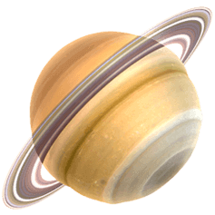

本文使用 `Three.js + React + CANNON` 技术栈，实现通过滑动屏幕控制模型在 `3D` 世界里运动的 `Low Poly` 低多边形风格小游戏。本文主要涉及到的知识点包括：`Three.js` 阴影类型、创建粒子系统、`cannon.js` 基本用法、使用 `cannon.js` 高度场 `Heightfield` 创建地形、通过轮盘移动控制模型动画等。

## 效果

* **游戏玩法**：点击开始游戏按钮，通过操作屏幕底部轮盘来移动阿狸，在倒计时限定时间内找到基地。
* **主线任务**：限定时间内找到庇护所。
* **支线任务**：自由探索开放世界。

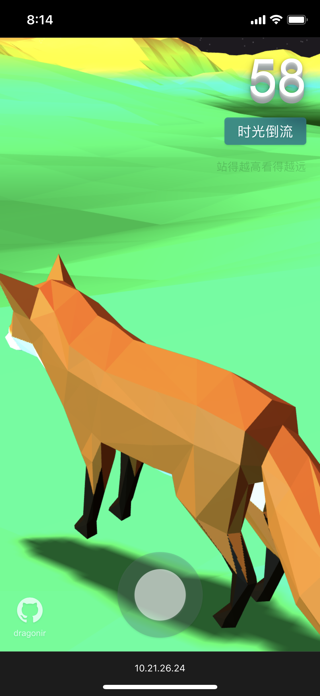

**在线预览**：

* `👀` 地址1：<https://3d-eosin.vercel.app/#/metaverse>
* `👀` 地址2：<https://dragonir.github.io/3d/#/metaverse>

已适配:

* `💻` `PC` 端
* `📱` 移动端

> `🚩` 小提示：站得越高看得越远，隐隐约约听说基地位于初始位置的**西面**，开始时应该向左前方前进哦。

## 设计

游戏流程如下图所示：页面加载完成后玩家 `👨‍🚀` 点击开始按钮，然后在限定时间内通过控制页面底部轮盘 `🕹` 移动模型，找到目标基地所在的位置。寻找成功或失败都会显示结果页 `🏆`，结果上面有两个按钮**再试一次**和**自由探索**，点击**再试一次**时间会重置，然后重新回到起点开始倒计时。点击**自由探索**则不在计时，玩家可以在 `3D` 开放世界里操作模型自由探索。同时，游戏内页面也提供一个**时光倒流**按钮，它的作用是玩家 `👨‍🚀` 可以在失败前自己手动重置倒计时 `⏳`，重新回到起点开始游戏。

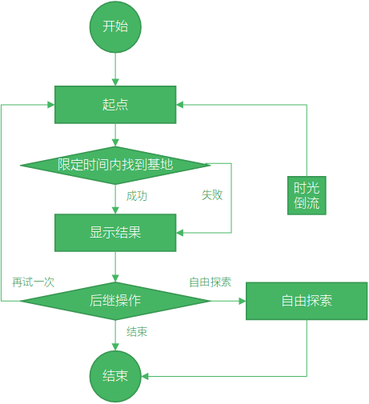

## 实现

### 加载资源

加载开发所需的必备资源：`GLTFLoader` 用于加载狐狸 `🦊` 和基地 `🏠` 模型、`CANNON` 是用于创建 `3D` 世界的物理引擎；`CannonHelper` 是对 `CANNON` 一些使用方法的封装；`JoyStick` 用于创建通过监听鼠标移动位置或触碰屏幕产生的位移来控制模型移动的轮盘 `🕹`。

```js
import * as THREE from 'three';
import { GLTFLoader } from 'three/examples/jsm/loaders/GLTFLoader';
import CANNON from 'cannon';
import CannonHelper from './scripts/CannonHelper';
import JoyStick from './scripts/JoyStick';
```

### 页面结构

页面结构比较简单，`.webgl` 用于渲染 `WEBGL`；`.tool` 是游戏内的工具栏，用于重置游戏和显示一些提示语；`.loading` 是游戏加载页面，用来显示游戏加载进度、介绍游戏规则、显示游戏开始按钮；`.result` 是游戏结果页面，用于显示游戏成功或失败结果，并提供**再试一次**和**自由探索**两个按钮 `🔘`。

```js
(<div id="metaverse">
  <canvas className='webgl'></canvas>
  <div className='tool'>
    <div className='countdown'>{ this.state.countdown }</div>
    <button className='reset_button' onClick={this.resetGame}>时光倒流</button>
    <p className='hint'>站得越高看得越远</p>
  </div>
  { this.state.showLoading ? (<div className='loading'>
    <div className='box'>
      <p className='progress'>{this.state.loadingProcess} %</p>
      <p className='description'>游戏描述</p>
      <button className='start_button' style={{'visibility': this.state.loadingProcess === 100 ? 'visible' : 'hidden'}} onClick={this.startGame}>开始游戏</button>
    </div>
  </div>) : '' }
  { this.state.showResult ? (<div className='result'>
    <div className='box'>
      <p className='text'>{ this.state.resultText }</p>
      <button className='button' onClick={this.resetGame}>再试一次</button>
      <button className='button' onClick={this.discover}>自由探索</button>
    </div>
  </div>) : '' }
</div>)
```

### 数据初始化

数据变量包括加载进度、是否显示加载页面、是否显示结果页、结果页文案、倒计时、是否开启自由探索等。

```js
state = {
  loadingProcess: 0,
  showLoading: true,
  showResult: false,
  resultText: '失败',
  countdown: 60,
  freeDiscover: false
}
```

### 场景初始化

初始化场景 `🏔`、相机 `📷`、光源 `💡`。

```js
const renderer = new THREE.WebGLRenderer({
  canvas: document.querySelector('canvas.webgl'),
  antialias: true,
  alpha: true
});
renderer.setSize(window.innerWidth, window.innerHeight);
renderer.setPixelRatio(Math.min(window.devicePixelRatio, 2));
renderer.shadowMap.enabled = true;
renderer.shadowMap.type = THREE.PCFSoftShadowMap;
const scene = new THREE.Scene();
// 添加主相机
const camera = new THREE.PerspectiveCamera(45, window.innerWidth / window.innerHeight, .01, 100000);
camera.position.set(1, 1, -1);
camera.lookAt(scene.position);
// 添加环境光
const ambientLight = new THREE.AmbientLight(0xffffff, .4);
scene.add(ambientLight)
// 添加平行光
var light = new THREE.DirectionalLight(0xffffff, 1);
light.position.set(1, 1, 1).normalize();
scene.add(light);
```

#### `💡` Three.js 阴影类型

本文使用了 `THREE.PCFSoftShadowMap` 以开启效果更加柔和的阴影，`Three.js` 提供以下几种阴影类型：

* `THREE.BasicShadowMap`：提供未经过滤的阴影贴图，性能最快，但质量最低。
* `THREE.PCFShadowMap`：使用 `Percentage-Closer Filtering (PCF)` 算法过滤阴影贴图，是默认类型。
* `THREE.PCFSoftShadowMap`：使用 `PCF` 算法过滤的更加柔和的阴影贴图，尤其是在使用低分辨率阴影贴图时。
* `THREE.VSMShadowMap`：使用方差阴影贴图 `VSM` 算法过滤的阴影贴图。 使用 `VSMShadowMap` 时，所有阴影接收者也会投射阴影。

### 创建世界

使用 `Cannon.js` 初始化物理世界 `🌏`。

```js
// 初始化物理世界
const world = new CANNON.World();
// 在多个步骤的任意轴上测试刚体的碰撞
world.broadphase = new CANNON.SAPBroadphase(world);
// 设置物理世界的重力为沿y轴向上-10米每二次方秒
world.gravity.set(0, -10, 0);
// 创建默认联系材质
world.defaultContactMaterial.friction = 0;
const groundMaterial = new CANNON.Material("groundMaterial");
const wheelMaterial = new CANNON.Material("wheelMaterial");
const wheelGroundContactMaterial = new CANNON.ContactMaterial(wheelMaterial, groundMaterial, {
  // 摩擦系数
  friction: 0,
  // 恢复系数
  restitution: 0,
  // 接触刚度
  contactEquationStiffness: 1000
});
world.addContactMaterial(wheelGroundContactMaterial);
```

#### `💡` Cannon.js

`Cannon.js` 是用 `JavaScript` 实现的物理引擎库，可以与任何支持浏览器的渲染或游戏引擎，可以用于模拟刚体，实现 `3D` 世界 `🌏` 中更加真实的物理形式的移动和交互。更多 `Cannon.js` 相关 `API` 文档和示例可以参考文章末尾链接。

### 创建星空

创建 `1000` 个粒子用于模型星空 `✨`，并将它们添加到场景中。本示例中通过着色器形式创建粒子，这样更有利于 `GPU` 渲染效率。

```js
const textureLoader = new THREE.TextureLoader();
const shaderPoint = THREE.ShaderLib.points;
const uniforms = THREE.UniformsUtils.clone(shaderPoint.uniforms);
uniforms.map.value = textureLoader.load(snowflakeTexture);
for (let i = 0; i < 1000; i++) {
  sparkGeometry.vertices.push(new THREE.Vector3());
}
const sparks = new THREE.Points(new THREE.Geometry(), new THREE.PointsMaterial({
  size: 2,
  color: new THREE.Color(0xffffff),
  map: uniforms.map.value,
  blending: THREE.AdditiveBlending,
  depthWrite: false,
  transparent: true,
  opacity: 0.75
}));
sparks.scale.set(1, 1, 1);
sparks.geometry.vertices.map(spark => {
  spark.y = randnum(30, 40);
  spark.x = randnum(-500, 500);
  spark.z = randnum(-500, 500);
  return true;
});
scene.add(sparks);
```

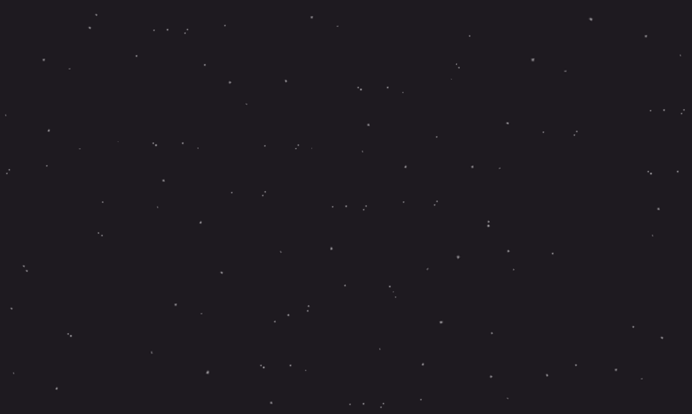

### 创建地形

通过 `CANNON.Heightfield` 高度场创建 `128 x 128 x 60` 可视化渐变色地形。地形的凹凸起伏状态是通过以下高度图 `HeightMap` 实现，它是一张黑白图片 `🖼`，通过像素点的颜色深浅来记录高度信息，根据高度图数据信息创建地形网格。可通过文章末尾提供的链接在线生成随机高度图。地形生成完成并将它添加到世界 `🌏` 中，然后在 `animate` 方法中页面重绘时调用 `check` 方法，用于检测和更新模型在地形上的位置。


```js
const cannonHelper = new CannonHelper(scene);
var sizeX = 128, sizeY = 128, minHeight = 0, maxHeight = 60, check = null;
Promise.all([
  // 加载高度图
  img2matrix.fromUrl(heightMapImage, sizeX, sizeY, minHeight, maxHeight)(),
]).then(function (data) {
  var matrix = data[0];
  // 地形体
  const terrainBody = new CANNON.Body({ mass: 0 });
  // 地形形状
  const terrainShape = new CANNON.Heightfield(matrix, { elementSize: 10 });
  terrainBody.addShape(terrainShape);
  // 地形位置
  terrainBody.position.set(-sizeX * terrainShape.elementSize / 2, -10, sizeY * terrainShape.elementSize / 2);
  // 设置从轴角度
  terrainBody.quaternion.setFromAxisAngle(new CANNON.Vec3(1, 0, 0), -Math.PI / 2);
  world.add(terrainBody);
  // 将生成的地形刚体可视化
  cannonHelper.addVisual(terrainBody, 'landscape');
  var raycastHelperGeometry = new THREE.CylinderGeometry(0, 1, 5, 1.5);
  raycastHelperGeometry.translate(0, 0, 0);
  raycastHelperGeometry.rotateX(Math.PI / 2);
  var raycastHelperMesh = new THREE.Mesh(raycastHelperGeometry, new THREE.MeshNormalMaterial());
  scene.add(raycastHelperMesh);
  // 使用 Raycaster检测并更新模型在地形上的位置
  check = () => {
    var raycaster = new THREE.Raycaster(target.position, new THREE.Vector3(0, -1, 0));
    var intersects = raycaster.intersectObject(terrainBody.threemesh.children[0]);
    if (intersects.length > 0) {
      raycastHelperMesh.position.set(0, 0, 0);
      raycastHelperMesh.lookAt(intersects[0].face.normal);
      raycastHelperMesh.position.copy(intersects[0].point);
    }
    target.position.y = intersects && intersects[0] ? intersects[0].point.y + 0.1 : 30;
    var raycaster2 = new THREE.Raycaster(shelterLocation.position, new THREE.Vector3(0, -1, 0));
    var intersects2 = raycaster2.intersectObject(terrainBody.threemesh.children[0]);
    shelterLocation.position.y = intersects2 && intersects2[0] ? intersects2[0].point.y + .5 : 30;
    shelterLight.position.y = shelterLocation.position.y + 50;
    shelterLight.position.x = shelterLocation.position.x + 5
    shelterLight.position.z = shelterLocation.position.z;
  }
});
```

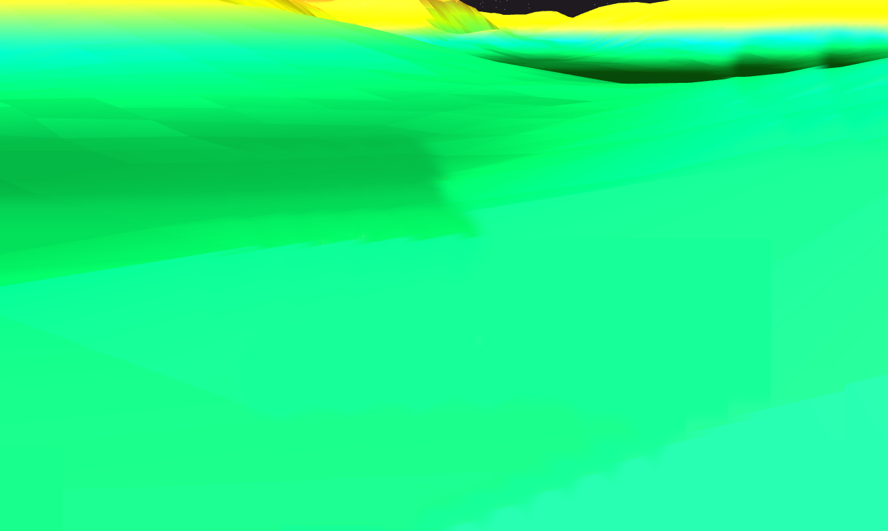

#### `💡` CANNON.Heightfield

本示例中凹凸不平的地形是通过 `CANNON.Heightfield` 实现的，它是 `Cannon.js` 物理引擎的高度场。在物理学中把**某个物理量在空间中一个区域内的分布**称为**场**，高度场就是与高度相关的场。`Heightfield` 的高度就是关于两个变量的函数，可以表达为 `HEIGHT(i,j)`。

```js
Heightfield(data, options)
```

* `data` 是一个 `y值` 数组，将用于构建地形。
* `options` 是一个配置项，有三个可配置参数：
  * `minValue` 是数据数组中数据点的最小值。如果未给出，将自动计算。
  * `maxValue` 最大值。
  * `elementSize` 是 `x轴` 方向上数据点之间的世界间距。

### 加载进度管理

使用 `LoadingManager` 管理加载进度，当页面模型加载完成之后，加载进度页面显示**开始游戏菜单**。

```js
const loadingManager = new THREE.LoadingManager();
loadingManager.onProgress = async (url, loaded, total) => {
  this.setState({ loadingProcess: Math.floor(loaded / total * 100) });
};
```

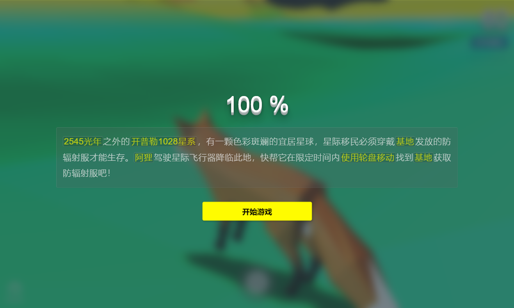

### 创建基地模型

加载基地模型 `🏠` 前先创建一个 `shelterLocation` 网格用来放置基地模型，该网格对象还用于后续地形检测。然后使用 `GLTFLoader` 加载基地模型，然后把它添加到 `shelterLocation` 网格上。最后添加一个 `PointLight` `💡` 给基地模型添加彩色点光源，添加一个 `DirectionalLight` `💡` 用于生成阴影。

```js
const shelterGeometry = new THREE.BoxBufferGeometry(0.15, 2, 0.15);
const shelterLocation = new THREE.Mesh(shelterGeometry, new THREE.MeshNormalMaterial({
  transparent: true,
  opacity: 0
}));
shelterLocation.position.set(this.shelterPosition.x, this.shelterPosition.y, this.shelterPosition.z);
shelterLocation.rotateY(Math.PI);
scene.add(shelterLocation);
// 加载模型
gltfLoader.load(Shelter, mesh => {
  mesh.scene.traverse(child => {
    child.castShadow = true;
  });
  mesh.scene.scale.set(5, 5, 5);
  mesh.scene.position.y = -.5;
  shelterLocation.add(mesh.scene)
});
// 添加光源
const shelterPointLight = new THREE.PointLight(0x1089ff, 2);
shelterPointLight.position.set(0, 0, 0);
shelterLocation.add(shelterPointLight);
const shelterLight = new THREE.DirectionalLight(0xffffff, 0);
shelterLight.position.set(0, 0, 0);
shelterLight.castShadow = true;
shelterLight.target = shelterLocation;
scene.add(shelterLight);
```

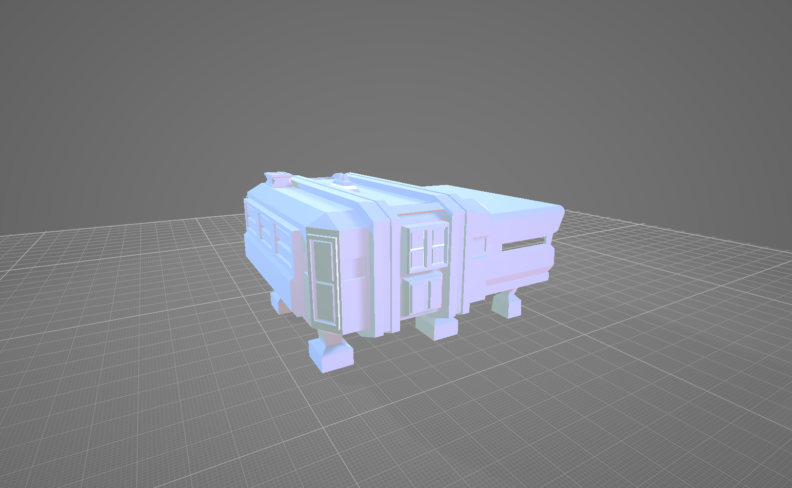

### 创建阿狸模型

狐狸 `🦊` 模型的加载也是类似的，需要先创建一个目标网格，后续用于地形检测，然后把狐狸 `🦊` 模型添加到目标网格上。狐狸 `🦊` 模型完成加载后，需要保存它的 `clip1`、 `clip1` 两种动画效果，后续需要通过判断轮盘 `🕹` 的移动状态来判断播放哪种动画。最后添加一个 `DirectionalLight` `💡` 光源来产生阴影。

```js
var geometry = new THREE.BoxBufferGeometry(.5, 1, .5);
geometry.applyMatrix4(new THREE.Matrix4().makeTranslation(0, .5, 0));
const target = new THREE.Mesh(geometry, new THREE.MeshNormalMaterial({
  transparent: true,
  opacity: 0
}));
scene.add(target);

var mixers = [], clip1, clip2;
const gltfLoader = new GLTFLoader(loadingManager);
gltfLoader.load(foxModel, mesh => {
  mesh.scene.traverse(child => {
    if (child.isMesh) {
      child.castShadow = true;
      child.material.side = THREE.DoubleSide;
    }
  });
  var player = mesh.scene;
  player.position.set(this.playPosition.x, this.playPosition.y, this.playPosition.z);
  player.scale.set(.008, .008, .008);
  target.add(player);
  var mixer = new THREE.AnimationMixer(player);
  clip1 = mixer.clipAction(mesh.animations[0]);
  clip2 = mixer.clipAction(mesh.animations[1]);
  clip2.timeScale = 1.6;
  mixers.push(mixer);
});

const directionalLight = new THREE.DirectionalLight(new THREE.Color(0xffffff), .5);
directionalLight.position.set(0, 1, 0);
directionalLight.castShadow = true;
directionalLight.target = target;
target.add(directionalLight);
```

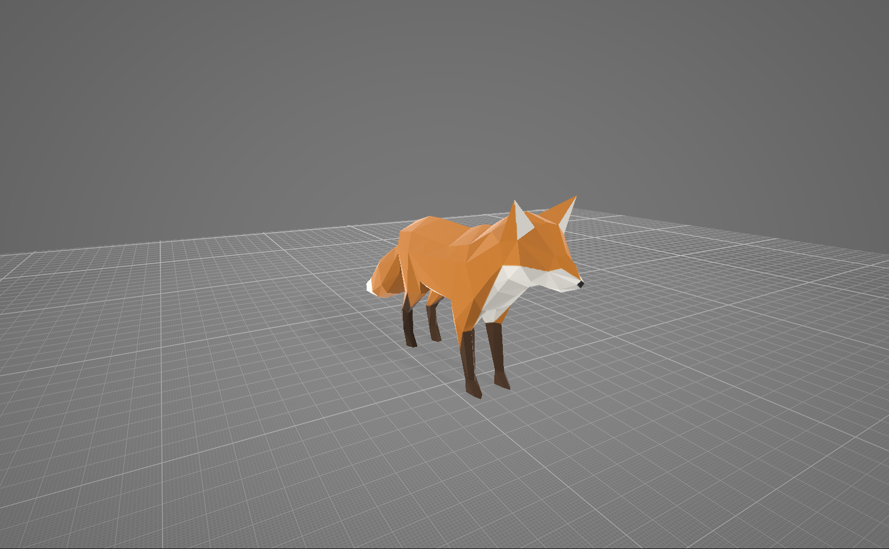

### 控制阿狸运动

使用轮盘控制器移动阿狸 `🦊` 模型时，实时更新模型的方向，若轮盘产生位移，更新模型位移并播放奔跑动画，否则播放禁止动画。同时根据模型目标的位置，实时更新相机 `📷` 的位置，生成第三人称视角。轮盘移动控制模型移动功能是通过引入 `JoyStick` 类来实现，它的主要实现原理是监听鼠标或点触位置，然后通过计算映射到模型位置变化上。

```js
var setup = { forward: 0, turn: 0 };
new JoyStick({ onMove: (forward, turn) => {
  setup.forward = forward;
  setup.turn = -turn;
}});
const updateDrive = (forward = setup.forward, turn = setup.turn) => {
  let maxSteerVal = 0.05;
  let maxForce = .15;
  let force = maxForce * forward;
  let steer = maxSteerVal * turn;
  if (forward !== 0) {
    target.translateZ(force);
    clip2 && clip2.play();
    clip1 && clip1.stop();
  } else {
    clip2 && clip2.stop();
    clip1 && clip1.play();
  }
  target.rotateY(steer);
}
// 生成第三人称视角
const followCamera = new THREE.Object3D();
followCamera.position.copy(camera.position);
scene.add(followCamera);
followCamera.parent = target;
const updateCamera = () => {
  if (followCamera) {
    camera.position.lerp(followCamera.getWorldPosition(new THREE.Vector3()), 0.1);
    camera.lookAt(target.position.x, target.position.y + .5, target.position.z);
  }
}
```

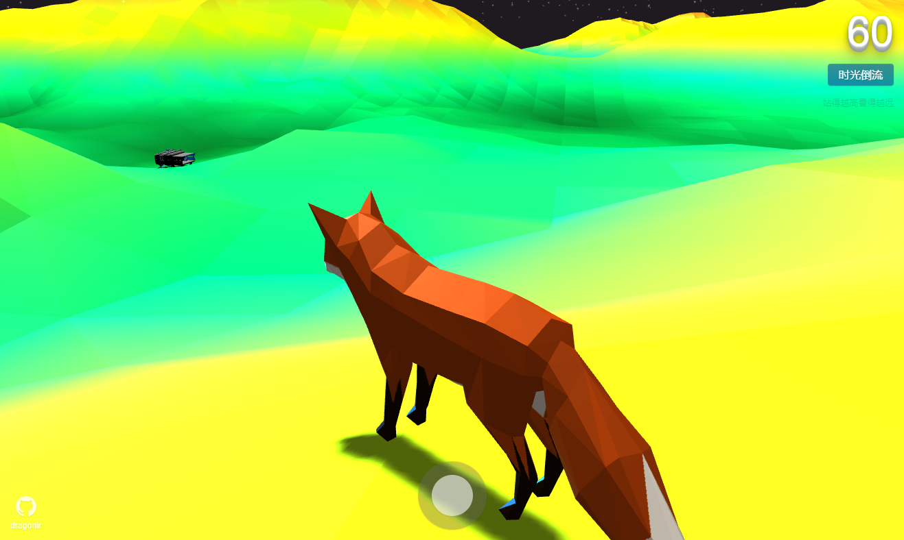

> `🚩` 轮盘控制器 `JoyStick` 类具体实现可参考文章末尾 `Codepen` 链接 [5]。

### 动画更新

在页面重绘动画中，更新相机、模型状态、`Cannon` 世界、场景渲染等。

```js
var clock = new THREE.Clock();
var lastTime;
var fixedTimeStep = 1.0 / 60.0;
const animate = () => {
  updateCamera();
  updateDrive();
  let delta = clock.getDelta();
  mixers.map(x => x.update(delta));
  let now = Date.now();
  lastTime === undefined && (lastTime = now);
  let dt = (Date.now() - lastTime) / 1000.0;
  lastTime = now;
  world.step(fixedTimeStep, dt);
  cannonHelper.updateBodies(world);
  check && check();
  renderer.render(scene, camera);
  requestAnimationFrame(animate);
};
```

### 页面缩放适配

页面产生缩放时，更新渲染场景 `🏔` 和相机 `📷`。

```js
window.addEventListener('resize', () => {
  var width = window.innerWidth, height = window.innerHeight;
  renderer.setSize(width, height);
  camera.aspect = width / height;
  camera.updateProjectionMatrix();
}, false);
```

到此，游戏三维世界 `🌏` 已经全部实现完毕了。

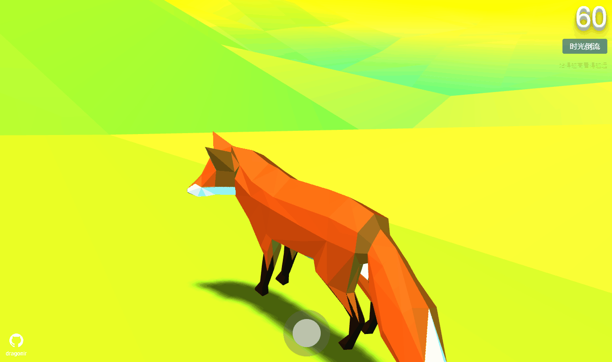

### 添加游戏逻辑

根据前面的游戏流程设计，现在添加游戏逻辑，开始游戏时重置数据并开始 `60s` 倒计时 `⏳` ；重置游戏时将阿狸 `🦊` 位置、方向及相机位置设置为初始状态；自由探索时开启自由探索状态，并清除倒计时。`⏳`

```js
startGame = () => {
  this.setState({
    showLoading : false,
    showResult: false,
    countdown: 60,
    resultText: '失败',
    freeDiscover: false
  },() => {
    this.interval = setInterval(() => {
      if (this.state.countdown > 0) {
        this.setState({
          countdown: --this.state.countdown
        });
      } else {
        clearInterval(this.interval)
        this.setState({
          showResult: true
        });
      }
    }, 1000);
  });
}
resetGame = () => {
  this.player.position.set(this.playPosition.x, this.playPosition.y, this.playPosition.z);
  this.target.rotation.set(0, 0, 0);
  this.target.position.set(0, 0, 0);
  this.camera.position.set(1, 1, -1);
  this.startGame();
}
discover = () => {
  this.setState({
    freeDiscover: true,
    showResult: false,
    countdown: 60
  }, () => {
    clearInterval(this.interval);
  });
}
```

### 毛玻璃效果

`Loading` 页面、结果页面以及回到过去按钮都采用了**毛玻璃效果**样式 `💧`，通过以下几行样式代码，即可实现惊艳的毛玻璃。

```stylus
background rgba(0, 67, 170, .5)
backdrop-filter blur(10px)
filter drop-shadow(0px 1px 1px rgba(0, 0, 0, .25))
```

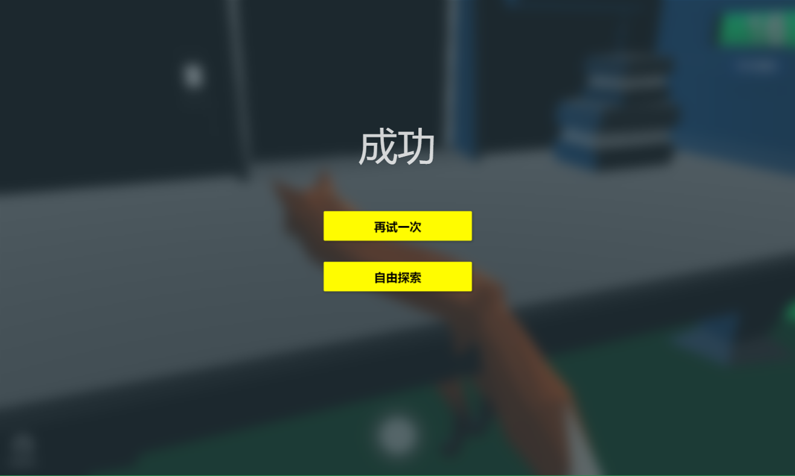

## 总结

本文涉及到的新知识点主要包括：

* `Three.js` 阴影类型
* 创建粒子系统
* `cannon.js` 基本用法
* 使用 `cannon.js` 高度场 `Heightfield` 创建地形
* 通过轮盘移动控制模型动画

> 想了解场景初始化、光照、阴影、基础几何体、网格、材质及其他**Three.js**的相关知识，可阅读我往期文章。**转载请注明原文地址和作者**。如果觉得文章对你有帮助，不要忘了**一键三连哦 👍**。

## 附录

* [1]. [Three.js 火焰效果实现艾尔登法环动态logo](https://juejin.cn/post/7077726955528781832)
* [2]. [Three.js 实现神奇的3D文字悬浮效果](https://juejin.cn/post/7072899771819622413)
* [3]. [Three.js 实现让二维图片具有3D效果](https://juejin.cn/post/7067344398912061454)
* [4]. [Three.js 实现2022冬奥主题3D趣味页面，冰墩墩 🐼](https://juejin.cn/post/7060292943608807460)
* [5]. [Three.js 制作一个专属3D奖牌](https://juejin.cn/post/7055079293247815711)
* [6]. [Three.js 实现虎年春节3D创意页面](https://juejin.cn/post/7051745314914435102)
* [7]. [Three.js 实现脸书元宇宙3D动态Logo](https://juejin.cn/post/7031893833163997220)
* [8]. [Three.js 实现3D全景侦探小游戏](https://juejin.cn/post/7042298964468564005)
* [9]. [Three.js 实现炫酷的酸性风格3D页面](https://juejin.cn/post/7012996721693163528)

## 参考资料

* [1] [threejs.org](https://threejs.org/)
* [2] [cannonjs.org](http://www.cannonjs.org/)
* [3] [heightmap-generator](http://heightmap-generator.com/)
* [4] [three.js cannon.js物理引擎之Heightfield](https://www.mrguo.link/article?id=53)
* [5] [Joggin' version 0.1](https://codepen.io/b29/pen/JjyJWEg)
