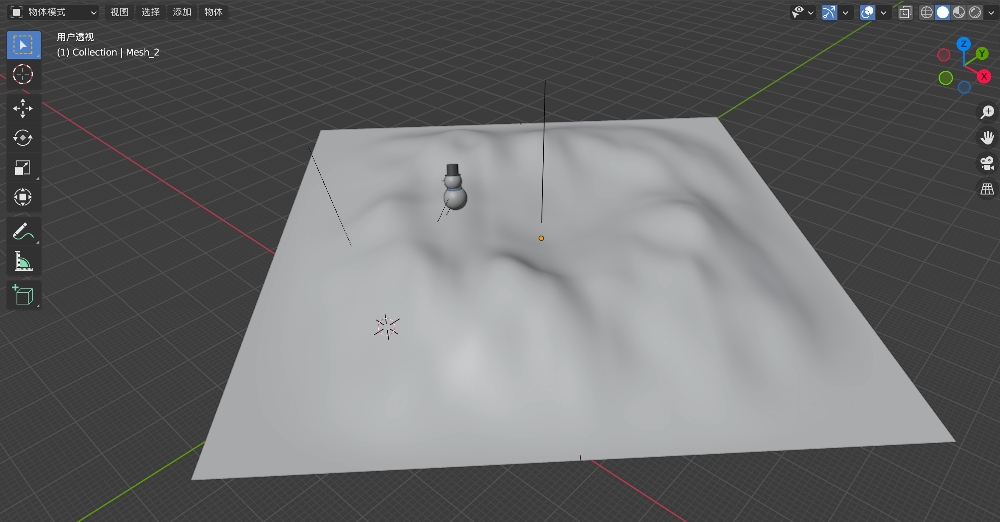
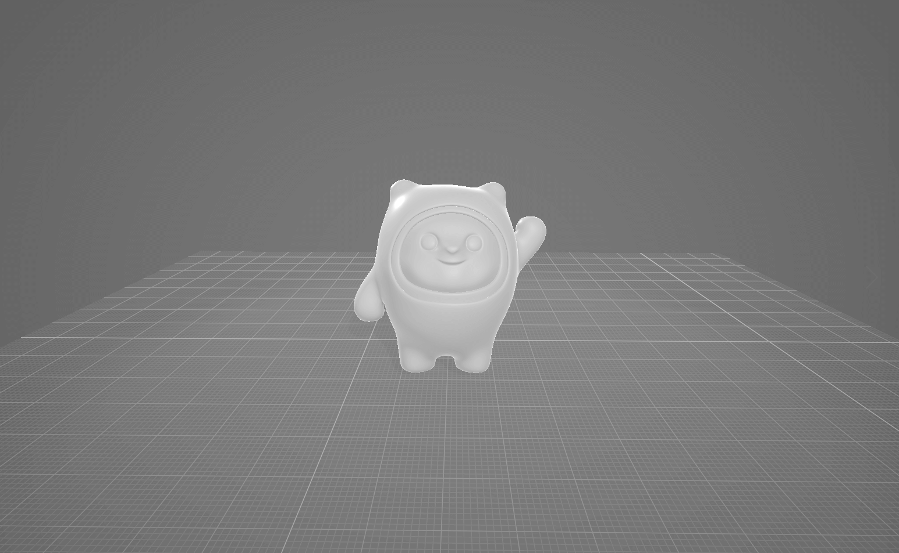
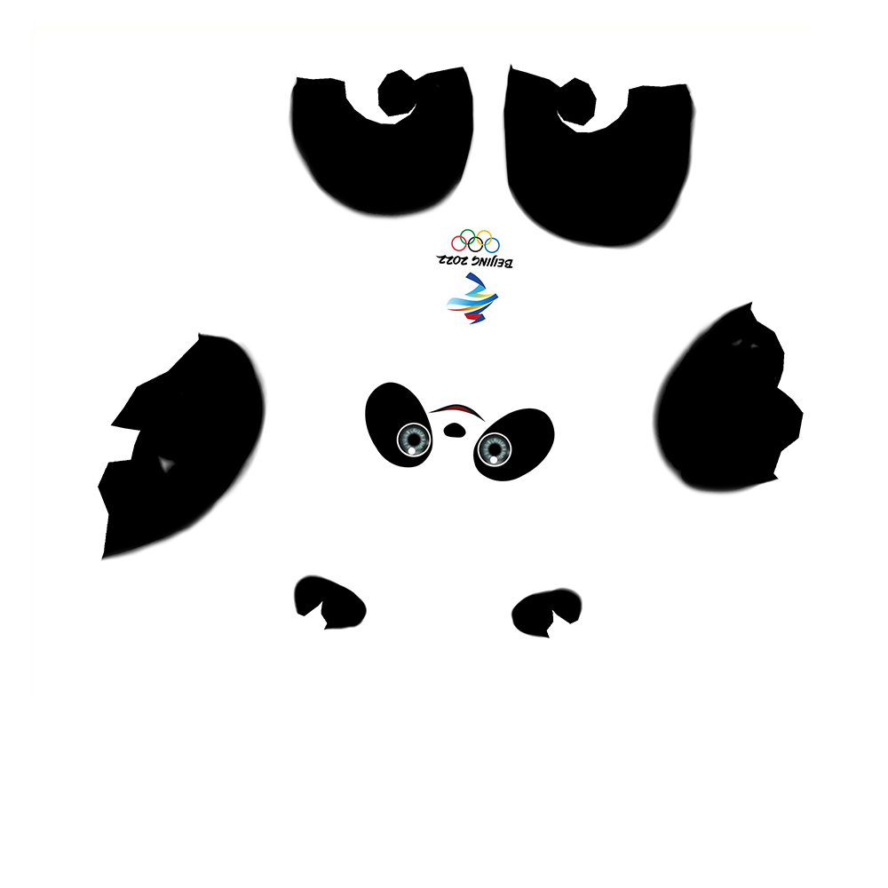
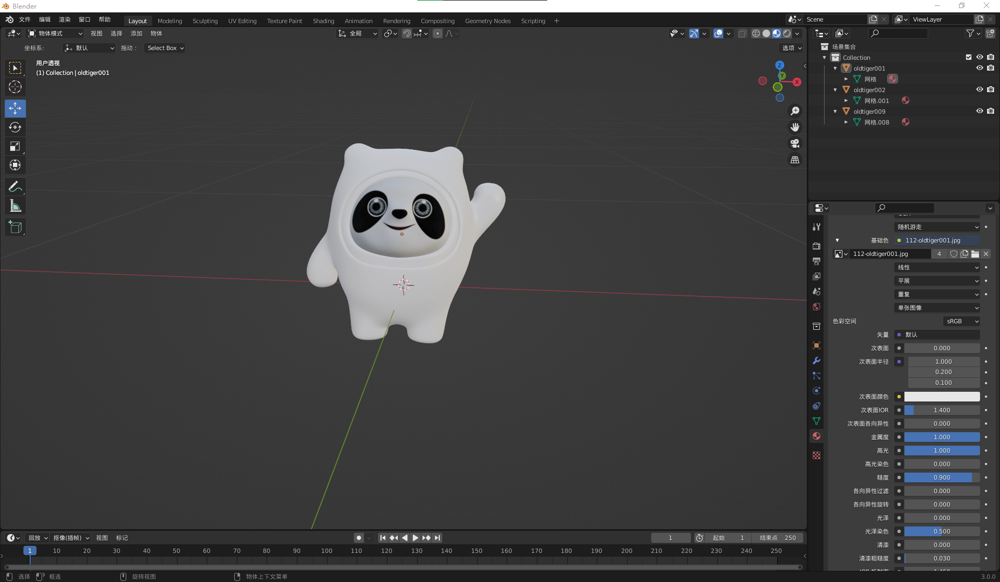
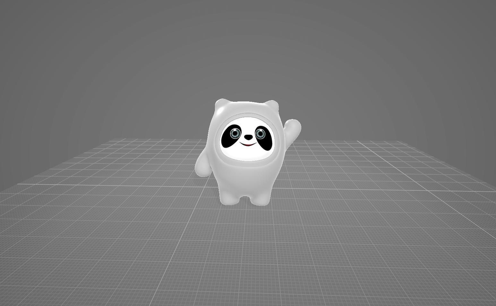
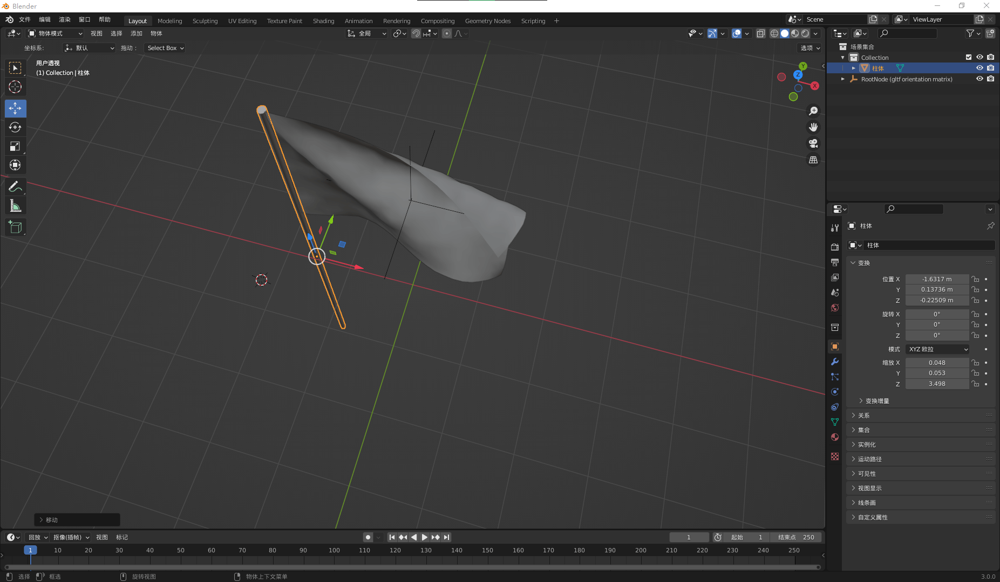
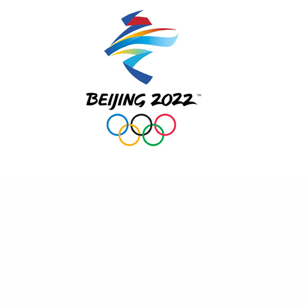
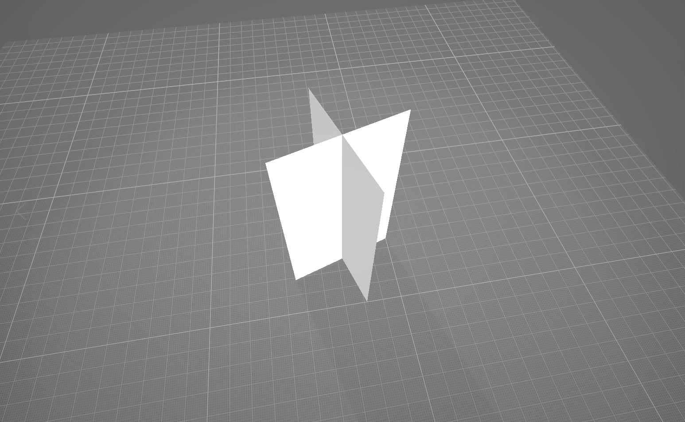
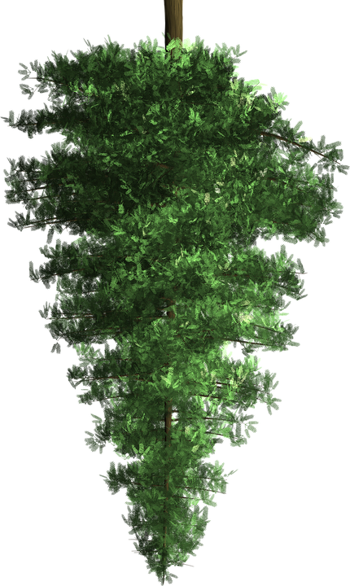
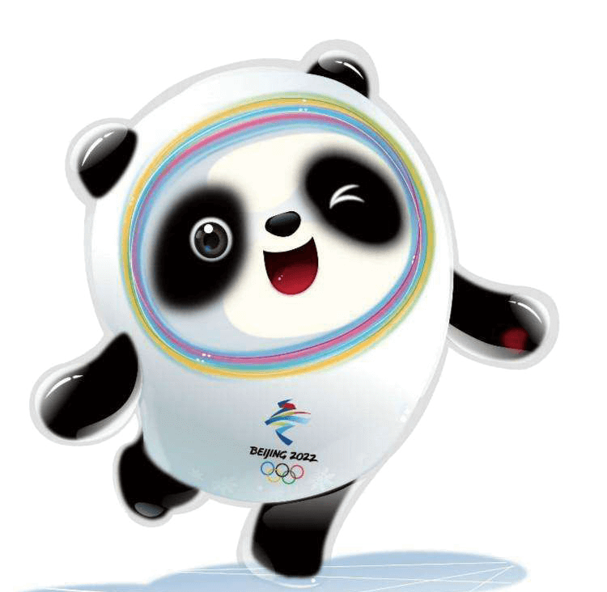

# Three.js 实现2022冬奥主题3D趣味页面，一只萌萌的冰墩墩送给大家 🐼


> 声明：本文涉及奥运元素3D模型仅用于个人学习、研究和欣赏，请勿二次修改、非法传播、转载、出版、商用、及进行其他获利行为。

## 背景

迎冬奥，一起向未来！**2022冬奥会**马上就要开始了，本文使用 `Three.js + React` 技术栈，实现冬日和奥运元素，制作了一个充满趣味和纪念意义的冬奥主题 `3D` 页面。本文涉及到的知识点主要包括：`TorusGeometry` 圆环面、`MeshLambertMaterial` 非光泽表面材质、`MeshDepthMaterial` 深度网格材质、`custromMaterial` 自定义材质、`Points` 粒子、`PointsMaterial` 点材质等。

## 效果

实现效果如以下 `👇` 动图所示，页面主要由 `2022` 冬奥会吉祥物 `冰墩墩` 、奥运五环、舞动的旗帜 `🚩`、树木 `🌲` 以及下雪效果 `❄️` 等组成。按住鼠标左键移动可以改为相机位置，获得不同视图。


> `👀` 在线预览：<https://dragonir.github.io/3d/#/olympic> （部署在 `GitHub`，加载速度可能会有点慢 `😓`）

## 实现

### 引入资源

首先引入开发页面所需要的库和外部资源，`OrbitControls` 用于镜头轨道控制、`TWEEN` 用于补间动画实现、`GLTFLoader` 用于加载 `glb` 或 `gltf` 格式的 `3D` 模型、以及一些其他模型、贴图等资源。

```js
import React from 'react';
import { OrbitControls } from "three/examples/jsm/controls/OrbitControls";
import { TWEEN } from "three/examples/jsm/libs/tween.module.min.js";
import { GLTFLoader } from "three/examples/jsm/loaders/GLTFLoader";
import bingdundunModel from './models/bingdundun.glb';
// ...
```

### 页面DOM结构

页面 `DOM` 结构非常简单，只有渲染 `3D` 元素的 `#container` 容器和显示加载进度的 `.olympic_loading`元素。

```js
<div>
  <div id="container"></div>
  {this.state.loadingProcess === 100 ? '' : (
    <div className="olympic_loading">
      <div className="box">{this.state.loadingProcess} %</div>
    </div>
  )}
</div>
```

### 场景初始化

初始化渲染容器、场景、相机。关于这部分内容的详细知识点，可以查阅我往期的文章，本文中不再赘述。

```js
container = document.getElementById('container');
renderer = new THREE.WebGLRenderer({ antialias: true });
renderer.setPixelRatio(window.devicePixelRatio);
renderer.setSize(window.innerWidth, window.innerHeight);
renderer.shadowMap.enabled = true;
container.appendChild(renderer.domElement);
scene = new THREE.Scene();
scene.background = new THREE.TextureLoader().load(skyTexture);
camera = new THREE.PerspectiveCamera(60, window.innerWidth / window.innerHeight, 0.1, 1000);
camera.position.set(0, 30, 100);
camera.lookAt(new THREE.Vector3(0, 0, 0));
```

### 添加光源

本示例中主要添加了两种光源：`DirectionalLight` 用于产生阴影，调节页面亮度、`AmbientLight` 用于渲染环境氛围。

```js
// 直射光
const light = new THREE.DirectionalLight(0xffffff, 1);
light.intensity = 1;
light.position.set(16, 16, 8);
light.castShadow = true;
light.shadow.mapSize.width = 512 * 12;
light.shadow.mapSize.height = 512 * 12;
light.shadow.camera.top = 40;
light.shadow.camera.bottom = -40;
light.shadow.camera.left = -40;
light.shadow.camera.right = 40;
scene.add(light);
// 环境光
const ambientLight = new THREE.AmbientLight(0xcfffff);
ambientLight.intensity = 1;
scene.add(ambientLight);
```

### 加载进度管理

使用 `THREE.LoadingManager` 管理页面模型加载进度，在它的回调函数中执行一些与加载进度相关的方法。本例中的页面加载进度就是在 `onProgress` 中完成的，当页面加载进度为 `100%` 时，执行 `TWEEN` 镜头补间动画。

```js
const manager = new THREE.LoadingManager();
manager.onStart = (url, loaded, total) => {};
manager.onLoad = () => { console.log('Loading complete!')};
manager.onProgress = (url, loaded, total) => {
  if (Math.floor(loaded / total * 100) === 100) {
    this.setState({ loadingProcess: Math.floor(loaded / total * 100) });
    // 镜头补间动画
    Animations.animateCamera(camera, controls, { x: 0, y: -1, z: 20 }, { x: 0, y: 0, z: 0 }, 3600, () => {});
  } else {
    this.setState({ loadingProcess: Math.floor(loaded / total * 100) });
  }
};
```

### 创建地面

本示例中凹凸起伏的地面是使用 `Blender` 构建模型，然后导出 `glb` 格式加载创建的。当然也可以只使用 `Three.js` 自带平面网格加凹凸贴图也可以实现类似的效果。使用 `Blender` 自建模型的优点在于可以自由可视化地调整地面的起伏效果。

```js
var loader = new THREE.GLTFLoader(manager);
loader.load(landModel, function (mesh) {
  mesh.scene.traverse(function (child) {
    if (child.isMesh) {
      child.material.metalness = .1;
      child.material.roughness = .8;
      // 地面
      if (child.name === 'Mesh_2') {
        child.material.metalness = .5;
        child.receiveShadow = true;
      }
  });
  mesh.scene.rotation.y = Math.PI / 4;
  mesh.scene.position.set(15, -20, 0);
  mesh.scene.scale.set(.9, .9, .9);
  land = mesh.scene;
  scene.add(land);
});
```



### 创建冬奥吉祥物冰墩墩

现在添加可爱的冬奥会吉祥物熊猫冰墩墩 `🐼`，冰墩墩同样是使用 `glb` 格式模型加载的。它的原始模型来源于[这里](https://www.justeasy.cn/3dmodel/OGxVUFg4Zy9UWnJYZkoxQXBwSndJZz09.html)，从这个网站免费现在模型后，原模型是使用 `3D max` 建的我发现并不能直接用在网页中，需要在 `Blender` 中转换模型格式，还需要调整调整模型的贴图法线，才能还原渲染图效果。

**原模型**：



**冰墩墩贴图**:



**转换成Blender支持的模型，并在Blender中调整模型贴图法线、并添加贴图**:



**导出glb格式**:



> `📖` 在 `Blender` 中给模型添加贴图教程传送门：[在Blender中怎么给模型贴图](https://jingyan.baidu.com/article/363872ecf6367f2f4ba16f95.html)

仔细观察`冰墩墩 🐼`可以发现，它的外面有一层**透明塑料或玻璃质感外壳**，这个效果可以通过修改模型的透明度、金属度、粗糙度等材质参数实现，最后就可以渲染出如 `👆 banner图` 所示的那种效果，具体如以下代码所示。

```js
loader.load(bingdundunModel, mesh => {
  mesh.scene.traverse(child => {
    if (child.isMesh) {
      // 内部
      if (child.name === 'oldtiger001') {
        child.material.metalness = .5
        child.material.roughness = .8
      }
      // 半透明外壳
      if (child.name === 'oldtiger002') {
        child.material.transparent = true;
        child.material.opacity = .5
        child.material.metalness = .2
        child.material.roughness = 0
        child.material.refractionRatio = 1
        child.castShadow = true;
      }
    }
  });
  mesh.scene.rotation.y = Math.PI / 24;
  mesh.scene.position.set(-8, -12, 0);
  mesh.scene.scale.set(24, 24, 24);
  scene.add(mesh.scene);
});
```

### 创建奥运五环

奥运五环由基础几何模型圆环面 `TorusGeometry` 来实现，创建五个圆环面，并调整它们的材质颜色和位置来构成**蓝黑红黄绿**顺序的五环结构。五环材质使用的是 `MeshLambertMaterial`。

```js
const fiveCycles = [
  { key: 'cycle_0', color: 0x0885c2, position: { x: -250, y: 0, z: 0 }},
  { key: 'cycle_1', color: 0x000000, position: { x: -10, y: 0, z: 5 }},
  { key: 'cycle_2', color: 0xed334e, position: { x: 230, y: 0, z: 0 }},
  { key: 'cycle_3', color: 0xfbb132, position: { x: -125, y: -100, z: -5 }},
  { key: 'cycle_4', color: 0x1c8b3c, position: { x: 115, y: -100, z: 10 }}
];
fiveCycles.map(item => {
  let cycleMesh = new THREE.Mesh(new THREE.TorusGeometry(100, 10, 10, 50), new THREE.MeshLambertMaterial({
    color: new THREE.Color(item.color),
    side: THREE.DoubleSide
  }));
  cycleMesh.castShadow = true;
  cycleMesh.position.set(item.position.x, item.position.y, item.position.z);
  meshes.push(cycleMesh);
  fiveCyclesGroup.add(cycleMesh);
});
fiveCyclesGroup.scale.set(.036, .036, .036);
fiveCyclesGroup.position.set(0, 10, -8);
scene.add(fiveCyclesGroup);
```

#### `💡` TorusGeometry 圆环面

`TorusGeometry` 一个用于生成圆环几何体的类。

**构造函数**：

```js
TorusGeometry(radius: Float, tube: Float, radialSegments: Integer, tubularSegments: Integer, arc: Float)
```

* `radius`：圆环的半径，从圆环的中心到管道（横截面）的中心。默认值是 `1`。
* `tube`：管道的半径，默认值为 `0.4`。
* `radialSegments`：圆环的分段数，默认值为 `8`。
* `tubularSegments`：管道的分段数，默认值为 `6`。
* `arc`：圆环的圆心角（单位是弧度），默认值为 `Math.PI * 2`。

#### `💡` MeshLambertMaterial 非光泽表面材质

一种非光泽表面的材质，没有镜面高光。该材质使用基于非物理的 `Lambertian` 模型来计算反射率。这可以很好地模拟一些表面（例如未经处理的木材或石材），但不能模拟具有镜面高光的光泽表面（例如涂漆木材）。

**构造函数**：

```js
MeshLambertMaterial(parameters : Object)
```

* `parameters`：（可选）用于定义材质外观的对象，具有一个或多个属性。材质的任何属性都可以从此处传入。

### 创建旗帜

旗面模型是从[sketchfab](https://sketchfab.com/)下载的，还需要一个旗杆，可以在 `Blender`中添加了一个柱状立方体，并调整好合适的长宽高和旗面结合起来。原本想把国旗贴图添加到旗帜模型上，但为了避免使用错误，造成敏感问题，于是使用 `北京2022冬奥会` 旗帜贴图了 `😂`。



**旗面贴图**：



旗面添加了动画，需要在代码中执行动画帧播放。

```js
loader.load(flagModel, mesh => {
  mesh.scene.traverse(child => {
    if (child.isMesh) {
      child.castShadow = true;
      // 旗帜
      if (child.name === 'mesh_0001') {
        child.material.metalness = .1;
        child.material.roughness = .1;
        child.material.map = new THREE.TextureLoader().load(flagTexture);
      }
      // 旗杆
      if (child.name === '柱体') {
        child.material.metalness = .6;
        child.material.roughness = 0;
        child.material.refractionRatio = 1;
        child.material.color = new THREE.Color(0xeeeeee);
      }
    }
  });
  mesh.scene.rotation.y = Math.PI / 24;
  mesh.scene.position.set(2, -7, -1);
  mesh.scene.scale.set(4, 4, 4);
  // 动画
  let meshAnimation = mesh.animations[0];
  mixer = new THREE.AnimationMixer(mesh.scene);
  let animationClip = meshAnimation;
  let clipAction = mixer.clipAction(animationClip).play();
  animationClip = clipAction.getClip();
  scene.add(mesh.scene);
});
```

### 创建树木

为了充实画面，营造冬日氛围，于是就添加了几棵松树 `🌲` 作为装饰。添加松树的时候用到一个技巧非常重要：我们知道因为树的模型非常复杂，有非常多的面数，面数太多会降低页面性能，造成卡顿。本文中使用两个如下图 `👇` 所示的两个交叉的面来作为树的基座，这样的话树只有两个面数，使用这个技巧可以和大程度上优化页面性能，而且树 `🌲` 的样子看起来也是有 `3D` 感的。



**材质贴图**：



为了使树**只在贴图透明部分透明、其他地方不透明**，并且可以**产生树状阴影而不是长方体阴影**，需要给树模型添加如下 `MeshPhysicalMaterial`、`MeshDepthMaterial` 两种材质，两种材质使用同样的纹理贴图，其中 `MeshDepthMaterial` 添加到模型的 `custromMaterial` 属性上。

```js
 let treeMaterial = new THREE.MeshPhysicalMaterial({
  map: new THREE.TextureLoader().load(treeTexture),
  transparent: true,
  side: THREE.DoubleSide,
  metalness: .2,
  roughness: .8,
  depthTest: true,
  depthWrite: false,
  skinning: false,
  fog: false,
  reflectivity: 0.1,
  refractionRatio: 0,
});
let treeCustomDepthMaterial = new THREE.MeshDepthMaterial({
  depthPacking: THREE.RGBADepthPacking,
  map: new THREE.TextureLoader().load(treeTexture),
  alphaTest: 0.5
});
loader.load(treeModel, mesh => {
  mesh.scene.traverse(child =>{
    if (child.isMesh) {
      child.material = treeMaterial;
      child.custromMaterial = treeCustomDepthMaterial;
    }
  });
  mesh.scene.position.set(14, -9, 0);
  mesh.scene.scale.set(16, 16, 16);
  scene.add(mesh.scene);
  // 克隆另两棵树
  let tree2 = mesh.scene.clone();
  tree2.position.set(10, -8, -15);
  tree2.scale.set(18, 18, 18);
  scene.add(tree2)
  // ...
});
```

实现效果也可以从 `👆` 上面 `Banner` 图中可以看到，为了画面更好看，我取消了树的阴影显示。

> `📌` 在 `3D` 功能开发中，一些不重要的装饰模型都可以采取这种策略来优化。

#### `💡` MeshDepthMaterial 深度网格材质

一种按深度绘制几何体的材质。深度基于相机远近平面，白色最近，黑色最远。

**构造函数**：

```js
MeshDepthMaterial(parameters: Object)
```

* `parameters`：（可选）用于定义材质外观的对象，具有一个或多个属性。材质的任何属性都可以从此处传入。

**特殊属性**：

* `.depthPacking[Constant]`：`depth packing` 的编码。默认为 `BasicDepthPacking`。
* `.displacementMap[Texture]`：位移贴图会影响网格顶点的位置，与仅影响材质的光照和阴影的其他贴图不同，移位的顶点可以投射阴影，阻挡其他对象，以及充当真实的几何体。
* `.displacementScale[Float]`：位移贴图对网格的影响程度（黑色是无位移，白色是最大位移）。如果没有设置位移贴图，则不会应用此值。默认值为 `1`。
* `.displacementBias[Float]`：位移贴图在网格顶点上的偏移量。如果没有设置位移贴图，则不会应用此值。默认值为 `0`。

#### `💡` custromMaterial 自定义材质

给网格添加 `custromMaterial` 自定义材质属性，可以实现透明外围 `png` 图片贴图的内容区域阴影。

### 创建雪花

创建雪花 `❄️`，就要用到**粒子知识**。`THREE.Points` 是用来创建点的类，也用来批量管理粒子。本例中创建了 `1500` 个雪花粒子，并为它们设置了限定三维空间的随机坐标及横向和竖向的随机移动速度。

```js
// 雪花贴图
let texture = new THREE.TextureLoader().load(snowTexture);
let geometry = new THREE.Geometry();
let range = 100;
let pointsMaterial = new THREE.PointsMaterial({
  size: 1,
  transparent: true,
  opacity: 0.8,
  map: texture,
  // 背景融合
  blending: THREE.AdditiveBlending,
  // 景深衰弱
  sizeAttenuation: true,
  depthTest: false
});
for (let i = 0; i < 1500; i++) {
  let vertice = new THREE.Vector3(Math.random() * range - range / 2, Math.random() * range * 1.5, Math.random() * range - range / 2);
  // 纵向移速
  vertice.velocityY = 0.1 + Math.random() / 3;
  // 横向移速
  vertice.velocityX = (Math.random() - 0.5) / 3;
  // 加入到几何
  geometry.vertices.push(vertice);
}
geometry.center();
points = new THREE.Points(geometry, pointsMaterial);
points.position.y = -30;
scene.add(points);
```

#### `💡` Points 粒子

`Three.js` 中，雨 `🌧️`、雪 `❄️`、云 `☁️`、星辰 `✨` 等生活中常见的粒子都可以使用 `Points` 来模拟实现。

**构造函数**：

```js
new THREE.Points(geometry, material);
```

* 构造函数可以接受两个参数，一个几何体和一个材质，几何体参数用来制定粒子的位置坐标，材质参数用来格式化粒子；
* 可以基于简单几何体对象如 `BoxGeometry`、`SphereGeometry`等作为粒子系统的参数；
* 一般来讲，需要自己指定顶点来确定粒子的位置。

#### `💡` PointsMaterial 点材质

通过 `THREE.PointsMaterial` 可以设置粒子的属性参数，是 `Points` 使用的默认材质。

**构造函数**：

```js
PointsMaterial(parameters : Object)
```

* `parameters`：（可选）用于定义材质外观的对象，具有一个或多个属性。材质的任何属性都可以从此处传入。

#### `💡` 材质属性 .blending

材质的`.blending` 属性主要控制纹理融合的叠加方式，`.blending` 属性的值包括：

* `THREE.NormalBlending`：默认值
* `THREE.AdditiveBlending`：加法融合模式
* `THREE.SubtractiveBlending`：减法融合模式
* `THREE.MultiplyBlending`：乘法融合模式
* `THREE.CustomBlending`：自定义融合模式，与 `.blendSrc`, `.blendDst` 或 `.blendEquation` 属性组合使用

#### `💡` 材质属性 .sizeAttenuation

粒子的大小是否会被相机深度衰减，默认为 `true`（仅限透视相机）。

#### `💡` Three.js 向量

几维向量就有几个分量，二维向量 `Vector2` 有 `x` 和 `y` 两个分量，三维向量 `Vector3` 有`x`、`y`、`z` 三个分量，四维向量 `Vector4` 有 `x`、`y`、`z`、`w` 四个分量。

**相关API**：

* `Vector2`：二维向量
* `Vector3`：三维向量
* `Vector4`：四维向量

### 镜头控制、缩放适配、动画

```js
controls = new OrbitControls(camera, renderer.domElement);
controls.target.set(0, 0, 0);
controls.enableDamping = true;
// 禁用平移
controls.enablePan = false;
// 禁用缩放
controls.enableZoom = false;
// 垂直旋转角度限制
controls.minPolarAngle = 1.4;
controls.maxPolarAngle = 1.8;
// 水平旋转角度限制
controls.minAzimuthAngle = -.6;
controls.maxAzimuthAngle = .6;
```

```js
window.addEventListener('resize', () => {
  camera.aspect = window.innerWidth / window.innerHeight;
  camera.updateProjectionMatrix();
  renderer.setSize(window.innerWidth, window.innerHeight);
}, false);
```

```js
function animate() {
  requestAnimationFrame(animate);
  renderer.render(scene, camera);
  controls && controls.update();
  // 旗帜动画更新
  mixer && mixer.update(new THREE.Clock().getDelta());
  // 镜头动画
  TWEEN && TWEEN.update();
  // 五环自转
  fiveCyclesGroup && (fiveCyclesGroup.rotation.y += .01);
  // 顶点变动之后需要更新，否则无法实现雨滴特效
  points.geometry.verticesNeedUpdate = true;
  // 雪花动画更新
  let vertices = points.geometry.vertices;
  vertices.forEach(function (v) {
    v.y = v.y - (v.velocityY);
    v.x = v.x - (v.velocityX);
    if (v.y <= 0) v.y = 60;
    if (v.x <= -20 || v.x >= 20) v.velocityX = v.velocityX * -1;
  });
}
```

> `🔗` 完整代码：<https://github.com/dragonir/3d/tree/master/src/containers/Olympic>

## 总结

`💡` 本文中主要包含的新知识点包括：

* `TorusGeometry` 圆环面
* `MeshLambertMaterial` 非光泽表面材质
* `MeshDepthMaterial` 深度网格材质
* `custromMaterial` 自定义材质
* `Points` 粒子
* `PointsMaterial` 点材质
* 材质属性 `.blending`、`.sizeAttenuation`
* `Three.js` 向量

**进一步优化的空间**:

* 添加更多的交互功能、界面样式进一步优化；
* 吉祥物冰墩墩添加骨骼动画，并可以通过鼠标和键盘控制其移动和交互。

**下期预告**：

* 《`Metahuman`元人类！`Three.js`人像优化》

> 想了解场景初始化、光照、阴影、基础几何体、网格、材质及其他 `Three.js` 的相关知识，可阅读我往期文章。如果觉得文章对你有帮助，不要忘了**一键三连哦 👍**。

## 附录

* [1]. [1000粉！使用Three.js制作一个专属3D奖牌 🥇](https://juejin.cn/post/7055079293247815711)
* [2]. [Three.js 实现虎年春节3D创意页面](https://juejin.cn/post/7051745314914435102)
* [3]. [Three.js 实现脸书元宇宙3D动态Logo](https://juejin.cn/post/7031893833163997220)
* [4]. [Three.js 实现3D全景侦探小游戏](https://juejin.cn/post/7042298964468564005)
* [5]. [Three.js实现炫酷的酸性风格3D页面](https://juejin.cn/post/7012996721693163528)
* [6]. [3dx模型转换为blender支持格式](https://anyconv.com/tw/max-zhuan-obj/)


