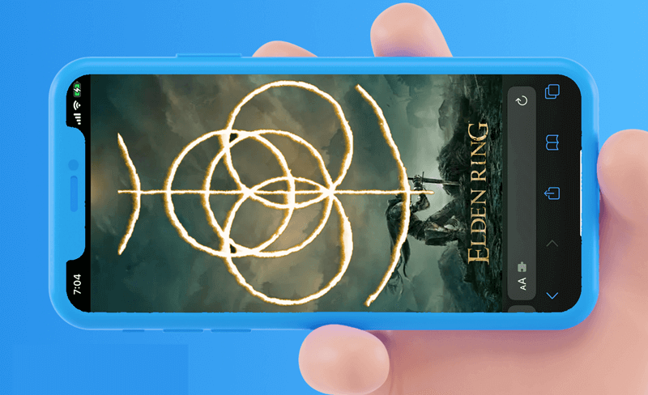
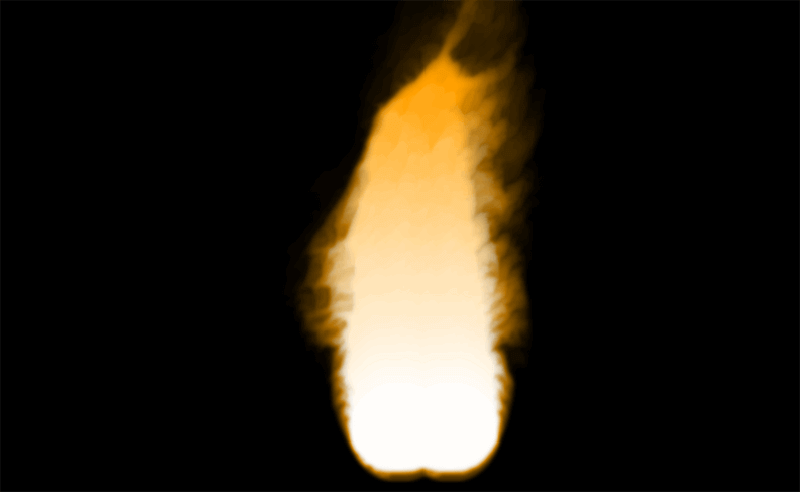
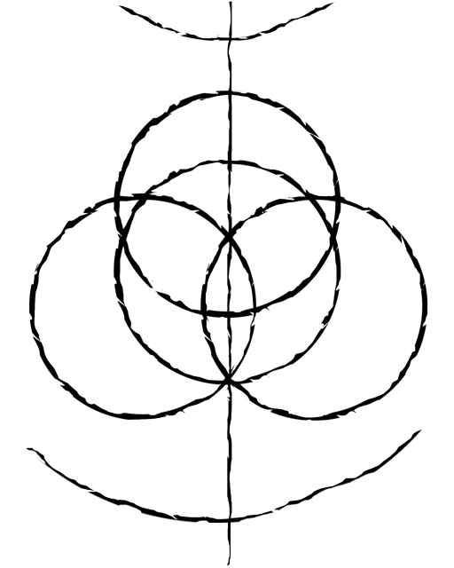

# Three.js 火焰效果实现艾尔登法环动态logo 🔥


> 声明：本文涉及图文和模型素材仅用于个人学习、研究和欣赏，请勿二次修改、非法传播、转载、出版、商用、及进行其他获利行为。

## 背景

《艾尔登法环》是最近比较火的一款游戏，观察可以发现它的 `Logo` 是由几个圆弧和线段构成。本文使用 `React + Three.js` 技术栈，实现具有火焰效果艾尔登法环 `Logo`，本文中涉及到的知识点包括：`Fire.js` 基本使用方法及 `Three.js` 的其他基础知识。

## 效果

实现效果如 `👆` `banner` 图所示，页面主体由 `Logo` 图形构成，`Logo` 具有由远及近的加载效果，加载完毕后具有上下缓动动画效果。



**在线预览**：

* `👀` 地址1：<https://3d-dragonir.vercel.app/#/ring>
* `👀` 地址2：<https://dragonir.github.io/3d/#/ring>

已适配:

* `💻` `PC` 端
* `📱` 移动端

## 实现

`Logo` 的火焰效果主要是通过 `Fire.js` 实现的， 开始实现之前先来了解一下它的基本用法。

### `💡 Fire.js`

`Threejs` 提供了一个可以实现火焰和烟雾效果的扩展包，通过引用并设置参数可以实现非常逼真的火焰和厌恶效果。**【不过该扩展包已经从新版中移除】**

**火焰设置可选属性**：

* `color1`：内焰颜色
* `color2`：外焰颜色
* `color3`：烟雾颜色
* `colorBias`：颜色偏差
* `burnRate`：燃烧率
* `diffuse`：扩散
* `viscosity`：粘度
* `expansion`：膨胀
* `swirl`：旋转
* `drag`：拖拽
* `airSpeed`：空气速度
* `windX`：`X` 轴风向
* `windY`：`Y` 轴风向
* `speed`：火焰速度
* `massConservation`：质量守恒

**常用方法**：

* 添加资源：`addSource(u, v, radius, density, windX, windY)`
* 清除资源：`clearSources()`
* 设置贴图：`setSourceMap(texture)`

**基本用法**：

通过简单几步：创建载体、使用Fire构造函数初始化、添加火焰、添加到场景等简单几步，就可实现火焰效果。可以创建多个火源，多种火焰效果也可以叠加到同一个载体上。

```js
const geometry = new THREE.PlaneBufferGeometry(10, 10);
const fire = new THREE.Fire(geometry,{
  textureWidth: 10,
  textureHeight: 10,
  debug:false
});
fire.addSource(0.5, 0.1, 0.1, 1.0, 0.0, 1.0);
scene.add(fire);
```

**实现效果**：



> `🔗` 在线亲手尝试调整火焰各种参数效果：[threejs/examples/webgl_fire.html](https://techbrood.com/threejs/examples/webgl_fire.html)

### 资源引入

引入开发所需的的模块资源，注意 `Three.js` 和 `Fire.js` 是从当前目录引入的**旧版本**，**新版本已删除** `Fire.js`。`TWEEN` 用于实现简单的镜头补间动画、`ringTexture` 是需要显示火焰效果轮廓的贴图。

```js
import React from 'react';
import * as THREE from './libs/three.module.js';
import { Fire } from './libs/Fire.js';
import { TWEEN } from "three/examples/jsm/libs/tween.module.min.js";
import ringTexture from './images/ring.png';
```

页面 `DOM` 结构非常简单，只包含一个渲染 `WEBGL` 的容器 `#container`。

```js
<div className='ring_page' id="container"></div>
```

### 场景初始化

初始化渲染场景、相机和光源。（如若需要详细了解这部分知识可翻阅我往期的文章或阅读官网文档，本文不再赘述）

```js
const container = document.getElementById('container');
const renderer = new THREE.WebGLRenderer({ antialias: true,  alpha: true });
renderer.setPixelRatio(Math.min(window.devicePixelRatio, 2))
renderer.setSize(window.innerWidth, window.innerHeight);
container.appendChild(renderer.domElement);
renderer.setClearAlpha(0);
const scene = new THREE.Scene();
const camera = new THREE.PerspectiveCamera(60, window.innerWidth / window.innerHeight, 0.1, 1000);
camera.position.set(0, 0, 100);
camera.lookAt(new THREE.Vector3(0, 0, 0));
const ambientLight = new THREE.AmbientLight(0xffffff, 1);
scene.add(ambientLight);
```

#### `💡` 设置渲染背景透明度

* `alpha`：`canvas` 是否开启透明度，默认为 `false`。
* `renderer.setClearAlpha(alpha : Float)`：设置 `alpha` 透明度值，合法参数是一个 `0.0` 到 `1.0` 之间的浮点数。

以上代码中，通过设置 `new THREE.WebGLRenderer({ antialias: true,  alpha: true })` 和 `renderer.setClearAlpha(0)` 可以将 `canvas` 背景设置为透明，这样就可以通过 `CSS` 设置背景样式。本例中的背景图片就是通过 `CSS` 设置的，而不是 `Sence.background`。

> `🌵` 当开启 `alpha: true` 时，透明度默认为 `0`，可以不用写 `renderer.setClearAlpha(0)`。

### 添加Logo主体

创建一个 `PlaneBufferGeometry` 平面作为火焰 `Logo` 载体，`Logo` 形状通过调用 `setSourceMap` 使用贴图生成，然后添加 `Fire.js` 的各种参数，调整平面的位置，最后将它添加到场景中即可。

```js
const ring = new Fire(new THREE.PlaneBufferGeometry(20, 25), {
  textureWidth: 800,
  textureHeight: 1000,
  debug: false,
});
ring.setSourceMap(new THREE.TextureLoader().load(ringTexture));
ring.color1 = new THREE.Color(0xffffff);
ring.color2 = new THREE.Color(0xf59e00);
ring.color3 = new THREE.Color(0x08120a);
ring.colorBias = .6;
ring.burnRate = 10;
ring.diffuse = 1;
ring.viscosity = .5;
ring.expansion = -1.6;
ring.swirl = 10;
ring.drag = 0.4;
ring.airSpeed = 18;
ring.windX = 0.1;
ring.windY = 0.2;
ring.speed = 100;
ring.massConservation = false;
ring.position.y = 4;
ring.position.z = -6;
scene.add(ring)
```



> `🌵` `Logo` 形状也可直接使用圆环等几何体拼接生成，本文为了简单省时并且更加逼真，直接使用了自己在 `Photoshop` 中绘制的贴图。注意贴图主体部分实际应用中要使用**白色**，为了便于展示我改成了黑色。

### 页面缩放适配

```js
window.addEventListener('resize', () => {
  camera.aspect = window.innerWidth / window.innerHeight;
  camera.updateProjectionMatrix();
  renderer.setSize(window.innerWidth, window.innerHeight);
}, false);
```

### 镜头补间动画

页面刚开始加载完成时由远及近的镜头补间动画。

```js
const controls = new OrbitControls(camera, renderer.domElement);
Animations.animateCamera(camera, controls, { x: 0, y: 0, z: 22 }, { x: 0, y: 0, z: 0 }, 2400, () => {
  controls.enabled = false;
});
```

### 页面重绘动画

图案上线往复运动的缓动动画及渲染更新。

```js
let step = 0;
const animate = () => {
  requestAnimationFrame(animate);
  renderer.render(scene, camera);
  stats && stats.update();
  TWEEN && TWEEN.update();
  step += .03;
  ring && (ring.position.y = Math.abs(2.2 + Math.sin(step)));
}
```

到这里，一个**低配版**的艾尔登法环 `Logo` 所有效果都全部实现了 `😂`，希望随着自己图形学方面知识的积累，后续可以通过 `shader` 实现更加炫酷的效果 `🔥`。 完整代码可通过下方链接查看。


> `🔗` 完整代码：<https://github.com/dragonir/3d/tree/master/src/containers/Ring>

## 总结

本文知识点主要包含的的新知识：

* `Fire.js`
* 设置渲染背景透明度

> 想了解场景初始化、光照、阴影、基础几何体、网格、材质及其他**Three.js**的相关知识，可阅读我往期文章。**转载请注明原文地址和作者**。如果觉得文章对你有帮助，不要忘了**一键三连哦 👍**。

## 附录

* [1]. [Three.js 实现神奇的3D文字悬浮效果](https://juejin.cn/post/7072899771819622413)
* [2]. [Three.js 实现让二维图片具有3D效果](https://juejin.cn/post/7067344398912061454)
* [3]. [Three.js 实现2022冬奥主题3D趣味页面，冰墩墩 🐼](https://juejin.cn/post/7060292943608807460)
* [4]. [Three.js 制作一个专属3D奖牌](https://juejin.cn/post/7055079293247815711)
* [5]. [Three.js 实现虎年春节3D创意页面](https://juejin.cn/post/7051745314914435102)
* [6]. [Three.js 实现脸书元宇宙3D动态Logo](https://juejin.cn/post/7031893833163997220)
* [7]. [Three.js 实现3D全景侦探小游戏](https://juejin.cn/post/7042298964468564005)
* [8]. [Three.js 实现炫酷的酸性风格3D页面](https://juejin.cn/post/7012996721693163528)
